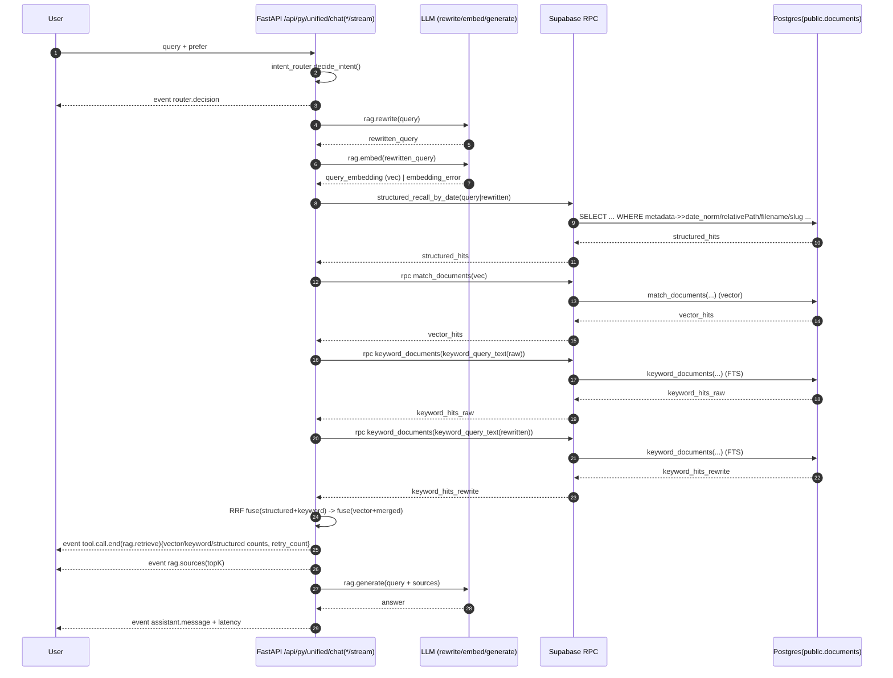

# 2026-04-23｜RAG 回归修复（B1/B2）与检索工程化总结

## 今日目标

- 修复回归中 RAG 检索 0 hits、不可解释的问题，形成可观测链路与兜底策略。
- 针对“格式写法差异导致 FTS 漏命中”，落地 B2（fts_tokens alias）并形成可执行验收文档。
- 针对“自然语言日期（含中文数字）无法命中 diary”，落地 B1（结构化召回）保证确定性命中。

---

## 改动摘要（按问题→机制→落点）

### 1) RAG 0 hits / 不可解释

- **机制**：检索链路增加可观测字段与兜底（RPC 重试、raw+rewrite 双路 keyword 融合、事件统计输出）
- **落点**：Unified Chat 的 `rag.retrieve` 输出包含：
  - `vector_hits`
  - `keyword_hits_raw`
  - `keyword_hits_rewrite`
  - `structured_hits`
  - `retry_count`
  - `embedding_error`

### 2) 日期/格式写法差异导致 FTS 漏命中（B2）

- **机制**：在索引层增强 `fts_tokens`（不改 `documents.content` / `documents.embedding`），使同一实体多写法更稳定 @@ 命中。
- **落点**：
  - **B2 v1**：日期 alias（`2026-4-14` ↔ `2026-04-14`，含分隔符/空格变体）
  - **B2 v2**：版本号/分隔符归一/CamelCase 轻量拆分（均有上限，防 token 膨胀）
  - **B2 v2.1**：针对 `0-1-0` 这类 FTS 天生不友好的 query，做 **query-side** 扩展：
    - `0-1-0 → 0_1_0 / 0.1.0 / v0.1.0`（OR 组合）

### 3) 自然语言日期（中文数字）无法触发结构化召回（B1）

- **机制**：B1 通过解析日期并使用 metadata 做结构化召回，保证“像查文件一样”稳定命中 diary。
- **落点**：结构化召回支持：
  - `二零二六年四月十四号`
  - `贰零贰陆年肆月拾肆号`（财务大写数字）
  - `四月十四号`（缺年：尝试当年与上一年）

### 4) 缺少可验收语料（RunnableWithMessageHistory）

- **机制**：补充最小语料，用于验收 CamelCase/标识符检索链路（前端内容仓新增，需入库后端 `documents` 才能检索）。
- **落点**：`ai-ink-brain/content/learning/2026-04-23/runnable-with-message-history.md`

---

## 数据库 Struct（本次涉及）

### 表：`public.documents`

- `id bigint`
- `content text`
- `metadata jsonb`
  - 常用：`relativePath/slug/filename/chunk_index/category/...`
  - B1 新增/补齐：`date_norm/slug_norm`（写入侧）
- `embedding vector(N)`
- `fts_tokens tsvector`（触发器维护；B2 在生成时注入 alias_text）

### 索引

- `documents_fts_tokens_gin`：GIN(fts_tokens)

### 触发器与函数

- `public.documents_fts_tokens_update()`：写入/更新时重算 `fts_tokens`
- `public.rag_fts_alias_text(content)`：B2 alias 生成（日期/版本号/分隔符/标识符）

### RPC

- `public.match_documents(query_embedding, match_count, match_threshold)`：向量召回
- `public.keyword_documents(query_text, match_count)`：FTS 召回（`websearch_to_tsquery('simple', ...)`）
- `public.refresh_documents_fts_tokens_for_paths(relative_paths text[])`：按路径刷新 `fts_tokens`

---

## Mermaid｜Unified Chat（RAG）检索链路（含 B1/B2）



---

## Mermaid｜Postgres FTS struct（B2：fts_tokens 生成方式）

```mermaid
flowchart TB
  subgraph T[public.documents]
    C[content:text]
    M[metadata:jsonb]
    F[fts_tokens:tsvector]
    E[embedding:vector(N)]
  end

  subgraph B2[B2 alias layer (index-only)]
    A[rag_fts_alias_text(content)\n- date variants\n- version variants\n- separator norm\n- CamelCase split (capped)]
  end

  C --> A
  C -->|content + alias_text| V[to_tsvector('simple', ...)]
  A -->|alias_text| V
  V --> F

  TR[trigger: documents_fts_tokens_update] --> V
  RPCR[RPC: refresh_documents_fts_tokens_for_paths] --> V
  KRPC[RPC: keyword_documents(query_text)\nwebsearch_to_tsquery('simple', ...)] -->|@@| F
```

---

## Mermaid｜B1 vs B2 边界（为何两者都需要）

```mermaid
flowchart LR
  Q[User Query] --> R1[B1: structured recall\n(确定性定位文档/范围)]
  Q --> R2[B2: FTS alias\n(同一实体多写法命中)]
  Q --> R3[Vector recall\n(语义相似)]
  R1 --> H[Candidate hits]
  R2 --> H
  R3 --> H
  H --> FUSE[RRF fusion + ranking]
  FUSE --> GEN[LLM generate w/ citations]
```

---

## 关键学习点（可复用）

- **不要把 alias 塞进 content/embedding**：会污染语义与引发重灌成本；优先索引层（fts_tokens）与结构化层（metadata）。
- **FTS 存在天生盲区**：例如 `0-1-0` 可能被拆成单字符数字 token，导致永远 0 命中；需 query-side 归一化兜底。
- **企业落地是“可观测 + 回归集 + 迭代增强”**：alias 规则不是一次性完美，而是“遇到失败模式→加规则→回填→验收”。

