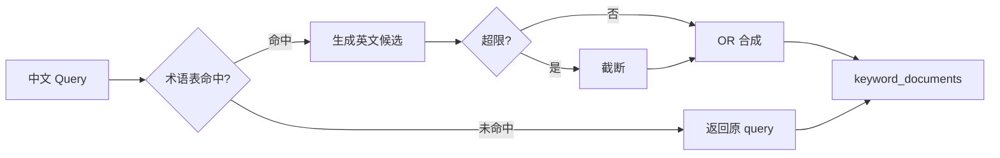
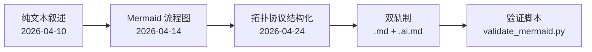

# 2026-04-24｜从纯文本到拓扑协议：Mermaid 双轨制与 i18n 跨语言召回 v1 落地

## TL;DR

- **Mermaid 拓扑协议双轨制**在后端（5 图）与前端（5 图）全部落地：`.md` 人类版 + `.ai.md` AI 协议版 + `validate_mermaid.py` 验证脚本
- **i18n 跨语言召回 v1** 验收通过：中文 query → 英文候选 OR 扩展，术语表 42 条，pytest 32 全绿
- 技术图谱从「纯文本叙述」→「Mermaid 流程图」→「拓扑协议结构化」的三阶段演进完成

---

## 1) 今日关键目标

- [x] 将 Mermaid 拓扑协议从概念落地为可执行规范（双轨制 + 验证脚本）
- [x] 后端 5 张 flowchart 全部完成 `.ai.md` AI 协议版重写
- [x] 前端 5 张 flowchart 同步完成 `.ai.md` 与 `.cursorrules` 更新
- [x] i18n 跨语言召回 v1 任务验收（术语表 + query-side OR 扩展 + 可观测性）

---

## 2) 关键产出 / 决策

### 决策 1：Mermaid 双轨制（人类版 + AI 协议版）

**Why**：LLM 生成 Mermaid 时裸边（`A --> B`）幻觉率高，但人类读带引号的边（`A --"->"--> B`）视觉噪音大。

**What**：
- `.md` = 人类友好版：简洁标签、裸边可用、锚点写在节点内
- `.ai.md` = AI 协议版：结构化标记（`~>` 异步、`?>` 条件、`[ok]`/`[err]` 状态、`::xxx` 元关系）、零裸边、锚点分离为 `// → path#Ln`

**影响面**：
- 后端：`docs/_tech_graph/` 5 张 flowchart 双轨化 + `99_mermaid_protocol.md` 规范
- 前端：`docs/_tech_graph/` 5 张 flowchart 双轨化 + `.cursorrules` 引用总规范
- 验证：`scripts/validate_mermaid.py` 支持前后端通用扩展名

### 决策 2：拓扑协议边标记语义

| 标记 | 语义 | 示例 |
|------|------|------|
| `->` | 同步执行 | `process()` → `save()` |
| `~>` | 异步（await） | `await embed_text()` |
| `=>` | 映射/赋值 | `result = transform(data)` |
| `?>` | 条件分支 | `if not valid:` / `try/except` |
| `[ok]` | 成功路径 | `validate() --"[ok]"--> save()` |
| `[err]` | 错误路径 | `parse() --"[err]"--> fallback()` |
| `::yields` | 流式产出 | `LLM --"::yields"--> sources` |
| `::branches` | 并行分支 | `gather` 多路 |
| `::merges` | 结果归并 | `fuse_hits_rrf()` |
| `::archives` | 日志归档 | `OUT --"::archives"--> DB` |

### 决策 3：i18n v1 最小可用方案

**Why**：中文提问无法召回英文文档（如 "消息历史" 无法命中 `RunnableWithMessageHistory`）。

**What**：
- 术语表 `data/i18n_glossary.json`：42 条中文 → 英文候选（如 "消息历史" → `["message history"]`）
- Query-side OR 扩展：原始 query + 候选以 `OR` 合并进 `keyword_documents(query_text)`
- 严格上限：候选数 ≤ 5、单候选 ≤ 48 字符、总 query ≤ 240 字符
- 可观测：`rag.query_expand` 事件输出扩展前后对比

**验收**：pytest 32 passed，包括候选生成、上限截断、异常兜底。

---

## 3) 实现要点

### 3.1 拓扑协议验证脚本

```python
# scripts/validate_mermaid.py
# 检查项：
# 1. 零裸边（无边标记的 -->）
# 2. 锚点格式 // → path#Ln
# 3. 异步节点 [[async def ...]] 必须用 ~> 边
```

### 3.2 i18n Query 扩展流程



### 3.3 双轨文件行数对比

| 图 | 人类版 | AI 版 | 膨胀率 |
|---|-------|------|--------|
| 00_main | 54 | 70 | +29% |
| 10_flow_rag | 52 | 78 | +50% |
| 11_text2sql | 45 | 63 | +40% |
| 12_fts | 45 | 64 | +42% |
| 13_rpc | 40 | 59 | +47% |

---

## 4) 风险与坑位

- **锚点正则兼容**：前端使用 `.tsx` `.ts` 扩展名，初始验证脚本只支持 `.py` `.sql` `.md`，已修复
- **通配符路径**：`app/**/page.tsx` `[...slug]` 等 glob 语法不符合标准锚点格式，作为合理例外
- **人类版维护成本**：双轨意味着改代码需同步更新两份图。缓解：优先更新 `.ai.md`，`.md` 按需同步
- **i18n 术语表运营**：42 条仅覆盖高频术语，长期需回填机制（遇到未命中 → 人工补充 → 回归验证）

---

## 5) 明日计划

- [ ] 验证拓扑协议在真实 LLM 生成场景中的幻觉降低效果（对比实验）
- [ ] 评估是否将 `99_mermaid_protocol.md` 推广到 Snail / secondCar 子仓
- [ ] i18n 术语表回填：从最近 3 天未命中 query 中提取候选补充

---

## 工程图｜技术图谱三阶段演进



## 工程图｜i18n v1 Query-Side 扩展

```mermaid
flowchart TD
    Q[用户中文 Query] --> G{术语表<br/>glossary命中?}
    G -->|命中| C[生成英文候选<br/>max 5 / 48char]
    G -->|未命中| R[原 query]
    C --> O[OR 合成<br/>"中文" OR "en1" OR ...]
    O --> L{总长>240?}
    L -->|是| T[截断]
    L -->|否| K
    T --> K[keyword_documents]
    R --> K
    K --> FTS[FTS 召回]
    FTS --> EVT[rag.query_expand<br/>事件输出]
```
