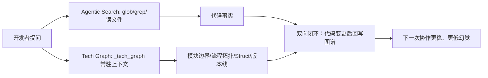

## 2026-04-25: 从 RAG 到 Agentic Search + Tech Graph 的落地复盘

### 日期与进度概览
- **日期**：2026 年 4 月 25 日
- **进度**：把“AI 辅助开发”从「单点 RAG」升级为「Agentic Search + Tech Graph（静态约束）」的可持续工程范式，并对齐后端项目的 `_tech_graph/` 交付形态
- **关键词**：Agentic Search、RAG、Tech Graph、Mermaid、拓扑协议、边界与契约、漂移校验

---

### 今日摘要
- **结论 1（适配性）**：代码工程里，传统 RAG 容易出现 **索引滞后 + 语义碎片化**；以文件工具为核心的 **Agentic Search 更贴近开发者查代码习惯**。
- **结论 2（补短板）**：Agentic Search 的“按需探索”天然碎片化，必须配一个 **静态、可维护的架构事实源**；我选择落地为 `/_tech_graph` 的 Mermaid 图谱体系。
- **结论 3（工程化关键）**：关键不是“写文档”，而是用 **图谱约束 + 漂移校验 + manifest 强校验** 把架构从“口口相传”变成“可验证事实”。
- **结论 4（排障视角）**：仅有业务主链路不够；需要补齐 **运行层（events/SSE）+ 失败路径**，让新 Agent 能走“最短定位链路”而不是靠猜。

---

## 1) 今日关键目标
- 把自己近期关于 **RAG vs Agentic Search** 的体感结论整理成可复用的工程认知
- 对齐后端项目 `ai-ink-brain-api-python/docs/_tech_graph/` 的落盘标准，明确“入口总图 / 子流程 / Struct / 版本线 / 规约”的职责分工
- 形成一份能被未来自己/新 Agent 直接接手的复盘笔记（可读、可检索、可引用）

---

## 2) 关键产出 / 决策（Why + What）
- **决策**：在代码工程场景里，将协作范式定位为 **Agentic Search（动态检索）+ Tech Graph（静态架构约束）** 的双闭环，而不是把“私有知识库协作”默认等同于 RAG。
  - **原因（Why）**：
    - **代码高频变化** → RAG 需要额外的 ingest / 更新 / 清理流水线维持索引一致性，成本高且仍有漂移风险
    - **代码强结构化**（函数名、路由、变量、调用链）→ “模糊语义匹配”并不天然更优，反而可能引入不相关片段
    - **流程拓扑重要** → 切片容易割裂上下游；图谱能把 **主干路径 / 异常分支 / 子流程加载** 固化
  - **影响面（What）**：
    - **短期**：把日常查代码/改逻辑放到 Agentic Search，让工具实时对齐当前代码事实
    - **中长期**：把跨模块边界、数据结构、失败路径、运行观测写入 `_tech_graph/`，并用校验脚本防止文档静默过期

---

## 3) 实现要点（How，尽量可复用）

### 3.1 把“图谱”当作唯一常驻上下文（Single Source of Truth）
后端图谱的落盘策略很清晰：`00_main.ai.md` 是入口总图，负责把路由分发、关键分支（RAG/Text2SQL/CodeRAG/ingest/observability）串起来，并通过“加载节点”跳转到子流程图。

【引用 1/2｜来源：后端图谱入口总图（节选）】

```6:22:ai-ink-brain-api-python/docs/_tech_graph/00_main.ai.md
  Q[[用户请求]] --"->"--> E{"@router.dispatch"}

  E --"POST /api/py/unified/chat"--> U1[[Unified JSON]]
  E --"POST /api/py/unified/chat/stream"--> U2[[Unified SSE]]

  U1 --"::branches"--> RAG[[RAG 子流程]]
  U2 --"::branches"--> RAG
  U1 --"::branches"--> T2S[[Text2SQL 子流程]]
  U2 --"::branches"--> T2S

  RAG --"加载"--> RAG_DOC[>10_flow_rag.md]
  T2S --"加载"--> T2S_DOC[>11_flow_text2sql.md]
```

### 3.2 用“失败路径”来约束协作：不是只写 Happy Path
图谱不只画“主干能跑通”，而是显式写出 **鉴权失败、Embedding 失败、无召回 hits** 等失败分支，让后续实现与排障都有确定锚点，减少“默认一切都会成功”的隐性幻觉。

【引用 2/2｜来源：RAG 子流程失败路径（节选）】

```7:35:ai-ink-brain-api-python/docs/_tech_graph/10_flow_rag.ai.md
  IN[[入口 Query]] --"->"--> AUTH[[鉴权]]
  AUTH --"[ok]"--> HIS[[历史轮次]]
  AUTH --"[err]"--> ERR_AUTH[>Auth Failed]

  HIS --"可选"--> RW[[Query Rewrite]]

  RW --"::branches"--> KQ[[keyword_query_text()]]
  RW --"::branches"--> EMB[[async def embed]]

  EMB --"[err]"--> EMB_FAIL[>Embedding Failed]
  EMB_FAIL --"->"--> KEYWORD_ONLY[[keyword-only]]
```

### 3.3 结构化事实优先：Struct 作为“表结构真值”
为了避免“概念讲清了，但工程事实不一致”，后端图谱用 `01_struct.md` 把 DB 结构固化为 Struct（而非长 DDL），并在 `metadata` 上明确 required/optional 的意图。

```5:32:ai-ink-brain-api-python/docs/_tech_graph/01_struct.md
  class documents {
    +bigserial id
    +text content
    +jsonb metadata
    +vector(1024) embedding
    +tsvector fts_tokens  %% vFTS (hybrid_search.sql)
    +timestamptz created_at
  }

  class rag_conversation_logs {
    +uuid id
    +varchar session_id
    +text query
    +text rewritten_query
    +jsonb retrieved_context
    +text response
    +jsonb metadata
    +timestamptz created_at
  }
```

### 3.4 图谱工程化：规约 + 漂移校验，避免“静默过期”
今天确认的工程化抓手是两条：
- **规约**：禁止编造端点/RPC/表/字段；流程图必须能靠连线自洽；`00_main` 只保留入口与分支，子流程按需加载。
- **漂移校验**：端点/RPC/env/表名变化若未同步到 `_tech_graph/`，必须能被脚本发现（避免文档静默过期）。

```36:37:ai-ink-brain-api-python/docs/_tech_graph/99_spec.md
- 最小漂移校验（P0_3）：运行 `python tools/tech_graph_drift_check.py`，检查端点/RPC/env/表名是否在 `docs/_tech_graph/*.md` 被覆盖（用于避免文档静默过期）。
```

补充：我把“事实源”进一步推进到 **manifest**（机器可读真值）：
- `docs/_tech_graph/_manifest.json`：端点/RPC/表/env/anchors 的真值快照
- `python tools/tech_graph_manifest_check.py`：从源码/SQL 抽取 truth 与 manifest 对比，不一致即失败（把“文档漂移”从提示升级为门槛）

---

## 4) 风险与坑位（含排障线索）
- **坑 1：把 RAG 当成“唯一答案来源”**
  - **现象**：代码改了但回答仍引用旧逻辑；或者召回片段与调用链不一致
  - **规避**：代码类问题优先走 Agentic Search（实时读文件/追调用），图谱只存“静态事实与边界”
- **坑 2：只画 Happy Path，忽略失败分支**
  - **现象**：默认“Embedding 永远成功 / 永远有 hits”，导致错误处理缺位
  - **规避**：流程图强制包含 `[err]` 分支与 fallback（例如 keyword-only、no_data）
- **坑 3：图谱写得很漂亮，但无人维护**
  - **现象**：一段时间后图谱与代码漂移，反而变成“误导源”
  - **规避**：把漂移校验当成门槛（至少在本地/CI 任一侧能跑）
- **坑 4：只有业务视角，没有运行视角**
  - **现象**：出问题时只能“猜哪里错了”，排障链路长；新 Agent 很难快速定位到事件/日志落点
  - **规避**：为关键链路补一张 runtime/observability 总览图（事件类型、错误 stage、日志落点、debug 开关），并从入口总图按需加载

【截图占位：Tech Graph 入口总图（00_main）】
- 需要展示：`00_main.ai.md` 的入口分发 + 子流程加载节点（RAG/Text2SQL/FTS/RPC）
- 期望视角：全屏 + 关键分支高亮
- 备注：无需展示任何密钥/环境变量值

---

## 5) 明日计划（可执行 checklist）
- [ ] 把“主题文章素材”拆成 2 份：对外文章（观点）+ 对内日记（工程事实/引用/排障线索）
- [ ] 在前端仓 `ai-ink-brain/_tech_graph/` 补一张“前端 ↔ Python API ↔ DB”的端到端边界图（与后端 `00_main` 对齐）
- [ ] 将“图谱漂移校验”接入到日常流程（至少做到：改端点/RPC/表 → 必须改图谱）

---

## 工程图 / 过程图（可选）

