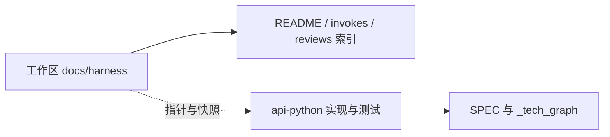

## 2026-05-14: Harness Invoke 体系固化与 ChatBI SQL AST / Prompt Guard 交付

### TL;DR

- 工作区根目录 `docs/harness/`：完成 Invoke 快照目录与各帽 `TEMPLATE-*-invoke.md` 互链，任务审核帽要求落盘「下一棒可复制 Prompt」，并补充 ChatBI 任务线 **R1–R4** 审核指针与 execute / self-check 等 invoke 快照。
- `ai-ink-brain-api-python`：交付 **P1-1 Text2SQL 后闸 SQL AST 硬化** 与归档、**plan_execution_token** 验签与 base64 填充修复；交付 **P1-2 prompt guard PoC**（**Unified JSON + SSE** 共用短路逻辑）、**FP-1** 错误信封契约测试及 Harness 审核 **R3/R4**；技术图谱与安全 SPEC、任务单同步更新；另落盘 **SSE 优先** 工程约定单 `task_engineering_chatbi_sse_first_v1.md`。
- 当日 `ai-ink-brain` 子仓无提交；本归总依据 **Git 当日提交** 与既有 Harness / 任务文档语义整理（无单独 `docs/diary` 同日素材文件）。

---

### 日期与进度概览

- **日期**：2026 年 5 月 14 日
- **进度**：Harness 侧「帽—模板—快照—审核」闭环可检索；后端侧 ChatBI 安全从 P1-1 收口进入 P1-2 PoC 与契约锁定。
- **关键词**：Harness V2、Invoke 快照、任务审核、独立复检、ChatBI、SQL AST gate、prompt guard、plan token、契约测试、任务归档

---

## 1) 今日关键目标

- 将 Harness **开帽落盘、invoke 快照、审核轮次指针** 写入规划与 README，各帽 **可复制调用体** 与 **下一棒 Prompt** 对齐协作习惯。
- 在后端完成 **P1-1** 后闸与归档、**P1-2** prompt 防护 PoC，并以 **单测 + fixture** 固定关键契约。

## 2) 关键产出 / 决策（Why + What）

### 工作区根 `docs/harness/`

- **规划与验收**：更新 `HARNESS_V2_PLAN.md`、`HARNESS_V2_P0_ACCEPTANCE.md`、Harness 测评文档、`VERIFICATION_CI_PATTERN.md`、`README.md`、`tasks/README.md`，落盘 PR 验收、verify-fast、任务收口等结论。
- **Invoke 机制**：新增 `invokes/README.md`；`HARNESS_V2_PLAN.md` 增补 **§3 Invoke 快照脚注** 与 **P2-6**；各 `TEMPLATE-*-invoke.md` 增加 **§3 开帽落盘** 约定。
- **交接质量**：`prompts/22-task-audit.md` 与 `TEMPLATE-task-audit-invoke.md` 强调审核产出须含 **下一棒可复制 Prompt** 并与对话一致。
- **独立复检**：`50-independent-reinspect.md`、`TEMPLATE-independent-reinspect-invoke-full.md`、`EXAMPLE-invoke-independent-reinspect-both-chatbi-p1-1.md`；示例 **TASK_PATH** 与 P1-1 **done/** 归档路径对齐。
- **ChatBI 审核与快照**：`reviews/` 下 task_chatbi 系列 **R1–R4** 短文档或指针；`invokes/` 含任务审核 R2 指针及 ChatBI **execute（30）/ self-check（40）** 等快照文件。

### `ai-ink-brain-api-python`

- **P1-1**：`api/chatbi_sql_gate.py` 硬化；`docs/_tech_graph/`（含 `11_flow_text2sql` 双轨）、`docs/spec/v3-agent/SPEC-ChatBI-V3-Security.md`、任务文档与 `tests/test_chatbi_sql_ast_gate_v1.py` 等配套。
- **修复**：`api/chatbi_plan_token.py` — **plan_execution_token** 验签定界与 base64 填充；`tests/test_chatbi_plan_token.py` 同步。
- **归档**：`task_chatbi_v3_sql_ast_text2sql_gate_v1` 自 `docs/tasks/active/` 迁至 `docs/tasks/done/`；视图与流程图再跟进。
- **P1-2**：新增 `api/chatbi_prompt_guard.py`，`api/unified_chat.py` 接入 **`handle_unified_chat`（JSON）与 `handle_unified_chat_stream`（SSE）**；`PROJECT_CONFIG`、SPEC、活跃任务单、`tests/test_chatbi_prompt_guard_poc.py`（含 **SSE v1 短路** 用例）；**FP-1** 信封契约与 `tests/test_chatbi_prompt_guard_fp1_envelope_contract.py` 及 fixture。
- **仓内 Harness**：`.gitignore` 与 `docs/harness/`（invokes、reviews）纳入，与任务 / invoke 快照联动。

## 3) 前端侧总结

- 当日前端子仓无代码提交；无 `ai-ink-brain/docs/diary/2026-05-14.md` 素材。若需读者向前的「产品侧」叙述，可后续由前端 Agent 补写同日 `docs/diary` 再合并修订本篇。

## 4) 后端侧总结

- 安全能力按 **P1-1 → 归档 → P1-2 PoC** 顺序推进；图谱与 SPEC 与实现同批变更，降低「文档滞后于代码」风险。
- 契约层以 **fixture + 单测** 固定 unified chat 错误信封，便于 CI 回归。

## 5) 风险与坑位（含排障线索）

- **JSON / SSE 双路径漂移**：prompt guard 已与 **`handle_unified_chat_stream`** 对齐；若后续只改 JSON 或只手测一端，易漏 **Agent 分支、incremental、v1 非 Agent** 组合。合并前以 **全量 `pytest tests -m "not intent_eval and not intent_benchmark"`** 为准，必要时补 **SSE Agent** 专项用例（见活跃任务单「已知未测」）。
- **SSE 否认语义非 HTTP 信封**：流式短路为 **`chain` 内 `error`（`stage=prompt_guard`）+ `latency` + `done.ok=false`**，与 JSON 的 **`events[]` + `ok:false`** 不同形；排障勿把 FP-1 fixture 硬套到 SSE 原始字节流。
- **结构化日志 `route`**：`log_chatbi_record` 在 JSON 为 **`unified_chat`**，SSE 为 **`unified_chat_sse`**；按字段过滤时勿混用。
- **审核文件名日期**：部分 `reviews/*_20260515.md` 与提交日 5 月 14 日并存，排障时以 **commit 时间与任务名** 为主键，勿仅凭文件名日期检索。
- **双仓 `docs/harness`**：工作区根与 `ai-ink-brain-api-python` 均可能含 harness 片段，变更指针时需约定 **权威来源或镜像关系**，避免分叉。
- **错误信封变更**：若未来调整 **JSON** unified 错误结构，需同步 **SPEC、fixture、`test_chatbi_prompt_guard_fp1_envelope_contract`**；若调整 **SSE** 否认帧，需同步 **SPEC §3.1、`_contract_manifest`（若涉及新 `chain.type`）与 stream 单测**。

---

## 工程图（可选）

---

## 6) 明日计划（可执行 checklist）

- [ ] **【最优先】技术图谱 / graph.json 管线**：依工作区 `docs/tech_graph/改进方向.md` 与 `docs/tech_graph/SPEC/`；明日先做 **Harness 20 规格短评** 或 **子仓 task 草案**（草案区 `docs/tech_graph/tasks/ai-ink-brain-api-python/`、`docs/tech_graph/tasks/ai-ink-brain/`），并核对根 `AGENTS.md` 与双仓 `docs/_tech_graph` 是否需对齐。**本项排在 SSE PoC 之前**，降低契约与依赖图分叉风险。
- [ ] **SSE PoC 补强**：按 `ai-ink-brain-api-python/docs/tasks/active/task_engineering_chatbi_sse_first_v1.md`，补 **Agent + SSE** 下 prompt guard 的 pytest 或 `CHATBI_JSON_LOG` 断言（见 `ai-ink-brain-api-python/docs/tasks/active/task_chatbi_v3_prompt_injection_guard_poc_v1.md` §5 / 已知未测）；Chain Chat 时间线观测另链 `content/tasks/active/task_chain_chat_timeline_observability_alignment_v1.md`（相对本仓根）。
- [ ] 对照 `HARNESS_V2_PLAN.md` 核对 **P2-6** 与 Invoke §3 脚注是否仍与仓库现状一致。
- [ ] 本地或 CI 跑通 `ai-ink-brain-api-python` 中与 **ChatBI / prompt guard / sql gate** 相关的 pytest 批次。
- [ ] 如需公众号引用，将长段按 `DIARY_GUIDE.md` **≤300 字** 拆段并标注「引用 1/n」。
