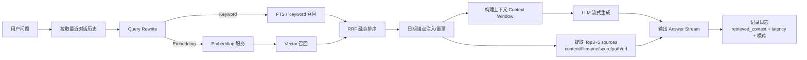

## Day14 2026-04-14 : 从「复读机」到「逻辑大脑」：让 RAG 既**找得准**，也**说得清** 🧠📚

### 日期与进度概览
- **日期**：2026 年 4 月 14 日
- **项目进度**：RAG 核心链路闭环（检索 → 融合 → 生成 → 证据链 → 日志）
- **关键词**：Hybrid Search（Vector + FTS）、RRF 融合、日期锚点、证据链（Citations）、可观测性（Observability）

---

## 1) 今日关键目标：让 AI 不止会答，更要“可验证” ✅
今天的工作核心不是让模型“能说”，而是让它具备两种工程级品质：

- **可检索（Retrievable）**：能稳定命中目标文档，而不是只在语义相似处打转。
- **可追溯（Traceable）**：每次回答都能给出清晰的证据链，让用户知道“依据是什么”。

这两个品质合在一起，才让系统从“像在聊天”升级为“像在思考”。

> 📌 **一句话总结**：RAG 的价值不只是“回答”，而是“可验证的回答”。

---

## 2) 技术突破：补上单路检索的“盲区” 🔎

### 2.1 混合检索：Vector + Keyword 双路召回
单纯向量检索擅长“语义相似”，但对“硬关键词、标题、编号、任务名”并不总是稳定；反过来，全文检索擅长“字面命中”，却容易错过同义改写。

因此采用 **双路并行召回**：
- **Vector 路**：处理同义改写、概念相近、表达松散的问题。
- **Keyword/FTS 路**：处理任务编号、标题词、精确短语、文件名线索等“硬事实”。

检索从“押题”变成“覆盖面更全的候选集生成”。

### 2.2 RRF 融合：用“排名共识”替代“单一分数迷信”
混合检索的关键不只是“两路都搜”，而是“如何合并”。今天采用 **RRF（Reciprocal Rank Fusion）**：不纠结两路分数的量纲差异，而是看排名共识，让“多路都靠前”的结果自然上浮。

核心逻辑（只保留核心公式）：

```python
def rrf(rank: int, k: int = 60) -> float:
    return 1.0 / (k + max(1, rank))
```

### 2.3 日期锚点：面向日记场景的“强约束命中” 🗓️
日记类内容有一个天然结构：**日期是主索引**。仅靠语义召回容易被“主题相近但日期不同”的内容干扰。

因此把日期线索当作“硬锚点”，在召回阶段优先注入与日期匹配的候选片段，确保面对“某天发生了什么”这类问题时能直达目标内容。

---

## 3) 证据链透明化：把“我认为”变成“我依据” 🧾

### 3.1 为什么证据链是 RAG 的必选项
没有证据链，RAG 容易退化成：
- 模型凭经验补全（幻觉风险）
- 用户无法验证（信任成本高）
- 开发无法排障（不知道检索对不对、哪里拖慢）

因此在回答完成后输出一个结构化 **sources** 列表（Top 3~5），每条至少包含：
- `content/snippet`：片段摘要（便于快速预览）
- `filename`：来源文件名
- `score`：融合后的最终得分
- `url/path`：可定位原文的位置或链接

这让“回答质量”从主观体验变成可以被客观检查的事实。

### 3.2 可观测性：把一次对话拆成可量化的流水线 📈
把一次请求拆解为多个阶段（历史、改写、Embedding、检索、生成），记录耗时与检索模式（例如 hybrid / keyword-only）。

价值在于：当体验变差时不再靠猜，而是能快速定位瓶颈与退化原因。

---

## 4) 架构体会：Python 与 TypeScript 的职责边界更清晰 🧩
今天进一步确认了一个适合个人博客的“双螺旋分工”：

- **后端（Python）**：检索权威（Embedding/Chunking/Retrieval/Rerank/Logs），保证一致性与可观测性。
- **前端（TypeScript/Next）**：体验权威（流式渲染、引用卡片、水墨风交互、会话态），把“可用”变成“好用”。

职责边界清晰后，迭代会更快：后端专注“更准”，前端专注“更懂用户”。

---

## 5) 今日反思与结论 ✍️
- **RAG 不是“把文档塞进库”**，而是对信息做二次调度：召回、融合、约束、解释与记录缺一不可。
- **Query Rewrite + 历史上下文**让检索从“单轮问答”升级到“对话理解”，把用户口中的“那个任务/那篇文章”变得可定位。
- **证据链**不仅服务用户，也服务开发者：它把“答案是否可信”变成一眼可见的工程事实。

---

## 工程改进示意图（检索与证据链闭环） 🗺️



---