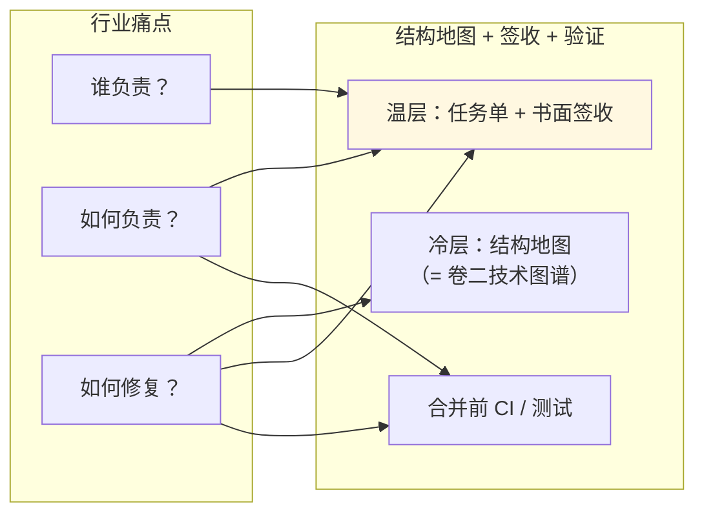
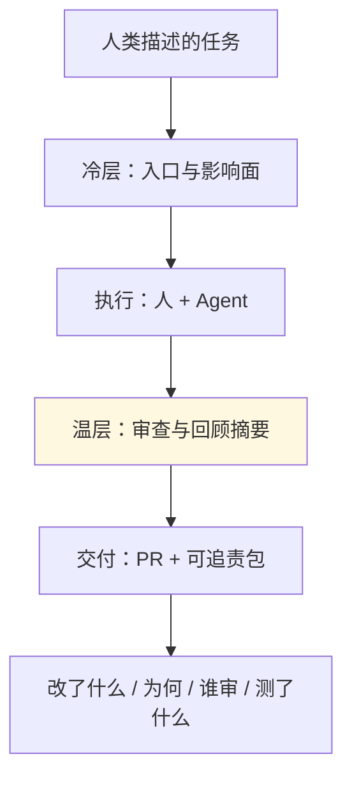
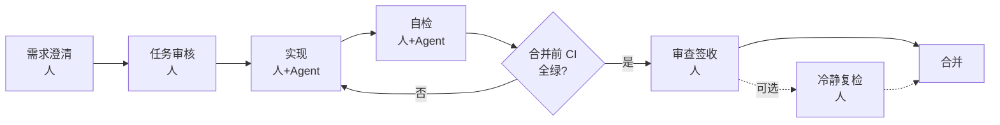
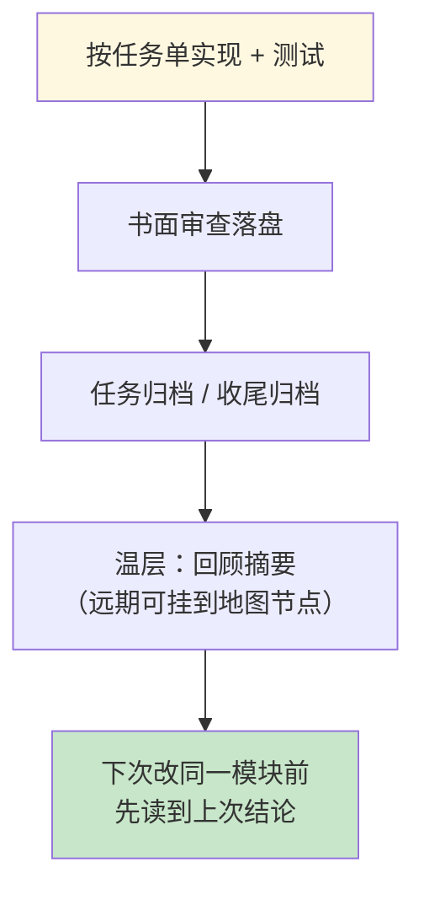
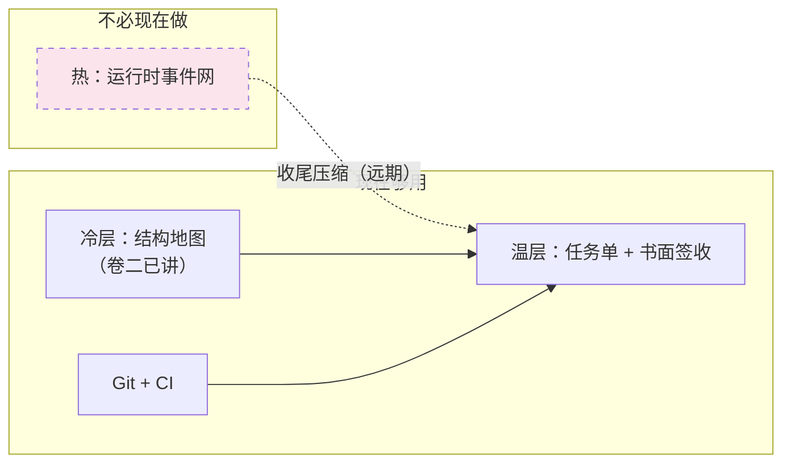
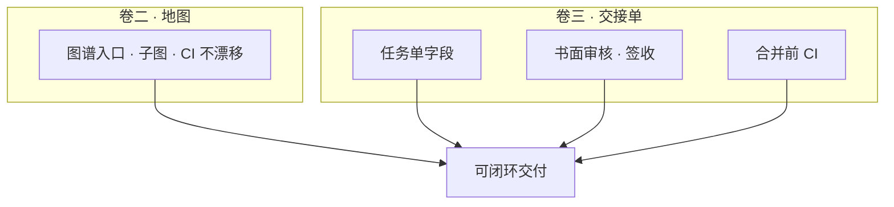

<blockquote>
<p><strong>2026-05-30</strong> · 系列《AI 编程可闭环协作》卷三 · Harness 与 SDD——让改动可签收、可合并 <strong>系列文稿（Markdown）</strong>：<a href="https://github.com/Cyning12/ai-coding-closed-loop-articles">github.com/Cyning12/ai-coding-closed-loop-articles</a> <strong>阅读顺序</strong>：建议先读<a href="https://cloud.tencent.com/developer/article/2675471">卷一</a>「怎样才算做完」，再读<a href="https://cloud.tencent.com/developer/article/2676250">卷二</a>「技术图谱」，再读本篇。</p>
</blockquote>
<hr />

<blockquote>
<h2><strong>目录</strong></h2>
</blockquote>
<div class="md-table-wrap">
<table>
<thead><tr>
<th>节</th>
<th>标题</th>
</tr></thead>
<tbody>
<tr>
<td>—</td>
<td>摘要</td>
</tr>
<tr>
<td><strong>11</strong></td>
<td>任务单最少写什么</td>
</tr>
<tr>
<td><strong>12</strong></td>
<td>审查与签收</td>
</tr>
<tr>
<td><strong>13</strong></td>
<td>SDD 阶段流</td>
</tr>
<tr>
<td><strong>14</strong></td>
<td>半自动协作</td>
</tr>
<tr>
<td><strong>15</strong></td>
<td>存量 / 无 CI 降级</td>
</tr>
<tr>
<td><strong>16</strong></td>
<td>结语</td>
</tr>
</tbody>
</table></div>
<hr />

<blockquote>
<h2><strong>摘要</strong></h2>
</blockquote>
若你还没读过 **卷一** 与 **卷二**，建议先看——卷一讲 **图谱 + 协作流程** 如何叠放；卷二讲 Agent **先看地图再动手**。

**本卷只展开过程这一轨**：任务单最少写什么、为什么 **书面审查 / 签收** 不可省、**规格驱动（SDD）** 阶段如何从澄清走到合并、以及 **半自动协作** 的边界。

卷二解决「改哪里」；卷三解决「何时算做完、谁签字、凭什么合并」。**有地图没签收，照样不敢合并。**

本卷还回答一个行业难题：**用 AI 写代码，谁负责、如何证明尽到了注意义务、出问题从哪修**——答案不在更大的模型里，而在 **任务单 + 书面签收 + 合并前自动检查** 组成的 **可追责轨迹**（下文 §12.8）。

收尾后的经验沉淀在 **卷四**；**冷/温/热分层用语在本卷首次引入**；本卷聚焦 **温层里的签收纪律** 与日常默认操作（分层对照表见 §11.2.1）。

<hr />

<blockquote>
<h2><strong>11. 任务单最少写什么：验收、非范围、失败路径</strong></h2>
<h3><strong>11.1 本节要回答什么</strong></h3>
</blockquote>
一轮需求 **开工前**，任务单里 **最少** 要有哪些内容，人和 Agent 才能对齐「什么叫做完」——而不是在聊天里各说各话。

<blockquote>
<h3><strong>11.2 Harness 是什么</strong></h3>
</blockquote>
**Harness 协作流程** 指：用 **可检索的任务单 + 书面审查 + 合并前自动检查**，把「聊过了」变成「交差了」。关键是 **字段与签收纪律**，不是多买一个工具。

它与卷一的三支柱对应：


<div class="md-table-wrap">
<table>
<thead><tr>
<th>支柱</th>
<th>任务单里体现什么</th>
</tr></thead>
<tbody>
<tr>
<td><strong>告知</strong></td>
<td>背景、范围、图谱入口、依赖说明</td>
</tr>
<tr>
<td><strong>约束</strong></td>
<td>非范围、失败路径、测试策略</td>
</tr>
<tr>
<td><strong>验证</strong></td>
<td>验收清单里的 <strong>合并前必绿</strong> + 自检命令</td>
</tr>
</tbody>
</table></div>
<blockquote>
<h3><strong>11.2.1 图谱入口与冷/温/热分层（本卷用语 · 衔接卷二）</strong></h3>
</blockquote>
**分层用语在本卷首次出现**：卷一、卷二已分别讲 **结构（技术图谱）** 与 **过程骨架**，但正文 **未使用「冷层 / 温层 / 热层」** 命名。下表是把前文 **对照收拢** 的简称。


<div class="md-table-wrap">
<table>
<thead><tr>
<th>层</th>
<th>是什么</th>
<th>与已读前卷的关系</th>
<th>本卷落点</th>
</tr></thead>
<tbody>
<tr>
<td><strong>冷层</strong></td>
<td>不常变的 <strong>结构地图</strong></td>
<td><strong>对应卷二的技术图谱</strong>（卷二称「地图」「子图」「图谱入口」）</td>
<td>任务单里的 <strong>图谱入口</strong></td>
</tr>
<tr>
<td><strong>温层</strong></td>
<td><strong>协作轨迹</strong>：任务单 + 书面签收 + 回顾摘要</td>
<td>卷一过程轨 + <strong>本卷主体</strong></td>
<td>§11–§14</td>
</tr>
<tr>
<td><strong>热层</strong></td>
<td><strong>运行时事件</strong>记忆（远期、非日常必做）</td>
<td>前卷未展开</td>
<td>§14.8 划界；完整愿景另有单独篇章详细介绍。</td>
</tr>
</tbody>
</table></div>
若你已读过卷二，可把那里的 **技术图谱** 理解为 **冷层** 的落点：回答 **改哪里、从哪进、会影响谁**。任务单里的 **图谱入口** 一行，就是让 Agent 开工前先 **挂到地图上**，而不是在全仓库里乱搜。

**冷层只管结构**，不管「上次为何定这个阈值」——那是 **温层** 里回顾摘要的事（§13.7、卷四）。二者别混：有地图没签收，仍不敢合并。

<blockquote>
<p><strong>与卷五的关系</strong>：冷/温/热的 <strong>完整定义</strong> 与「<strong>不是</strong> 架构三层」纠偏，见 <strong>卷五 §23.1</strong>（<strong>以卷五为准</strong>；本节仅为本卷协作记忆分层简称）。</p>
<h3><strong>11.3 与卷一的关系</strong></h3>
</blockquote>
卷一 §3 用 **意图 / 成果 / 验收** 描述一轮交付；卷一 §6 给了最小起步示例。卷三把三要素 **落到可执行字段**：


<div class="md-table-wrap">
<table>
<thead><tr>
<th>卷一要素</th>
<th>任务单里对应什么</th>
</tr></thead>
<tbody>
<tr>
<td><strong>意图</strong></td>
<td>背景与目标 + <strong>非范围</strong></td>
</tr>
<tr>
<td><strong>成果</strong></td>
<td>范围清单 +（建议）<strong>图谱入口</strong>（卷二 §8.3）</td>
</tr>
<tr>
<td><strong>验收</strong></td>
<td>可勾选清单 + <strong>测试策略</strong> + <strong>合并前自动检查</strong></td>
</tr>
</tbody>
</table></div>
<blockquote>
<h3><strong>11.4 最少字段表</strong></h3>
</blockquote>
任务单开工前，至少建议写清下面几项（名称可按团队习惯调整）：


<div class="md-table-wrap">
<table>
<thead><tr>
<th>项目</th>
<th>是什么</th>
<th>举例</th>
</tr></thead>
<tbody>
<tr>
<td><strong>验收清单</strong></td>
<td>可勾选的完成条件</td>
<td>「PR 上单测 workflow 全绿」；「错误验证码返回 401」</td>
</tr>
<tr>
<td><strong>非范围</strong></td>
<td>本轮 <strong>明确不做</strong> 的事</td>
<td>「不改短信登录」</td>
</tr>
<tr>
<td><strong>失败路径</strong></td>
<td>出错时系统 <strong>应如何表现</strong></td>
<td>「库不可用 → 500 + 可重试提示」</td>
</tr>
<tr>
<td><strong>测试策略</strong></td>
<td>关键路径是否 <strong>先写失败测试</strong></td>
<td>见 §11.5</td>
</tr>
<tr>
<td><strong>图谱入口</strong>（建议）</td>
<td>先读哪张主图/子图</td>
<td>「从登录子图进入」</td>
</tr>
</tbody>
</table></div>
**失败路径** 建议表格式，每行：**触发 → 行为（含状态码）→ 可否重试 → 用户可见类型**；可选加 **可测场景编号** 列（如 `auth-invalid-code`），与单测或验收命令互链。缺这一节，Agent 容易只写 happy path。

<blockquote>
<h3><strong>11.5 测试策略：写清档位，而非口号式 TDD</strong></h3>
</blockquote>
<div class="md-table-wrap">
<table>
<thead><tr>
<th>档位</th>
<th>含义</th>
<th>适用</th>
</tr></thead>
<tbody>
<tr>
<td><strong>必须自动化</strong></td>
<td>先 <strong>可失败</strong> 的测试，再改实现；自检附命令与通过证明</td>
<td>鉴权、对外契约、流式背压、核心回归</td>
</tr>
<tr>
<td><strong>建议有测</strong></td>
<td>鼓励补测；验收以命令 + 人工为主</td>
<td>一般功能</td>
</tr>
<tr>
<td><strong>不适用</strong></td>
<td><strong>一行理由</strong></td>
<td>纯文档、无行为变更</td>
</tr>
</tbody>
</table></div>
一人团队可对普通功能选「建议有测」，但 **鉴权、对外 API** 仍建议「必须自动化」。

**Harness 整体是 SDD + 验证**，不是要求每个 task 都走 strict red-green。多数 **纯文档、无行为变更** 的任务可选「不适用」——**整体安全网仍是合并前 CI 全量回归绿**；在鉴权、对外契约等 **关键点** 再用「必须自动化」把行为钉住。

「必须自动化」只应用于 **少数高风险路径**。日常更常见的是：**失败路径写清楚 → 实现时同 PR 补测 → CI 回归绿 → 自检贴命令输出**（「建议有测」档）。纯函数、权限闸门、已知 bug 回归，才更值得 **先写失败测试再改实现**。

<blockquote>
<h3><strong>11.6 合并前必绿</strong></h3>
</blockquote>
验收清单建议 **固定一条** 与 CI 对齐，例如：

- 后端：`pytest`（或 PR 上等价 workflow）全绿  
- 前端：`lint` + `test` + `build` 全绿

**本地命令与 PR workflow 一致**，避免「我机器过了、流水线没过」。

笔者在 **示例后端 API 项目** 中已落地：任务模板强制该条；**任务审核** 在开工前核对字段是否齐全（2026-05，收尾专题 PR #90）。你的仓库可从卷一 §6 模板加一行「合并前命令」起步。

<blockquote>
<h3><strong>11.7 扩展示例：验证码登录（延续卷一 §6）</strong></h3>
</blockquote>
<div class="md-table-wrap">
<table>
<thead><tr>
<th>要素</th>
<th>内容</th>
</tr></thead>
<tbody>
<tr>
<td><strong>非范围</strong></td>
<td>不改短信登录；不调整会话 TTL</td>
</tr>
<tr>
<td><strong>失败路径</strong></td>
<td>验证码错误 → 401；过期 → 401 + 提示刷新</td>
</tr>
<tr>
<td><strong>测试策略</strong></td>
<td>必须自动化：<code>TestLoginWithCaptcha</code> 等</td>
</tr>
<tr>
<td><strong>验收</strong></td>
<td>单测绿 + CI 绿 + 审查签收</td>
</tr>
</tbody>
</table></div>
<blockquote>
<h3><strong>11.8 可复制任务单骨架（在卷一模板上增补）</strong></h3>
</blockquote>
```markdown
## 任务单：<动词 + 范围>

### 验收清单
- [ ] <功能验收 1>
- [ ] PR 上单测 / 构建 workflow 全绿（本地等价：<你的命令>；尚无 CI 时改用手动命令，输出贴进签收记录，见 §15）

### 非范围
- <明确不做的事>

### 失败路径
| 可测场景编号（可选） | 触发 | 行为 | 可重试 | 用户可见 |
| --- | --- | --- | --- | --- |
| auth-invalid-code | <例：验证码错误> | 401 | 否 | 提示刷新 |

### 测试策略
- 必须自动化 / 建议有测 / 不适用（理由一行）

### 图谱入口（可选）
- 子图：<你的流程图文件名>
```

<blockquote>
<p>💡 <strong>常见疑问</strong> - <strong>和 Jira / 飞书工单有什么区别？</strong> → 工单管 <strong>产品沟通</strong>；任务单管 <strong>工程交付</strong>。叠加使用，不互相替代。 - <strong>一人团队也要写吗？</strong> → 可以短，但 <strong>验收 + 非范围 + 失败路径</strong> 不可省——否则无法核对 Agent 是否越界。 - <strong>是不是每个 task 都要 TDD？</strong> → <strong>否</strong>。写清测试策略档位 + <strong>合并前 CI 回归</strong> 是底网；只有鉴权、对外契约等关键点才用「必须自动化」<strong>先失败测例再改实现</strong>。</p>
</blockquote>
<hr />

<blockquote>
<h2><strong>12. 审查与签收：书面记录为什么不可省</strong></h2>
<h3><strong>12.1 本节要回答什么</strong></h3>
</blockquote>
为什么「聊过了」「LGTM」**不等于** 可以合并。

<blockquote>
<h3><strong>12.2 反模式</strong></h3>
</blockquote>
<div class="md-table-wrap">
<table>
<thead><tr>
<th>做法</th>
<th>问题</th>
</tr></thead>
<tbody>
<tr>
<td>口头 Review</td>
<td>换人、换模型后 <strong>不可检索</strong></td>
</tr>
<tr>
<td>聊天里「过了」</td>
<td>无对照 <strong>验收条</strong> 的证据</td>
</tr>
<tr>
<td>无记录合并</td>
<td>出事无法回答「谁批准、依据是什么」</td>
</tr>
</tbody>
</table></div>
<blockquote>
<h3><strong>12.3 两类书面记录</strong></h3>
</blockquote>
<div class="md-table-wrap">
<table>
<thead><tr>
<th>记录类型</th>
<th>何时</th>
<th>产出</th>
</tr></thead>
<tbody>
<tr>
<td><strong>任务审核</strong></td>
<td>实现 <strong>开始前</strong></td>
<td>范围与字段是否齐全；缺项 <strong>阻塞开工</strong></td>
</tr>
<tr>
<td><strong>审查签收</strong></td>
<td>自检后、<strong>合并前</strong></td>
<td>对照 diff、CI、任务单的 <strong>结束本轮</strong> 结论</td>
</tr>
</tbody>
</table></div>
二者 **不替代** Code Review 看 diff，而是把结论 **落盘**。Agent **不能** 代你终局签收；**合并主干** 须人拍板。

<blockquote>
<h3><strong>12.4 任务审核审什么（清单思路）</strong></h3>
</blockquote>
实现开始前，审核人宜逐项核对（可写进半页审查记录）：

- 验收清单是否 **可观测**（能勾选、能跑命令）  
- **非范围** 是否非空  
- **失败路径** 是否至少一行、可操作  
- **测试策略** 是否与变更风险匹配；**改对外 API、路由或鉴权** 时 **不得** 选「不适用」（至少「建议有测」，高敏用「必须自动化」）  
- 是否含 **合并前必绿** 条

缺项 → **阻塞**，回到任务单补全后再审。**零阻塞** 也要写记录：写明「已核对哪些项、可进入实现」。

<blockquote>
<h3><strong>12.5 高敏变更：建议「独立复检」</strong></h3>
</blockquote>
改 **对外 API、流式协议、鉴权** 时，除审查签收外，建议 **独立复检**：只读 **diff 摘要、自检输出、验收表**，逐项 pass/fail（宜新开对话，或同对话换角色说明且只贴三件套，见 §14.5）。精神类似 **审查者与实现者分开**（全自动编排系统如 Ralph Loop 同样强调这一原则）——不必上封闭循环编排器，纪律写在任务单即可。

示例项目规则：**必须自动化** 且动到 API/契约的 task，收尾前须有独立复检书面记录（2026-05 落地）。

<blockquote>
<h3><strong>12.6 谁来做</strong></h3>
</blockquote>
<div class="md-table-wrap">
<table>
<thead><tr>
<th>场景</th>
<th>建议</th>
</tr></thead>
<tbody>
<tr>
<td>个人项目</td>
<td><strong>未来的你</strong>（隔日冷读）或同伴</td>
</tr>
<tr>
<td>团队</td>
<td>指定 Reviewer</td>
</tr>
</tbody>
</table></div>
<blockquote>
<h3><strong>12.7 与 Code Review 的关系</strong></h3>
</blockquote>
Review 看代码质量；协作流程额外要求：**对照任务单 + CI + 留签收**。卷一 §4 的分工不变；本卷强调 **结论可检索**。

<blockquote>
<h3><strong>12.8 更深一层：谁负责、如何负责、如何修复</strong></h3>
</blockquote>
用 AI 辅助研发后，合并变快了，复盘却常变难。许多团队卡在三问上：


<div class="md-table-wrap">
<table>
<thead><tr>
<th>难题</th>
<th>核心问题</th>
<th>没有结构时会怎样</th>
</tr></thead>
<tbody>
<tr>
<td><strong>谁负责</strong></td>
<td>这行代码、这条决策算谁的</td>
<td>只有聊天；Git 作者是 Agent；说不清谁批准</td>
</tr>
<tr>
<td><strong>如何负责</strong></td>
<td>凭什么说「该做的都做了」</td>
<td>说不清验收口径、测没测、有没有越界</td>
</tr>
<tr>
<td><strong>如何修复</strong></td>
<td>CI 或线上红了，从哪切入</td>
<td>不知道动过哪些模块、当时为何那样改</td>
</tr>
</tbody>
</table></div>
这三件事，本质是 **归因 → 尽职 → 修复路径**。单靠模型变强解决不了；需要 **外置、可读、可核对** 的轨迹——笔者称之为 **白盒轨迹**（交付过程与依据应尽量完全可读、可核对，**不依赖**模型内部状态）：模型某一步怎么想仍可能说不清，但 **谁批准、按什么规格、测了什么** 应留在白盒里。

<!-- 图 1：流程图 #1 -->



<div class="md-table-wrap">
<table>
<thead><tr>
<th>三问</th>
<th>本卷 + 卷二怎么补</th>
</tr></thead>
<tbody>
<tr>
<td><strong>谁负责</strong></td>
<td><strong>人</strong> 在审查签收上拍板；Agent 是工具，不是责任主体</td>
</tr>
<tr>
<td><strong>如何负责</strong></td>
<td>任务单字段齐全 + 任务审核记录 + <strong>合并前必绿</strong></td>
</tr>
<tr>
<td><strong>如何修复</strong></td>
<td><strong>卷二结构地图</strong>（本卷称冷层）定位模块与影响面；<strong>温层</strong> 查上次回顾摘要；<strong>Git</strong> 看 diff；<strong>CI</strong> 看哪条测试红</td>
</tr>
</tbody>
</table></div>
<blockquote>
<h3><strong>12.9 可追责包：交付物不止是 PR</strong></h3>
</blockquote>
理想情况下，一轮交付除了 **PR / 代码 / 测试结果**，还应能 **一键追到依据**：


<div class="md-table-wrap">
<table>
<thead><tr>
<th>依据项</th>
<th>是什么</th>
</tr></thead>
<tbody>
<tr>
<td>任务单</td>
<td>验收、非范围、失败路径</td>
</tr>
<tr>
<td>书面审查</td>
<td>开工前审核 + 合并前签收</td>
</tr>
<tr>
<td>结构地图</td>
<td>本轮改动的入口与影响面（<strong>卷二技术图谱</strong>；本卷分层里称冷层）</td>
</tr>
<tr>
<td>版本记录</td>
<td>提交历史与合并记录</td>
</tr>
<tr>
<td>机器验收</td>
<td>CI / 单测日志</td>
</tr>
</tbody>
</table></div>
<!-- 图 2：流程图 #2 -->



**卷二给结构地图，卷三给签字依据**——叠在一起，才谈得上「敢用 AI 规模化改代码」。验收口径在 **任务单（温层）**；**结构地图** 见卷二（本卷分层里称 **冷层**）。**热层**（运行时事件网）面向长跑与在线系统，团队内部 AI 编程现阶段通常 **不必做**（§14.8）。

<blockquote>
<p>💡 <strong>常见疑问</strong> - <strong>Agent 写的代码，出现事故谁负责谁解决？</strong> → 算 <strong>签收合并的人与组织</strong>；Agent 是执行工具。所以 <strong>书面签收不可省</strong>，也不是形式主义。 - <strong>可追责包能消除模型黑盒吗？</strong> → 不能逐 token 解释模型；但能证明 <strong>按什么规格、谁批准、测了什么</strong>——这在工程与合规上通常才是「负责」的主战场。</p>
</blockquote>
<hr />

<blockquote>
<h2><strong>13. SDD 阶段流：从需求澄清到合并</strong></h2>
<h3><strong>13.1 本节要回答什么</strong></h3>
</blockquote>
卷一 §2.2 **阶段骨架** 如何变成 **可执行流水线**。

<blockquote>
<h3><strong>13.2 阶段图</strong></h3>
</blockquote>
<!-- 图 3：13.2 阶段图 -->



<blockquote>
<h3><strong>13.3 阶段表</strong></h3>
</blockquote>
<div class="md-table-wrap">
<table>
<thead><tr>
<th>阶段</th>
<th>主要谁</th>
<th>产出</th>
<th>图谱 / CI</th>
</tr></thead>
<tbody>
<tr>
<td>需求澄清</td>
<td>人 + Agent 辅助</td>
<td>任务单初稿</td>
<td>可选：主图/子图入口</td>
</tr>
<tr>
<td>任务审核</td>
<td>人</td>
<td>书面审核结论</td>
<td>核对 §11 字段</td>
</tr>
<tr>
<td>实现</td>
<td>人 + Agent</td>
<td>代码、文档</td>
<td>按 §11.5：<strong>必须自动化</strong> 时先有可失败测例再改实现；<strong>建议有测</strong> 时同 PR 补测；按入口改图（卷二）</td>
</tr>
<tr>
<td>自检</td>
<td>执行者</td>
<td>命令输出 + 验收摘要</td>
<td>本地或 CI 预跑</td>
</tr>
<tr>
<td>合并前 CI</td>
<td>机器</td>
<td>workflow 全绿</td>
<td>单测、lint、图谱门禁等</td>
</tr>
<tr>
<td>审查签收</td>
<td>人</td>
<td>签收记录</td>
<td>CI 绿 + 任务单勾选</td>
</tr>
<tr>
<td>合并</td>
<td>人</td>
<td>进主干</td>
<td>—</td>
</tr>
<tr>
<td>（可选）冷静复检</td>
<td>独立视角</td>
<td>隔日复核</td>
<td>高敏建议</td>
</tr>
</tbody>
</table></div>
<blockquote>
<h3><strong>13.4 SDD 一句</strong></h3>
</blockquote>
**规格驱动**：先写清 **验收与边界**（任务单 ± SPEC），再让 Agent 改实现——代码是规格的可执行表达。

<blockquote>
<h3><strong>13.5 机器与人</strong></h3>
</blockquote>
<div class="md-table-wrap">
<table>
<thead><tr>
<th>角色</th>
<th>管什么</th>
</tr></thead>
<tbody>
<tr>
<td>CI / 单测</td>
<td><strong>行为不漂移</strong></td>
</tr>
<tr>
<td>图谱门禁（若有）</td>
<td>流程图、入口清单与代码 <strong>大致一致</strong>（卷二 §9.5）</td>
</tr>
<tr>
<td>人</td>
<td><strong>敢不敢合</strong></td>
</tr>
</tbody>
</table></div>
CI 绿了，仍要人看 **范围与风险**。

<blockquote>
<h3><strong>13.6 与卷一阶段骨架的对照</strong></h3>
</blockquote>
卷一文字版：

```text
需求澄清 → 任务审核 → 实现 → 自检 → [CI 全绿?] →（否，回实现）→ 审查签收 → 合并
```

本卷增补：**任务审核** 可阻塞实现；**独立复检** 为可选加强，不替代签收。

<blockquote>
<h3><strong>13.7 收尾后与「温层」（指针）</strong></h3>
</blockquote>
任务 **归档 / 收尾** 时留下的 **任务单终稿、审查记录、回顾摘要**，在分层愿景里属于 **温层——协作轨迹**：记的是 **「这次为何这样改、谁签收」**，**不必重画整张结构地图**（结构地图属冷层，即卷二技术图谱；只在模块连线真的变了时才更新，见卷二）。

<!-- 图 4：13.7 收尾后与「温层」（指针） -->



**卷四** 展开如何把回顾摘要蒸馏成 **经验卡片 / 编译摘要**，让下一轮 **少翻全文**；仍 **不替代** 卷二地图答「改哪里」。**热层**属远期场景，本卷不展开。

<hr />

<blockquote>
<h2><strong>14. 半自动协作：何时链式、何时必须人工闸</strong></h2>
<h3><strong>14.1 本节要回答什么</strong></h3>
</blockquote>
Agent 能否 **一条对话** 里连续写任务、改代码、跑自检？何时 **必须停** 等人？

<blockquote>
<h3><strong>14.2 半自动 ≠ 全自动</strong></h3>
</blockquote>
<div class="md-table-wrap">
<table>
<thead><tr>
<th>可以链式</th>
<th>仍须人做</th>
</tr></thead>
<tbody>
<tr>
<td>小改动：实现 → 自检 → 整理审核材料</td>
<td><strong>任务审核</strong> 终局</td>
</tr>
<tr>
<td>工具内切换「角色说明」</td>
<td><strong>审查签收</strong></td>
</tr>
<tr>
<td>自动跑测试、贴日志</td>
<td><strong>合并主干</strong></td>
</tr>
</tbody>
</table></div>
参考 **Ralph Loop** 一类全自动编排系统：**四步封闭循环**（规划→实现→审查→结束），机器可连续跑完一轮。

**笔者选型是签收型流程**：省重复填表，**不**省人的签收与合并责任。

<blockquote>
<h3><strong>14.3 人工闸</strong></h3>
</blockquote>
任务单可用 **「待批准 / 已批准」** 表标记关键决策；Agent 在「待批准」时 **应停止** 进入实现。


<div class="md-table-wrap">
<table>
<thead><tr>
<th>闸（示例名）</th>
<th>典型阻塞</th>
<th>谁改「已批准」</th>
</tr></thead>
<tbody>
<tr>
<td>初稿任务单</td>
<td>任务审核、实现</td>
<td>负责人（<strong>默认人</strong>）</td>
</tr>
<tr>
<td>审核后</td>
<td>实现</td>
<td>读过审核记录的人（默认人）</td>
</tr>
<tr>
<td>复检后（可选）</td>
<td>收尾、合并</td>
<td>Tech Lead</td>
</tr>
<tr>
<td>发布前（可选）</td>
<td>合入主干</td>
<td>维护者</td>
</tr>
</tbody>
</table></div>
**默认由人** 把「待批准」改为「已批准」——**未显式授权的 Agent 不得代填**。初期建议坚持默认由人改「已批准」：人工闸还没走顺时，不要让实现 Agent 自行批准。

进阶：在 **OpenClaw** 等带 **总调度权限** 的模式里，理论上可以给某一 Agent **书面授权** 代填「已批准」（须可审计：谁授权、何时、依据哪份审核记录）。闸走顺之后，加上有权限的签收代理通常很快；**阶段顺序与任务单字段不变**。笔者尚未在自家流程里完整落地这一层，但整条 SDD 流水线不必因此改写。

§13 阶段图里的「人」，文中均指 **默认执行者**；若使用已授权、留痕的签收代理，仍须满足上段的授权与审计要求。

<blockquote>
<p>💡 <strong>常见疑问</strong> - <strong>以后能让总调度 Agent 代点「已批准」吗？</strong> → 可以作为进阶，但须显式授权与留痕；<strong>默认仍建议人</strong>。流程不变，变的是 <strong>谁被授权点这一下</strong>。</p>
<h3><strong>14.4 何时开链式、何时关</strong></h3>
</blockquote>
<div class="md-table-wrap">
<table>
<thead><tr>
<th>类型</th>
<th>建议</th>
</tr></thead>
<tbody>
<tr>
<td>小 bug、文档、单文件</td>
<td>可 <strong>半自动</strong>；仍须终轮签收</td>
</tr>
<tr>
<td>跨模块、契约、架构</td>
<td><strong>强制人工闸</strong>；多轮任务审核</td>
</tr>
</tbody>
</table></div>
半自动省的是 **复制模板**；**不保证** 模型不越界——纪律来自任务单 + 书面记录。

<blockquote>
<h3><strong>14.5 换上下文（Fresh Context）纪律</strong></h3>
</blockquote>
任务审核、独立复检时，输入只保留：**任务单、审查记录摘要、diff 要点、自检输出**——**不要** 粘贴整段实现过程长文。交给审核或复检的「三件」：**改了什么、跑了什么命令、验收表结论**。这与「审查者不与实现者共用记忆」同一精神。

**新开对话** 是最稳的做法；**同一对话里换角色说明** 也可：阶段之间切换「写任务单 / 审核 / 实现 / 自检 / 独立复检」等提示词，到审核或复检环节 **只贴三件套、不贴实现长文**，即在单窗口里做 **逻辑上的 Fresh Context**（与 §14.7 默认路径一致）。

**极简示例**：粘贴 **任务单全文 + `git diff --stat`（或 diff 摘要）+ 自检命令输出** 三件套即可开始审核或复检。

<blockquote>
<h3><strong>14.6 与 Cursor / Claude Code 的关系</strong></h3>
</blockquote>
工具可连续对话；**流程** 来自任务单与签收习惯。换工具时，**意图 / 成果 / 验收** 字段应可迁移（卷一 §0）。

<blockquote>
<h3><strong>14.7 默认纪律：一个任务、一个对话、一个 PR</strong></h3>
</blockquote>
在 **任务单 + 地图 + 书面签收** 架构下，笔者推荐的 **默认路径** 是：

```text
一个进行中的任务 → 一个 Agent 对话窗口 → 一条审查与收尾链 → 一个 PR
```

**同一对话可串完整链**：从任务单 → 任务审核 → 实现 → 自检 → 审查签收 →（高敏可选）独立复检 → 归档。**不必** 为每个阶段另开 Agent 或另开窗口——阶段之间 **换帽 / 换角色说明** 即可（§14.5）。独立复检可在同窗口完成，前提是 **只审 diff/日志/验收表**，不共用实现过程记忆；高敏或上下文对不齐时，再另开对话。

<!-- 图 5：14.7 默认纪律：一个任务、一个对话、一个 PR -->


<div class="md-table-wrap">
<table>
<thead><tr>
<th>问题</th>
<th>建议</th>
</tr></thead>
<tbody>
<tr>
<td>同一任务开多个对话分工？</td>
<td><strong>避免</strong>——上下文分裂，收尾与可追责包会对不齐</td>
</tr>
<tr>
<td>两个无关任务同时要交？</td>
<td><strong>可以两个对话</strong>，但须 <strong>独立 Git 分支与工作目录</strong>，勿共用同一份 checkout</td>
</tr>
<tr>
<td>多 Agent 自动派活长跑？</td>
<td><strong>远期</strong>场景；与本节「一任务一 PR」不矛盾——那是编排器拆成 <strong>多个任务</strong></td>
</tr>
</tbody>
</table></div>
这与「用 AI 盯同事谁改了哪个文件」无关：**谁改了哪行** 看 **Git**；**是否符合任务范围** 看 **任务单与审查**；**改 A 影响谁** 看 **卷二地图**。

<blockquote>
<h3><strong>14.8 现阶段：冷 + 温已够支撑研发</strong></h3>
</blockquote>
若场景是 **团队内部用 AI 协作写代码**、尚无大量真实用户流量，**卷二结构地图（本卷称冷层）+ 本卷签收与任务单（温层）+ Git/CI** 通常已够，**不必** 为协作单独上「运行时事件记忆」：

<!-- 图 6：14.8 现阶段：冷 + 温已够支撑研发 -->



<hr />

<blockquote>
<h2><strong>15. 存量 / 无 CI：阶段流降级</strong></h2>
<h3><strong>15.1 本节要回答什么</strong></h3>
</blockquote>
老项目、**还没有 CI** 时，如何 **不降质地缩水**。

<blockquote>
<h3><strong>15.2 与卷一 §5 衔接</strong></h3>
</blockquote>
先补 **手动门禁**（命令写进任务单），再逐步上 CI。

<blockquote>
<h3><strong>15.3 降级对照</strong></h3>
</blockquote>
<div class="md-table-wrap">
<table>
<thead><tr>
<th>有 CI</th>
<th>无 CI 降级</th>
</tr></thead>
<tbody>
<tr>
<td>PR 上 pytest / lint 全绿</td>
<td>合并前 <strong>本地</strong> 跑同一命令，要点贴进 <strong>签收记录</strong></td>
</tr>
<tr>
<td>图谱 check workflow</td>
<td>合并前 <strong>手动</strong> export/check（命令写进任务单）</td>
</tr>
<tr>
<td>任务审核书面记录</td>
<td><strong>不可省</strong>；模板可缩短</td>
</tr>
<tr>
<td>独立复检</td>
<td>一人团队：合并后 issue / 日记自检</td>
</tr>
</tbody>
</table></div>
<blockquote>
<h3><strong>15.4 与产品工单叠加</strong></h3>
</blockquote>
任务单 = **工程交付** 依据；工单 = **产品沟通**。先 **一轮** 手动闭环，再补 CI。

<blockquote>
<h3><strong>15.5 领域结构检查（进阶）</strong></h3>
</blockquote>
除通用单测与图谱契约门外，可为 **高频错误响应、流式事件名** 等增加 **小脚本结构检查**，与 pytest 并列进 CI——思路类似「报告结构 Linter」：专查最容易出现结构偏差的 JSON/API 形状，域按你业务自定。

笔者在 **示例后端 API 项目** 中已落地首条：**结构化错误响应** 的必填字段由注册表 + 脚本校验（理论对齐 P1，PR #92），收尾复检 PR #93。你的仓库可从「一种最容易出现结构偏差的 JSON 形状」起步，不必一次做全。

<hr />

<blockquote>
<h2><strong>16. 结语</strong></h2>
</blockquote>
<!-- 图 7：16. 结语 -->



卷二给 **结构地图**（本卷分层里称 **冷层**）；卷三给 **签收纪律**（**温层**）。叠在一起，才适合 **Auto 模型、预算有限** 的日常里 **稳定合并**。

AI 编程要规模化，关键不只是让模型多写几行代码，而是 **每次交付都能回答：谁签的、依据什么、影响多大、怎么回滚**（§12.8）。先建好 **白盒轨迹的地基**，再谈把更多执行交给 AI——顺序反了，只会更快产出 **不敢合并、也不敢背锅** 的改动。

下一卷 **卷四**：展示 **一整轮专题从 SPEC 到归档** 的完整例子，以及收尾后 **温层摘要如何压缩成经验卡片**（仍不替代图谱与任务单）。冷/温/热完整愿景见独立篇（可选读；发表版链接待补）。

<hr />


*许可：CC BY 4.0 · 署名可转载与改编 · 系列文稿：[ai-coding-closed-loop-articles](https://github.com/Cyning12/ai-coding-closed-loop-articles)*
