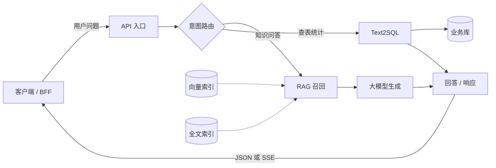
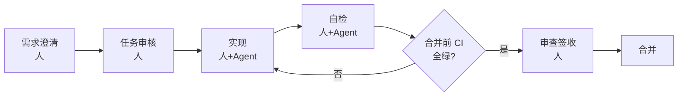
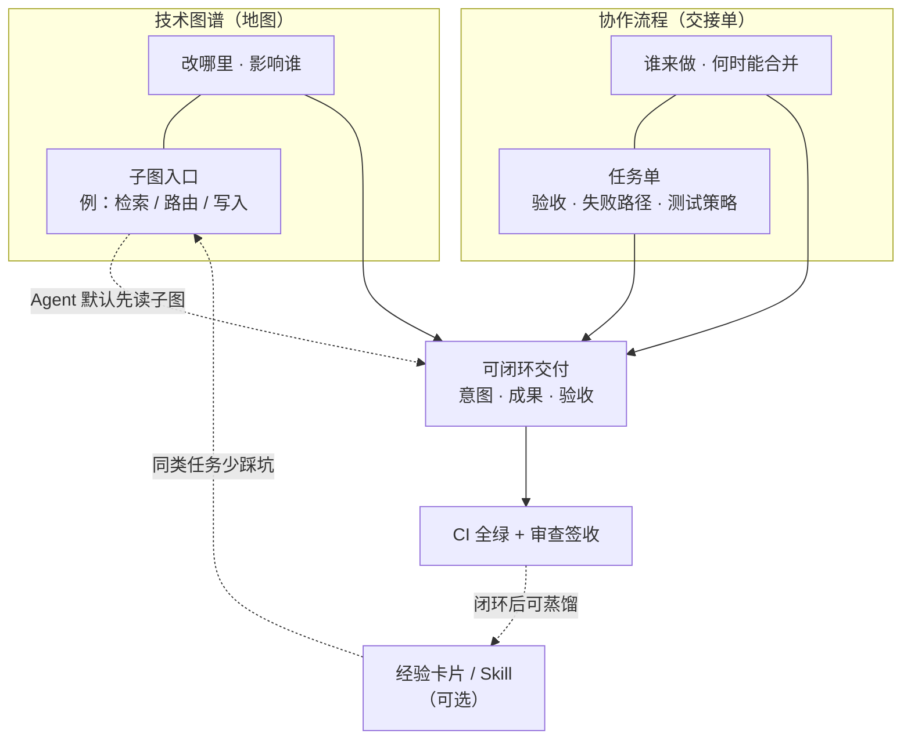

| 卷 | 副标题（连载） | 你得到什么 |
| --- | --- | --- |
| — | [从「更会写」到「敢合并」](https://cloud.tencent.com/developer/article/2681553) | 从「更会写」到「敢合并」· 15 分钟导读 |
| [卷一](https://cloud.tencent.com/developer/article/2675471) | 怎样才算「做完」 | 动机、双轨总览、最小起步 |
| [卷二](https://cloud.tencent.com/developer/article/2676250) | 技术图谱 | 子图、读法对照、图谱 CI |
| [卷三](https://cloud.tencent.com/developer/article/2678669) | Harness 与 SDD | 实践 SDD 的 Harness 协作流程（任务单、签收、阶段流） |
| [卷四](https://cloud.tencent.com/developer/article/2680278) | 闭环交付与经验沉淀 | 专题流水线、跨轮回顾摘要 |
| [卷五](https://cloud.tencent.com/developer/article/2681115) | 存量怎么落地 | 案例机制、FAQ、阶段 0～3、诚实边界 |

## 目录

| 节 | 标题 |
| --- | --- |
| — | 摘要 |
| 0 | 缘起：个人约束与团队经验 |
| 1 | 为什么「会写代码」不等于「能交付」 |
| 2 | 两条轨：结构（图谱）与过程（协作流程） |
| | 2.1 技术图谱：让 Agent「先看地图再动手」 |
| | 2.2 协作流程：可签收、可合并 |
| | 2.3 叠放：缺一条都会「差点意思」 |
| 3 | 一轮交付怎样算「做完」：意图、成果、验收 |
| 4 | 与 TDD、Code Review、DevOps 的关系 |
| 5 | 适合谁、不适合谁 |
| 6 | 最小起步（给想试的读者） |
| 7 | 结语 |

---

## 摘要

AI 写代码的**交付质量**，往往不仅取决于模型，更取决于 **上下文是否够用**、**交付是否验得动**。  
本文介绍一套在真实项目里跑过的做法：**用技术图谱回答「改哪里、会影响谁」**，**用协作流程（Harness 类任务单流程）回答「谁来做、何时能合并」**——二者叠放，才能把一轮需求做成 **可闭环的交付**（有意图、有成果、有验收），而不是聊完即散。

---

## 0. 缘起：个人约束与团队经验

这套方法**不是**从「企业治理办公室」起意，而是两条线叠在一起：

**一条线：当下的个人约束**

> **个人 AI Coding 使用者，预算有限，必须在有限资源里把价值放到最大。**

日常主力是 **Cursor Pro**，实现阶段多用 **Auto 模式**——往往**不能**随时指定最强、最贵的模型；Auto 还会**在不同模型之间切换**。不能赌「这一次一定是顶配模型」，而要让**不同档位的模型**，在同一套框架里，尽量产出**可预期、可验收**的结果。

**另一条线：之前在团队里形成的习惯**

在团队里做过需求拆分、Code Review、合并前 CI、书面留痕——知道 **「聊完了」和「交差了」不是一回事**。回到个人项目后，没有现成的同事帮你兜底，这些习惯就化成：**任务单、审查签收、测试与流水线**——也就是后文说的 **协作流程（Harness）** 一侧；不是大厂专属流程，而是**把团队里管用的做法，缩成一个人也能执行的最小集**。

两条线合在一起，探索方向变成：

| 痛点（个人 + 延续团队习惯） | 方法上的回应（卷一总览） |
| --- | --- |
| 上下文贵、不能整仓灌 Prompt | **技术图谱 + 子图**：先给「地图」，少读无关文件 |
| Auto 换模型、输出风格飘 | **任务单 + 协作流程**：意图 / 成果 / 验收写死，不完全依赖模型脾气 |
| 一个人也要能说清「做完了」 | **闭环交付**：签收 + CI，而不是「感觉差不多了」 |
| 同类坑下次重讲一遍 | **（可选）经验卡片 / Skill**：闭环后蒸馏，不替代图谱与任务单 |

后面各卷是在真实仓库里的**落地、对照实验与归纳**；卷一先把「图谱 + 过程」为何叠放讲清。若你是 **Pro + Auto、预算敏感** 的独立开发者，又曾在团队里吃过「没留痕、没验收」的亏，可以把本文当作**个人约束 + 团队经验压缩版**的工程化总结。

日常主力仍是 **Cursor Pro（Auto）**；也曾用过 **Kimi Code**，近期在 **Claude Code** 上用同一套任务单试了几项任务，协作流程可复用。**工具会变，意图 / 成果 / 验收不变**——本文不绑某一品牌。

---

## 1. 为什么「会写代码」不等于「能交付」

很多团队已经习惯：自然语言描述需求 → Agent 改文件 → 人眼看 diff → 合并。  
问题在于：

| 常见痛点 | 根因（简化） |
| --- | --- |
| 改 A 漏 B，联调才发现 | Agent **不知道系统结构** 与依赖 |
| 同一需求反复解释 | **没有可复用的规格与任务依据**（SPEC、配置、任务单） |
| PR 能合但心里没底 | **缺少书面签收与自动化验收** |
| 对话很长、账单很高 | **整仓塞给模型**，无关文件太多 |

TDD、Code Review、CI 并没有过时；AI 加入后，缺的是 **面向 Agent 的结构化上下文** 和 **面向人的协作纪律**。  
这就是 **AI Coding 治理** 要补的块：不是再发明一套敏捷，而是让 **告知 · 约束 · 验证** 在 AI 场景下可执行（业内也常对应 Inform / Constrain / Verify）。

---

## 2. 两条轨：结构（图谱）与过程（协作流程）

### 2.1 技术图谱：让 Agent「先看地图再动手」

**技术图谱**（流程图 + 模块关系 + 契约清单）回答：

- 系统长什么样？
- 这次改动应从哪个入口看起？
- 可能影响哪些模块、接口、测试？

**示例：多模块 API 一条主链路（左→右为请求方向；可另存为 `.md` 改模块名）**



**怎么读这张图**

| 层次 | 是什么 | 本示例里对应什么 |
| --- | --- | --- |
| **主图** | 一张「鸟瞰」：模块怎么连、请求从哪进、从哪出 | **就是上图**——方块如 `RAG 召回`、`Text2SQL` 是**入口名**，不是实现细节 |
| **子图** | 单独一篇 `.md`，只展开主图里**某一个方块**内部的步骤、依赖、测试锚点 | 主图不画满细节；在子图标题或图注里写「详见 `10_flow_rag.md`」即可（文件名按你仓库约定） |

流向：**用户在左** → API 入口 → 意图路由分叉 → 各分支处理 → 右侧 **回答 / 响应** 回传客户端（回包节点不要误标成第二个「对话 API」）。

**Agent 怎么用它（举例）**

> 任务：**改 RAG 召回策略**（例如阈值、融合排序、降级路径）。  
> 做法：在主图上定位到 **`RAG 召回`** 这一格 → **只打开** 对应的子图（如 `10_flow_rag.md`）→ 在子图里做**关联性分析**：会动哪些函数、是否牵连向量/全文检索、要补哪些单测。  
> **不必**把主图 + 所有子图 + 整仓目录一次性塞进 Prompt。

可概括为：**主图定入口与边界，子图定这次改动的纵深**；从「要改的那一格」钻进去，比从仓库根目录乱翻更快，也更不容易漏关联。卷二会写子图怎么拆、怎么链回主图。

实践要点（与具体工具无关）：

- 图谱 **由人维护、由脚本导出**（若暂无导出脚本，**手动维护一张接口清单表格也可**，后续再自动化），避免手改一份 JSON 和 Mermaid 两套不一致；**初期可先画一张主图 + 一条子图**，再逐步补全；
- 关键改动可用 **对照验证**（例如影响面命中率、上下文 token；具体做法见卷二，此处仅提示可量化验证）评估「读图方式」是否值得推广。

对读者而言：图谱解决的是 **「别漂」**——减少幻觉和漏改，不替代写测试。初期图谱不必完美，**能从入口文件画出第一层依赖即可**。

### 2.2 Harness（协作流程 / 任务单流程）：让协作「可签收、可合并」

**Harness**（下文也称 **协作流程** 或 **任务单流程**）指一套 **工程化协作外壳**（名称可自定），核心是 **SDD（规格驱动开发）式的阶段流程** 与任务单纪律。

**示例：阶段骨架（人 / Agent / CI 分工细节见卷三）**



文字版（与上图一致；**冷静复检**可在「审查签收」与「合并」之间插入，卷三展开）：

```text
需求澄清 → 任务审核 → 实现 → 自检 → [合并前 CI 全绿?] →（否，回到实现）→ 审查签收 → 合并
```

各阶段「谁来做」的细化见 **卷三**；本卷先给骨架。

与日常研发概念的对应：

| 大家熟悉的事 | 协作流程里强调什么 |
| --- | --- |
| 需求 / SPEC | 写清验收与非范围 |
| Code Review | **书面审查** 落盘，终审 = 可以结束任务 |
| CI | **合并前必绿**，不是「聊过了就算」 |
| TDD / 单测 | 关键路径 **先能失败再改实现**（策略写在任务单里） |

协作流程解决的是 **「别乱合并」**——过程可追溯，不替代技术图谱。

### 2.3 叠放：缺一条都会「差点意思」

| 只有过程 | 只有图谱 |
| --- | --- |
| 知道怎么审、怎么测 | 知道改哪里、影响谁 |
| 仍可能改错范围、漏依赖 | 仍可能没签收、没 CI 就合并 |

**推荐叠放**：同一轮需求里，任务单同时引用 **规格 / 图谱入口 / 测试策略**；审查签收前对照 **审查记录 + CI +（如有）实验结论**。

---

## 3. 一轮交付怎样算「做完」：意图、成果、验收

对大众读者，一轮 **可闭环的交付**（也可称 **专题 / 一轮交付**）至少包含：

| 要素 | 一句话 |
| --- | --- |
| **意图** | 要达成什么、不做什么（需求或 SPEC + 边界） |
| **成果** | 可合并的代码、配置、文档、规则变更 |
| **验收** | 测试 / CI 通过 + 审查签收 + 关键结论可追溯 |

**示例：小需求如何填三要素（给登录加图片验证码）**

| 要素 | 示例内容 |
| --- | --- |
| **意图** | 支持图片验证码防暴力破解；不影响已有短信登录 |
| **成果** | `login` 增加校验；新增 `captcha`；配置 `captcha_ttl=300`；`api.yaml` 更新 |
| **验收** | 单测 `TestLoginWithCaptcha` 通过；错误验证码 curl 返回 401；CI 全绿；审查签收 |

研发功能与基础设施改造 **同一套骨架**：差别只在「意图」来自产品需求还是技术专题，验收证据里有没有额外的对照实验报告。

**可选第四步**：闭环后把教训蒸馏成 **半页以内的经验卡片** 或团队 Skill，服务下一同类任务——不替代图谱，也不替代任务单。例如：「缓存失效坑：改 A 必须清 B 缓存」——**一句话教训即可**。

---

## 4. 与 TDD、Code Review、DevOps 的关系

- **TDD**：仍负责「行为对不对」；协作流程负责「这次改动有没有测试策略、敢不敢合并」。  
- **Code Review**：协作流程把「聊过」变成 **可检索的审查记录**；图谱让 Reviewer 更快看影响面。  
- **CI/CD**：自动化验收的硬背压；Agent 自检不能代替流水线。  
- **Prompt / Rules / Skills**：偏 **个人与项目习惯**；协作流程 + 图谱偏 **团队可审计的交付**。可叠加，避免两套冲突流程。

---

## 5. 适合谁、不适合谁

**更适合**

- 多模块后端 / 全栈，依赖关系复杂；
- 已上 PR + CI，希望 AI 改动 **可审计**；
- 愿意维护 **一份活图谱**（不必一步到位，可从一条核心链路开始）。

**暂不强调**

- 一次性脚本、单文件作业；
- 没有 CI、也没有书面 Review 习惯的小团队（应先补自动化验收，再谈 AI 规模化）。

**诚实边界**（基于当前实践范围）

- 方法在 **已建模的图谱 + 有限范围对照评测** 上验证过，**不能** 直接宣称「任意仓库、任意语言开箱即用」；
- 换模型、换仓库应 **重新建立对照测试与评测记录**，再谈指标；
- 图谱与流程 **降低风险、提高可预测性**，不保证零事故。

**换句话说**：若你还没有为仓库画过 **第一张主图**、也没有跑通过一次完整的 **任务单 → 合并前检查 → 书面签收**，本文的方法对你来说仍是 **纸上谈兵**——请 **先从一条链路** 试通，不要试图在一两周内给全仓铺满图谱与流程。

若你**尚无 CI**，可先定合并前必须手动跑的命令（如 `npm test && npm run build`）作为**手动门禁**，写在任务单里，再逐步补流水线。

---

## 6. 最小起步（给想试的读者）

1. **选一条核心链路**（例如问答 API、登录、入库）画进技术图谱，接入导出校验（PR 改图则 CI 提醒）。  
2. **写第一份任务单**：复制下面模板，改标题与清单即可。  
3. **定合并前必跑命令**（lint / test / build），写进仓库说明。  
4. **跑通一轮**：需求 → 审核 → 实现 → 自检 → **CI 全绿** → 审查签收 → 合并。  
5. **（可选）** 闭环后写一张经验卡片：同类需求下次少踩坑；可放在仓库 `docs/experience/` 下，或你的个人笔记里。

> **提示**：实际执行中，你可能遇到 **图谱/契约检查 CI 变红**、**任务单被拒开工**、**独立复检打回** 等分支。本文先讲 **理想路径**；恢复策略与真实案例见 **卷三**（签收纪律）与 **卷四**（专题收尾 · 含契约/锚点 CI 主失败分支）。

**任务单模板示例（可复制）**

```markdown
## 任务单：增加验证码登录

### 验收清单
- [ ] 正确验证码能登录
- [ ] 错误验证码返回 401
- [ ] 验证码 5 分钟过期

### 失败路径
- [ ] 验证码为空 → 400
- [ ] 验证码已过期 → 400

### 测试策略
- 必测：`TestLoginWithCaptcha_Success` / `TestLoginWithCaptcha_Wrong`
- 不适用：性能压测（本期量小）

### 图谱入口
- 子图：`10_flow_login.md`（示例路径，按你仓库改）

### CI 门禁（自动检查，不通过则阻塞合并）
- [ ] lint 通过
- [ ] 单测通过
- [ ] 图谱/契约一致性校验（若仓库已配置）

### 合并前命令
- `npm run lint && npm test && npm run build`
```

---

## 7. 结语

### 卷一总览：图谱 + 协作流程叠放



**读图要点**：图谱给 **空间结构**（含子图，省上下文）；协作流程给 **时间与责任**（任务单 + CI 闸）；二者在「可闭环交付」汇合，最终以 **机器验收 + 人签收** 落锤。可选经验沉淀反哺下一轮子图阅读，**不替代** 图谱与 Harness。


AI Coding 的竞争力，越来越多来自 **「上下文工程 + 工程纪律」**，而不是多背几条 Prompt。  
**图谱** 让 Agent 像熟路司机一样看导航；**协作流程** 让团队像有交接单的工班一样交棒。  
两者叠好，一轮需求才能从「聊完了」变成 **「做完了，且说得清依据」**——这才是 AI 时代研发治理该瞄准的状态。

---
