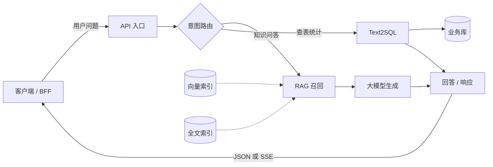
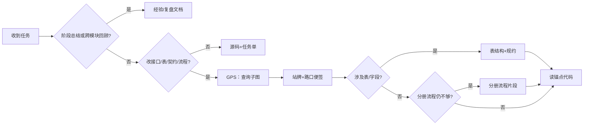

| 卷 | 副标题（连载） | 你得到什么 |
| --- | --- | --- |
| — | [从「更会写」到「敢合并」](https://cloud.tencent.com/developer/article/2681553) | 从「更会写」到「敢合并」· 15 分钟导读 |
| [卷一](https://cloud.tencent.com/developer/article/2675471) | 怎样才算「做完」 | 动机、双轨总览、最小起步 |
| [卷二](https://cloud.tencent.com/developer/article/2676250) | 技术图谱 | 子图、读法对照、图谱 CI |
| [卷三](https://cloud.tencent.com/developer/article/2678669) | Harness 与 SDD | 实践 SDD 的 Harness 协作流程（任务单、签收、阶段流） |
| [卷四](https://cloud.tencent.com/developer/article/2680278) | 闭环交付与经验沉淀 | 专题流水线、跨轮回顾摘要 |
| [卷五](https://cloud.tencent.com/developer/article/2681115) | 存量怎么落地 | 案例机制、FAQ、阶段 0～3、诚实边界 |

## 目录

| 节 | 标题 |
| --- | --- |
| — | 摘要 |
| 8 | 技术图谱是什么：流程图、依赖与契约 |
| 9 | Agent 默认怎么读图：对照与验收 |
| 10 | 结语 |

---

## 摘要

若你还没读过 **[卷一：怎样才算「做完」](https://cloud.tencent.com/developer/article/2675471)**，建议先看——那里讲清了 **图谱 + 协作流程** 如何叠放，以及「意图 / 成果 / 验收」怎样算一轮交付。

卷一也点过：**技术图谱** 负责回答 Agent「改哪里、会影响谁」。**本卷只展开图谱这一轨**：先 **认得仓库里有哪些图谱文件**（流程图、表结构说明、入口清单、机器总图等），再讲 **第一份图从哪来**（新项目 vs 老项目）、**流程图为何有 md / ai.md / json 三轨**、**Agent 默认怎么读**（查询子图 + 清单便签，而不是整仓灌 Mermaid）、**图谱相关 CI 门禁**在合并流程中的作用，以及 **怎样验证读图方式是否值得坚持**。协作流程与合并签收在 **卷三**；有地图没签收，照样不敢合并。

---

## 8. 技术图谱是什么：流程图、依赖与契约

卷一讲了主图、子图 **怎么用**。本节先回答三件事：**仓库里有哪些图谱文件、各自干什么** → **第一份图从哪来** → **Agent 默认怎么读**。不必先背文件名，下面命名只是笔者实践中使用示例，并非规范。

### 8.0 与卷一的衔接

卷一 §2.1 的 **主图 + 子图** 是本卷锚点。若你还没读过，先扫一眼卷一里的多模块 API 主链路示意，再读下文。

**公众版主图（与卷一同构，可另存改模块名）**




### 8.1 仓库里的技术图谱：先认「有哪些文件」

先不要想抽象方法论。技术图谱在工程上就是：**仓库里的一个专用文件夹**（例如 `docs/_tech_graph/`，名字可自定），里面放 **「帮 Agent 改代码用的地图与清单」**——不是产品 PRD 全文，也不是替代 README。

下面用 **通俗名** 介绍。**下表文件名为笔者项目中的命名，并不唯一**——你的团队可以自定目录名与编号规则，只要团队内一致即可。

#### 图谱夹里常见几类物件


| 通俗名            | 笔者项目中的文件名示例（不唯一）                    | 它到底是什么                                                             | 主要谁看               |
| -------------- | ----------------------------------- | ------------------------------------------------------------------ | ------------------ |
| **主流程图（人读）**   | `00_main.md`                        | **鸟瞰图**：用户请求从哪进、分几条业务大路                                            | 人（Review、讨论）       |
| **分册流程图（人读）**  | `10_flow_rag.md`                    | 主图上 **某一格**（如「RAG 召回」）展开成详细步骤                                      | 人                  |
| **流程图（导出用原稿）** | `00_main.ai.md`、`10_flow_rag.ai.md` | 与上 **同一套流程**，边、分支、**对应代码位置** 写得更规整，给脚本读                            | 人维护；脚本读            |
| **机器总图**       | `graph.json`                        | 把多篇「导出用原稿」**编译成一份总图**（节点、连线、代码锚点）；**不要手改这个文件**                     | Agent **查询**（见下）   |
| **表结构说明**      | `01_struct.md`                      | 数据库 **表/字段/关系**（常用类图表示）                                            | 改表、改向量维度时 **必翻**   |
| **入口清单**       | `_manifest.json`                    | **可从外部触发的功能入口索引**：API 项目常列路径与 handler；CLI/库/批处理可列命令、公开函数、模块入口与代码锚点 | 改路由、改入口、对照「从哪进代码」时 |
| **契约清单**（可选）   | `_contract_manifest.json`           | **跨服务约定**：如流式返回字段、错误码形状                                            | 改 BFF/前后端契约时       |
| **实现规约**       | `99_spec.md`                        | **环境变量、禁止编造、和代码一致的约束**                                             | 改配置、改关键路径前         |


**单独说清楚两个最容易懵的词：**

- **graph.json（机器总图）**  
不是让人逐字阅读的文档，而是 **「印刷好的大地图集」**：由 `*.ai.md` 经脚本 **导出** 得到。Agent 默认 **不会** 把整份 JSON 塞进对话（太大），而是 **按入口查一小段**——例如「从 RAG 这一节点往下 2 跳」（§8.4 叫 **查询子图**，§9 用 GPS 比喻）。  
**改图时**：改 `*.ai.md`（或先从 `*.md` 改起再同步），再重新导出；**不要** 直接改 `graph.json`。
- **01_struct（表结构说明）**  
就是 **「数据库地图」**：有哪些表、和业务流程怎么关联。  
**和 `graph.json` 不是一回事**；不能因为有了总图就删掉它。
- **入口清单 / 契约清单**（不同于机器总图）  
**机器总图** 描述 **流程与调用关系**；**入口清单** 描述 **有哪些对外的「门」**（不必是 HTTP）。可以想成：GPS 路网（总图） vs **公交站牌表**（入口清单） vs **路口规则**（契约清单）。

表结构、契约、机器总图可以 **第二步再补**。入门时先凑齐下面 **最小图谱夹** 即可开工。

#### 最小图谱夹示例（笔者项目 · 3 个文件）

### 8.2 第一份图谱从哪来？（新项目 vs 老项目）

读者常问：「我还没有图，第一张怎么画？」——**分新老项目，别一刀切。**

#### 新项目（推荐）


| 步   | 做法                                                            |
| --- | ------------------------------------------------------------- |
| 1   | 产品或技术方案里 **先画一页 Mermaid / 白板**：一条核心链路（用户 → API → 关键模块 → 回包）   |
| 2   | 工程落盘：**主图** + **一个分册**（人读 `.md`；习惯名如 `00_main` + `10_flow_*`） |
| 3   | 补 **入口清单**（表格或 JSON 均可）和 **表结构说明**（可后补）                       |
| 4   | 有脚本后：人读 `.md` 定稿后 **同步 `*.ai.md`** → **导出机器总图 `graph.json`**，并在 PR 上跑检查 |


**白话**：新仓 **先有小地图，再写代码**；不必等「全系统架构完美」。

#### 老项目 / 存量


| 情况                       | 第一份图怎么来                                |
| ------------------------ | -------------------------------------- |
| **有一点文档**（Wiki、旧架构图、接口表） | 文档定形状，**用代码入口与调用链核对**；文档当辅助，不当唯一依据     |
| **几乎没文档**                | **选一条能独立闭环的链路** → **从代码反推** 画主图 + 一篇子图 |
| **切忌**                   | 第一周铺全仓、所有历史模块一次画全                      |


**什么样的链路适合当「第一张」？**

- 有清晰 **HTTP / BFF 入口**（一个路由族即可）  
- 改完能用 **现有或刚补的少量单测** 验证  
- **先别选** 全局配置、横切中间件、多仓胶水

**反推怎么画（不写工具名也能做）**：从对外路由/handler 起笔 → 跟 2～3 层调用/表 → 主图 5～9 个方块 + 一篇子图。**第一版 70 分就够**；在真实 PR 里 **顺手改图 + 任务单验收** 迭代，不追求一次画准。

---

### 8.3 怎样选「第一条核心链路」画图

（在 §8.2 选定「画哪条」之后，用本 checklist 落笔。）


| 适合当试点            | 尽量先别选          |
| ---------------- | -------------- |
| 高频、有真实调用         | 一年改一次的边角模块     |
| 有基本单测或能补最小测试     | 完全无测试、一改就恐     |
| 依赖面可控（约 3～7 个节点） | 十条链路同时开图       |
| PR 愿意顺手改图        | 「图归架构组、业务从不维护」 |


1. 写下链路名（例：「AI 问答」「登录」「入库」）。
2. 画 **主图** 一页：左进右出，分叉写清。
3. 选 **一个** 最常改的分支，拆 **分册子图** 一篇。
4. 任务单写 **图谱入口**：主图 + 子图路径。
5. 合并前跑通卷一 §6 的合并前命令（按栈改）。

---

### 8.4 「子图」一词：分册文档 vs 查询裁切

「子图」在协作里有两层意思，**都对，别混**：


| 含义                 | 是什么                                               | 例子                                       |
| ------------------ | ------------------------------------------------- | ---------------------------------------- |
| **分册子图（写作）**       | 主图上一格展开的 **详细流程图文件**                              | `10_flow_rag.md` / `10_flow_rag.ai.md`   |
| **查询子图（Agent 默认）** | 从 `graph.json` 用「从某入口往下/往上几跳」**裁出来的一小块 JSON** | **不是** 把整份 `10_flow_rag.ai.md` 贴进 Prompt |


卷一说「打开 RAG 子图」多指 **分册**；**推荐 Agent 默认**用的是 **查询子图**（更省上下文，实验里称 **查询子图轨**，下文 §9.2）。

**不要整仓灌给 Agent**：整目录 + 整文件 `graph.json` + 所有 flow 全文 → 贵、噪声大、仍可能漏关联。


| 推荐                                   | 避免                   |
| ------------------------------------ | -------------------- |
| 任务单写明入口；**查询裁切** + 按需 **接口/契约清单** 切片 | 默认整包 Mermaid、整图 JSON |


**故事线（续卷一）**：改 RAG 召回策略 → 主图定位 `RAG 召回` → **查询子图**（或打开分册对照）→ 看契约/测试锚点 → 改代码。

---

### 8.5 与架构图、C4、ADR 的分工


| 资产               | 典型用途        | 与技术图谱关系                          |
| ---------------- | ----------- | -------------------------------- |
| **架构分层图 / 部署图**（如 C4：从系统边界到容器、组件的分层画法） | 给人讲边界、运维 | 图谱引用即可，**不重复画一遍** |
| **ADR / 架构决策记录** | 记录「为什么这样设计」 | 任务单链 ADR；Agent 读图谱 + 必要时读 ADR 摘要 |
| **Wiki / 需求文档**  | 产品语义        | **薄层叠加**：图谱不写 PRD 全文，只写工程入口与依赖   |


**技术图谱**（本篇主题）：给 Agent **改代码时的导航与影响面**——入口、流程、入口清单、表结构等（见 §8.1）。与 Wiki、ADR **并存**：产品语义在 Wiki，设计理由在 ADR，**动实现时优先更新图谱**。

---

### 8.6 存量仓库：图谱不求全仓


| 阶段    | 做什么                            |
| ----- | ------------------------------ |
| **0** | 一张主图 + 一条分册子图 + 一张接口/表清单（表格即可） |
| **1** | PR 触及该链路时 **顺手改图**             |
| **2** | 入口清单 + 导出脚本 + CI：防地图过期、防手改总图   |
| **3** | 对照验证读图方式（§9，进阶）                |


勿追求第一周全仓数字孪生；卷五将专讲 **存量渐进落地**。

---

## 9. Agent 默认怎么读图：对照与验收

### 9.1 为什么要谈「读图方式」

画了图 ≠ Agent 真会用。团队需要约定：**默认给模型看什么**——否则有人整仓贴 Mermaid，有人只给目录树，结果不可比、也难验收。

### 9.2 三种读法（通俗对照）

把仓库里的总地图想成 **一本厚地图册**（导出后的 `graph.json`，**不默认背整本**）：


| 读法                      | 好比                       | 说明                                                            |
| ----------------------- | ------------------------ | ------------------------------------------------------------- |
| **整包 Mermaid**          | 把整本图册复印进 Prompt          | token 极大；**已不再作为默认方式**                                           |
| **精选 Markdown 原文**      | 复印与本题相关的两三章说明书           | 实验 **对照臂**：配对 `*.ai.md` + `*.md` 片段；人读友好，作 Agent **主载荷** 往往更贵 |
| **查询子图 + 便签**（**推荐默认**） | **GPS 导航** + **站牌/警示便签** | 只裁与入口相关的一截路网 + 清单与影响提示                                        |


笔者曾在一处 **后端 API 示例项目** 上做过 **读法对照**（不是功能测试全集）：在 **已建图谱的单仓库** 里，用 **3 道固定任务** 比较不同「喂给模型的地图材料」。在 **该有限题集** 上观察到：**查询子图轨** 静态上下文明显小于「精选 Markdown 原文」；部分题 **影响面列得更全**（**未给出具体 token 数字，勿外推**）。据此在笔者项目中约定：**Agent 改图时默认查询子图**，而不是默认灌整段双轨 Markdown——你的团队应 **自建题集并重测** 后再固化规则。

**示例题集（笔者项目 · 3 题，仅说明「比的是什么」）**

> **以下三题仅为笔者仓库的读法对照样例，不是你的团队必须照抄的题目。** 请从 **真实 PR** 抽取 5～10 道自建题集。


| #   | 任务类型（白话）                            | 对照焦点             |
| --- | ----------------------------------- | ---------------- |
| 1   | 改 **RAG / 嵌入与运行环境** 相关配置            | 入口与环境变量、召回链路影响面  |
| 2   | 改 **统一问答的流式返回**（如 SSE / 事件形态）       | 契约与跨端字段、接口链路子图   |
| 3   | 改 **入库 / 管理类写入链路**（如 ingest、同步 RPC） | 流程子图 + 表/元数据是否列全 |


题集目的：**比较读图方式**（整包 / 精选 Markdown / GPS+便签），**不是**证明三道题做完就等于全仓合格。正式团队宜从 **真实 PR 抽出 5～10 道** 作自己的题集；上文三题 **不能** 代表 CLI、纯前端或其它业务形态。

**维护仍靠人**：`.md` / `.ai.md` 照旧更新 → 导出 → 再查询；**升级的是读法，不是取消图源**。

**日常 vs 进阶**：上面「GPS + 便签」指 Agent **每次按任务现场查询**——**日常开发不需要「按题打包」**。若要做 **读法对照实验**、或 **冻结某一任务的上下文** 以便复跑，才把 §9.2 题集里某一题所需的查询子图 + 站牌/警示便签 **预先收成一袋 Prompt 材料**（§9.6）。

### 9.3 GPS 与便签：谁是谁


| 比喻             | 对应什么                                                                    |
| -------------- | ----------------------------------------------------------------------- |
| **GPS 导航**     | 从总图 **按入口查询** 裁出的 **子图 JSON**（含节点、边、代码锚点）                               |
| **站牌便签**       | **入口清单里与本题相关的几条**（如 URL/handler，或命令、函数锚点）                               |
| **施工警示便签**     | **影响面提示**（「这类改动通常还动哪些文件」——进阶实验里加强）                                      |
| **路口规则便签**（可选） | **契约切片**（流式 API、字段约束等）                                                  |
| **整章说明书**      | 精选 `*.ai.md` + `*.md` 全文——留给 **对照或人读**，不作默认主载荷                          |
| **表结构 + 规约手册** | **表结构说明、实现规约**（笔者项目中如 `01_struct.md`、`99_spec.md`）——改表、改 env 时 **另外打开**；下文决策图里简写为 **「表结构+规约」** |


### 9.4 收到任务：该不该读图谱？

很多人问：「图谱夹文件不少，是不是每次对话都要通读？」——**不必。** 团队应约定 **读图决策**，避免 Agent 要么整仓灌图、要么完全不看。

下面用与 §9.3 **同一套比喻**（GPS / 便签 / 表结构+规约）；文件名仅为笔者项目示例。

**怎么读这张图**：**菱形** = 判断（是/否）；**矩形** = 动作（去读什么、去做什么）；**从左到右**沿箭头阅读。




**怎么读这张图：**


| 分支                  | 含义                                                                                          |
| ------------------- | ------------------------------------------------------------------------------------------- |
| **回顾支路**（第一个菱形选「是」） | 打开 **经验或复盘类文档**（若有）；用于理解背景，**不能**代替改代码时的 GPS+便签。 |
| **不必开图谱**（第二个菱形选「否」） | **源码 + 任务单** 往往够用，不必为了「有图谱」而开图谱夹。 |
| **改代码主链**（向右延伸） | 默认 **GPS（查询子图）→ 站牌/路口便签**；动表或元数据再开 **表结构说明与实现规约**；流程细节仍不够才看 **分册流程图片段**；最后落到 **锚点代码**——图是导航，不是替代实现。 |


**推荐读序（改代码时）**：

```text
GPS 查询子图 → 站牌/路口规则便签 → 按需 表结构+规约 → 不足时 分册流程图片段 → 锚点代码
```

**两种常见误解：**

1. **「不改业务代码就用不到图谱」**——对 **Agent 是否开图** 大体成立；但 **提 PR 合并时，CI 仍会校验图谱是否与代码一致**（见 §9.5），与 Agent 当轮读没读无关。
2. **「任务很小也要通读图谱夹」**——若任务单已写明「改某表的某字段」，即使改动行数少，也应打开 **表结构说明**（及必要时 **实现规约**）对照，而不是跳过图谱。

卷四将展开 **经验文档库** 与图谱的分工；本卷只强调：**默认读图姿势是 GPS+便签，不是每次复印整本图册。**

---

### 9.5 图谱与 CI：门禁在流程里干什么

卷一 §6 讲过 **合并前必绿**：单测、lint、构建等。技术图谱再补一层——**文档与代码别悄悄分叉**。它和「Agent 这一轮 Prompt 里带了什么」是 **两条线**：

```text
人/Agent 改代码 + 顺手改图（.md / .ai.md）
        ↓
    导出机器总图（若已有脚本）
        ↓
    提 PR → CI 自动跑图谱相关检查 + 常规测试
        ↓
    全绿 → Review → 合并
```

**CI 在这里的角色**：不是替 Agent 读图，而是 **在合并前拦住「图已过期」**——相当于地图出版社的 **校对车间**。


| 常见检查（按团队裁剪）      | 在拦什么                                          |
| ---------------- | --------------------------------------------- |
| **入口清单 vs 实现**   | 新增/删改的对外入口，清单里有没有登记、路径是否对得上                   |
| **导出总图 vs 流程原稿** | 机器总图是否与 `.ai.md` 同步（禁止只改总图、不改原稿）              |
| **文档漂移**         | 代码里出现的表名、关键环境变量等，图谱文档里是否有覆盖（例如检查表结构说明等）         |
| **与单测/lint 并列**  | 图谱门禁 **不替代** pytest、eslint 等；**一起**构成「敢合并」的条件 |


因此：**即使某次对话 Agent 没打开图谱夹，只要改动了入口/流程/表，PR 仍可能因图谱 CI 变红**——这是在保护全团队的下一位读者（人或 Agent），不是惩罚「没读图」。

入门团队：**任务单写清入口 + 合并前跑通卷一 §6 的命令**；有精力再逐步加上述图谱门禁。

**卷三预告**：合并前的 **完整协作流程、任务单字段与签收** 在卷三展开；本卷只解决「图是什么、怎么读、CI 如何防图过期」。

---

### 9.6（进阶）按题打包：何时需要「一袋行李」

§9.2 已说明：日常开发用 **现场 GPS + 便签** 即可。本节只给 **要做读法对照、或要冻结复现** 的团队。

**先分清两步，别和「导出总图」混了：**


| 步骤       | 产出                                 | 通俗                                                                    |
| -------- | ---------------------------------- | --------------------------------------------------------------------- |
| **导出**   | 仓库里的 `graph.json`（机器总图）            | 把多篇流程原稿 **编译成一本总图册**（§8.1）                                            |
| **按题打包** | 某一任务专用的 **一袋 Prompt 材料**（常存为 JSON） | 例如「改 RAG 召回」这道题：预先装入 **查询子图 + 入口清单切片 +（可选）影响面提示**，便于 **同一袋** 反复对比两种读法 |


**按题打包 ≠ 再 export 一份总图。** 它是 **「这道题出发时的行李」**；没有基准题集、不做 A/B 读法实验时 **可以不做**。

无对照实验时，**任务单 + §9.5 的 CI + 人工 Review** 已够闭环。**按题打包** 仅在做读法 A/B 或冻结复现时需要；**日常改需求不必做**。

---

### 9.7 诚实边界

- 读法对照指标只代表 **已建模仓库 + 声明题集（如 §9.2 三题）**；比的是 **读法**，不是业务全覆盖；换仓、换模型应 **重测**。  
- 验收的是 **读图策略是否值得坚持**，不是「有图谱就零 bug」。  
- **CI 保证的是文档与实现不漂移**；**Agent 读图姿势** 要靠团队约定与任务单——二者互补，见 §9.5。

---

## 10. 结语

你不必一次建完美数字孪生。**新项目：先画一条链路；老项目：选一条链路反推或对照文档。** 维护 **人读 `.md` + 导出源 `.ai.md`**，Agent 默认 **查询子图 + 清单便签**。再配合 **任务单、图谱 CI 与合并前验收**（§9.5；卷三展开协作流程），才能把「猜仓库」变成 **按图施工**。

---

*许可：CC BY 4.0 · 署名可转载与改编 · 系列文稿：[ai-coding-closed-loop-articles](https://github.com/Cyning12/ai-coding-closed-loop-articles)*
