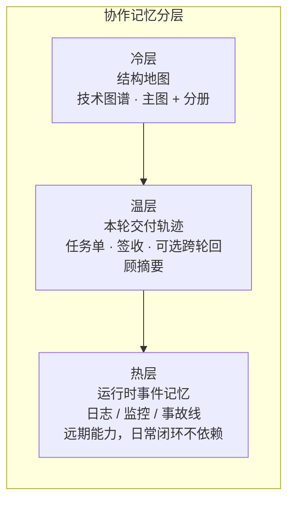
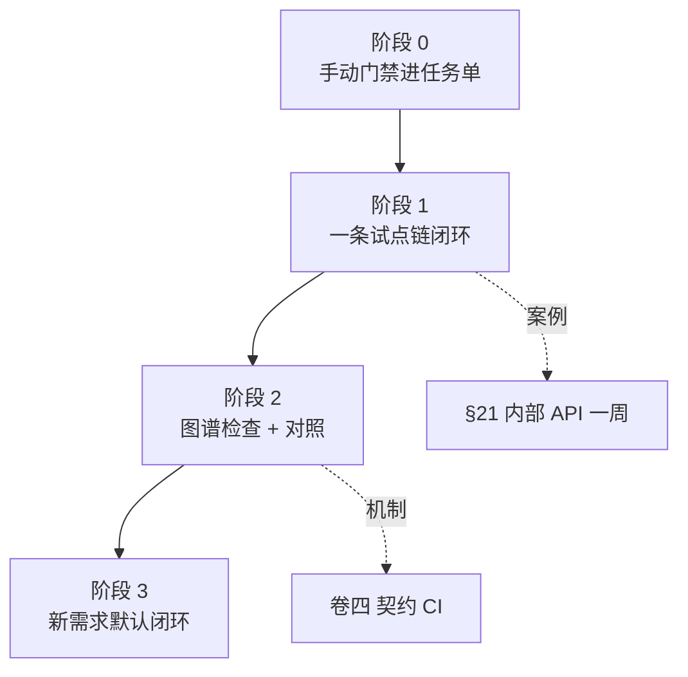

| 卷 | 副标题（连载） | 你得到什么 |
| --- | --- | --- |
| — | [从「更会写」到「敢合并」](https://cloud.tencent.com/developer/article/2681553) | 从「更会写」到「敢合并」· 15 分钟导读 |
| [卷一](https://cloud.tencent.com/developer/article/2675471) | 怎样才算「做完」 | 动机、双轨总览、最小起步 |
| [卷二](https://cloud.tencent.com/developer/article/2676250) | 技术图谱 | 子图、读法对照、图谱 CI |
| [卷三](https://cloud.tencent.com/developer/article/2678669) | Harness 与 SDD | 实践 SDD 的 Harness 协作流程（任务单、签收、阶段流） |
| [卷四](https://cloud.tencent.com/developer/article/2680278) | 闭环交付与经验沉淀 | 专题流水线、跨轮回顾摘要 |
| [卷五](https://cloud.tencent.com/developer/article/2681115) | 存量怎么落地 | 案例机制、FAQ、阶段 0～3、诚实边界 |

## 目录

| 节      | 标题                  |
| ------ | ------------------- |
| —      | 摘要                  |
| **21** | 存量案例：后端横切改动的一周      |
| **22** | 存量案例：前端 BFF + 契约类需求 |
| **23** | 常见误区 FAQ（含 §23.13 业界说法对齐） |
| **24** | 诚实边界：不能外推成什么        |
| **25** | 存量项目渐进落地            |
| **26** | 结语（系列收束）            |

---

## 摘要

卷一～四讲的是 **框架**：意图 / 成果 / 验收、技术图谱、任务单与签收、**专题收尾**（一轮交付合并后的归档，卷四 §17）。若你的仓库已经跑了很多年，常见状态是：**文档与代码分叉、CI 不全、不敢让 Agent 碰核心路由**——卷五专门回答：**存量项目怎样用「一周量级」试通一条链，而不是两周铺满全仓。**

**本卷三件事**：

1. **两则匿名周记案例**（§21 后端横切 · §22 全栈契约）——情节虚构化，只讲机制；
2. **FAQ**（§23）——含卷三读者常问的 **冷/温/热 ≠ 架构三层** 对照表；
3. **渐进路线**（§25）——阶段 0～3，与卷一 §6 最小起步衔接。

**本卷立场（与卷一～四同向，卷五说透）**：闭环是为了让 AI Coding **更准确、更敢合**——**不是**在「人本来就能较快做完」的事上强行多走 Agent、多填表、多改图。人把住 **关键节点**（任务单、合并前检查、签收、高敏复检）；试点链上沉淀 **示范性样板**（完整 PR 留档，供 Agent 模仿），日常 **大部分实现与图谱增量由 Agent 按样板起草、人审 diff**（**示范性** = 可模仿、可随栈迭代，**不是**一成不变的标准答案）。

**范例栈说明**：案例基于笔者在用的 **Python 后端 API + 可选 Next.js BFF** 双仓组合；**不是**「React 单体 + Node 一把梭」教程。全栈读者请按自己的仓拆成 **契约 + 分栈合并前命令**（卷一 §6）。

若你**尚无**合并前验收（CI 或等价手动门禁），请从 **§25 阶段 0** 或卷一 §6 开始，不要跳过「验得动」。

---

## 21. 存量案例：后端横切改动的一周

> **本节要回答**：在 **几乎没活图谱、CI 可能不全** 的后端仓，如何用 **一条非核心链路** 跑通卷一～三的最小闭环。

以下情节 **匿名化**；读者不必与任何真实仓库一一对应。

### 21.1 背景：为什么选「内部工具 API」当第一条链

**示例栈**：多模块 **Python 后端 API**（问答、入库、管理类路由并存）；向量检索与业务库在概念上并存，但 **本案例不展开 RAG 细节**。

**存量阻力（常见）**：


| 现象               | 后果                  |
| ---------------- | ------------------- |
| 文档里的端点列表与代码不一致   | Agent 改 A 仍按旧文档理解 B |
| 合并前检查不完整或无人看     | 「聊过了」就合，心里没底        |
| 核心用户链路不敢交给 Agent | 框架永远停在 PPT          |


**试点选链（定稿原则）**：第一条走 **内部工具 / 观测 / 配置类 API**——横切、可测、**不直接碰登录 / 支付**。推广顺序建议：**内部 → 后台 → 登录 → 支付**（先非核心，再碰用户面）。

本案例假设产品要在 **内部健康检查接口** 上补一项 **结构化错误码** 与 **契约字段对齐**（与卷四 §17 同类：**门牌号** = 契约/入口清单与代码一致，但本节 **不演 CI 红**，只走通 happy path + 一条诚实切口）。

### 21.2 Day 0～1：先「验得动」

**目标**：合并前必须能回答「敢不敢合」——没有 CI 也要 **手动门禁**（卷三 §14.1 · 卷一 §6）。


| 产出      | 内容                                    |
| ------- | ------------------------------------- |
| 合并前命令清单 | 与 PR 相同的 `pytest` 子集 + lint（示例；以你仓为准） |
| 任务单字段   | 验收 3 条 · 非范围 2 条 · 失败路径至少 1 条         |
| 书面习惯    | 合并前自勾表拍照或 Markdown 留档（一人团队 **不可省**）   |


**诚实切口**：该示例仓当时 **尚未** 配齐契约/锚点自动检查；Week 1 只要求 **单测绿 + 书面自勾**。全量 **入口清单** 检查放在 **§25 阶段 2**，不在第一周强上。

### 21.3 Day 2～3：再「有地图」——70 分即可

按卷二 §8.2～8.3  checklist，只画 **一条链**：

1. **主图** 上标出「内部工具 API」入口方块（不必画满 RAG / 全库）；
2. **一篇分册**（子图）展开：该路由依赖哪些模块、改坏会影响谁；
3. 任务单写一行 **图谱入口**（卷二 §8.3）。

**不必** 第一周补全全仓子图。主图 + 一篇分册 = **70 分即可开工**。

### 21.4 Day 4～5：敢改 + 签收

**任务单（节选 · 虚构）**


| 字段       | 内容                                     |
| -------- | -------------------------------------- |
| **意图**   | 内部健康检查接口返回统一错误码形状                      |
| **非范围**  | 不改统一聊天流 · 不动登录                         |
| **图谱入口** | 分册：`10_flow_internal_health.md`（示例文件名） |
| **验收**   | 单测绿 + 合并前命令全绿 + 书面签收                   |
| **失败路径** | 缺必填字段 → 400（单测覆盖）                      |


**实现**：人冻结任务单；Agent 按分册改 handler 与单测。改完对照 **审查自勾表 + CI（或手动等价）**。

**签收（本案例 · 小团队）**：

本案例动的是 **内部工具 API**：**作者自检 + CI（或手动门禁）+ 自勾表落盘**即可，不是「感觉对了」。**若改动触及对外 API、核心路由或契约清单**，仍须 **独立复检**（卷三 §12.5 精神）——**书面记录不可省**。

### 21.5 一周结束后：刻意不做什么


| 没做              | 为什么可以接受              |
| --------------- | -------------------- |
| 全仓图谱            | 阶段 1 只证明 **一条链** 可闭环 |
| 跨轮回顾摘要 / 知识库编译 | 卷四 §18 可选（跨轮回顾摘要）；Week 1 不展开 |
| 对照实验数字          | 不外推；卷二 §9 题集另论       |
| 强制踩坑库检索  | 可选失败案例备忘；**非**系列标配     |
| 全仓「人手永久维护图谱」 | 阶段 1 要的是 **示范性样板 PR**，不是维护制度本身 |


**一周真正要留下的**：一条可检索的 **示范性样板**（代码 + 最小图 + 任务单 + 签收）；下一轮同类改动让 Agent **按该样板** 改实现与图，人审 diff——**不是**证明「以后每条 API 都靠人手绘全仓图」。

**读者可带走的 3 条检查项**：

1. 合并前命令是否 **写进任务单** 且本轮 **跑过**？
2. 是否 **只选一条非核心链** 并写清图谱入口？
3. 合并后是否留下 **可检索的书面签收**（哪怕只有自勾表）？

### 21.6 与卷四的关系

卷四用 **虚构专题 + 契约 CI 红** 讲 **专题收尾** 与失败分支；本节用 **更小的存量切口** 讲 **第一周怎么动起来**。两条故事 **互补**：本节 happy path；卷四 §17.4 主失败分支。

---

## 22. 存量案例：前端 BFF + 契约类需求

> **本节要回答**：全栈存量里 **前端 BFF** 如何与 **后端契约 / 技术图谱** 对齐；与 §21 的差异是 **跨端契约同步**，不是再讲一条纯后端 RAG 链。

以下情节 **匿名化**；范例为 **Python 后端 API + Next.js BFF** 双仓，**不是** React 单体一把梭教程。

### 22.1 场景：后端已改，前端还在按旧字段解析

**背景**：产品要在 **统一聊天流** 上调整某一 SSE 事件的字段名与错误形状（与卷四 §17.4 **同类机制**，本节 **不重演** CI 红，侧重 **双仓怎么分工**）。

**常见卡点**：


| 卡点                      | 后果                                                              |
| ----------------------- | --------------------------------------------------------------- |
| 后端契约清单已更新，BFF 类型与消费逻辑仍旧 | 本地 lint 过、联调才炸                                                  |
| Agent 只改前端页面代码          | 不知道 Python 侧 **契约/锚点** 已变                                       |
| 两仓各开 PR、无顺序             | 双 PR 死锁或「文档 PR 等代码 PR」卡死（卷四 §17.4 已强调 **同 PR 原子提交**；跨仓用 **串行**） |


### 22.2 任务单：把「跨端」写进非范围

**任务单（节选 · 虚构）**


| 字段       | 内容                                                         |
| -------- | ---------------------------------------------------------- |
| **意图**   | BFF 按后端新 SSE 字段消费；页面展示一致                                   |
| **非范围**  | **本期不动** 后端 handler（后端已在上一 PR 合入）；或反向：本期 **只改后端**，BFF 跟进另开 |
| **图谱入口** | 后端主图「统一聊天」分册 + 前端「BFF 代理层」分册（各仓各一行）                        |
| **验收**   | 前端 `lint` + `test` + `build` 全绿；联调脚本通过；书面签收                |
| **失败路径** | SSE 缺字段 → 前端降级提示（单测或契约测试覆盖）                                |


**关键**：**非范围** 必须写清 **动哪一端、哪一端冻结**——否则 Agent 会「顺手改后端」导致契约再次分叉。

### 22.3 串行 PR：先后端，再 BFF（一人团队也适用）


| 顺序    | 做什么                              | 为什么                |
| ----- | -------------------------------- | ------------------ |
| **1** | 后端 PR：代码 + 契约/锚点 + 单测 + 结构图（若需要） | 先定 **门牌号**（卷四 §17） |
| **2** | 后端 PR 合入并完成书面签收                    | BFF 才有稳定契约可读       |
| **3** | 前端/BFF PR：类型、代理、页面消费             | 跟已合并的后端对齐          |
| **4** | 前端合并前检查全绿 + 签收                   | 与卷一 §6 分栈命令一致      |


一人团队可以 **同一周串行**，不必假扮「双评审委员会」；但 **两轮都要有书面记录**（§23.5）。


> 若平台不渲染 Mermaid，可按上表 **顺序 1→4** 执行即可。

**切勿**：后端 PR 未合就改 BFF 去「凑」旧字段，再在另一个仓开「只改文档」的 PR 等后端——卷四 §17.4 的 **双 PR 死锁** 在跨仓场景同样成立。

### 22.4 前端合并前检查（概念级）

与卷一 §6 一致，**按栈写死**，示例：

```text
lint → test → build
```

有 E2E 再加一步；**无 CI** 则写入任务单当 **手动门禁**。BFF 层另可增加 **契约测试**（消费后端发布的错误形状表），名称因项目而异，公众稿只记 **机制**。

### 22.5 与 §21、卷四 §17 怎么分工


| 篇 / 节        | 讲什么                                |
| ------------ | ---------------------------------- |
| **§21**      | 存量后端 **第一周** happy path（内部 API 试点） |
| **卷四 §17.4** | 后端专题 **契约 CI 红** + 同 PR 修绿         |
| **本节 §22**   | **双仓契约跟进**、任务单非范围、串行 PR            |


读者若只做后端，§21 + 卷四 足够；若全栈，**加上本节** 再对照 §25 阶段 1 的「前后端可并行不同链」。

### 22.6 诚实切口


| 没做 / 不宣称            | 说明                                   |
| ------------------- | ------------------------------------ |
| 自动双仓 parity 流水线     | 范例 **手工** 任务单 + 串行纪律，非开箱 monorepo 魔法 |
| 协作记录量减少幅当卷五 KPI | 卷四 §18.4 对照实验 **不外推**（§24）                  |
| 前端覆盖所有页面            | 只改 **统一聊天** 相关 BFF 路径                |


---

## 23. 常见误区 FAQ

> **本节要回答**：存量读者在试框架时最常卡住的 **概念与顺序** 问题。每条可 **单独摘发**；若你刚读完卷三又对「冷/温/热」犯迷糊，**先看 §23.1 对照表**（**不改卷三已发正文**，以本卷为准）。

### 23.1 冷 / 温 / 热：不是架构三层

卷三 §11.2.1、§14.8 用 **冷、温、热** 比喻 **协作里信息放哪、留多久**。不少读者会下意识对齐成「架构分层」或「代码能不能改」——**本系列不是这个意思**。


| 常见误解                    | 本系列实际指什么                                                                                       |
| ----------------------- | ---------------------------------------------------------------------------------------------- |
| 冷 = 架构层、温 = 契约层、热 = 实现层 | **否**。冷/温/热是 **协作记忆分层**，不是软件三层架构。                                                              |
| 冷 = 只读代码、温 = 可改文档       | **否**。冷层 = **结构地图**（卷二 **技术图谱**：主图 + 子图）；温层 = **本轮交付轨迹**（任务单、书面签收、可选 **跨轮回顾摘要**）。                     |
| 热 = 线上监控大盘、告警大屏         | **相关但不等同**。热层 = **运行时事件记忆**（日志聚合、事故时间线等）；**远期**能力，日常闭环 **不依赖** 热层。卷三 §14.8 只做划界，卷五 **不展开** 运维细节。 |


**一句收束**：

- **冷层** = 地图（改哪里、从哪进、会影响谁）→ 卷二；  
- **温层** = 轨迹（谁定了什么、何时敢合并、**收尾后**怎么回顾）→ 卷三、卷四；  
- **热层** = 事件记忆（可选、远期）→ 本卷不教你怎么搭监控栈。

若团队内部已有「架构冷/温/热」别种说法，请在 README 或术语表 **写清映射**，避免和本系列混用。

**分层示意图**（协作记忆，**不是**架构三层；自下而上为常用叠放顺序）：



### 23.2 先搭协作流程，还是先画图谱？

**不必二选一，但要有顺序感。**


| 阶段      | 先做啥                 | 说明                                                    |
| ------- | ------------------- | ----------------------------------------------------- |
| **0**   | **验得动**             | 合并前命令清单（有 CI 用 CI，没有就 **手动门禁** 写进任务单）——卷一 §6、卷三 §14.1 |
| **1**   | **一条链 + 任务单 + 最小图** | 试点链闭环一轮；主图 + **一篇** 分册即可开工（卷二 §8.2～8.3）               |
| **2 起** | 图谱检查、对照、可选跨轮回顾摘要      | 卷二 §9、卷四 §18                                          |


**误区**：没 CI、没任务单字段，先画满全仓图谱——图会很快 **和代码分叉**，没人敢用。  
**误区**：只有流程、没有图谱入口——Agent 仍易 **改错范围**（卷一 §2.3 叠放）。

### 23.3 协作留痕会不会越积越厚？

**会涨，这是正常现象。** 任务单、审查记录、对话导出都会变多。

本系列的应对是 **分层**，不是「别留痕」：


| 层级       | 作用                   | 是否必选       |
| -------- | -------------------- | ---------- |
| 任务单 + 签收 | **本轮交付依据**（验收勾了什么、谁签收，**以它为准**） | 必选         |
| 技术图谱     | 结构 **地图**（改哪里、影响谁）           | 试点链起就要有入口  |
| 跨轮回顾摘要   | 跨轮 **蒸馏**、少翻 **一整轮旧执行留痕全文**   | 可选（卷四 §18） |


笔者在后端示例仓做过 **跨轮回顾对照**（字符量降幅、失败样本、**不可外推** 边界）——见卷四 §18.4；**不是**「装了摘要就不用图谱」。降幅度量的是 **回顾同一决策时少翻多少材料**（多为字符量等 **代理指标**），**不是** 代码质量或全行业生产力提升 **61%～77%**（§24.2）。

### 23.4 不会写导出脚本，图谱怎么起步？

**先「表格 + 手画」，再自动化。**

1. 用表格列：**入口 / 依赖谁 / 改坏会影响谁**（卷二 §8.2 新项目 vs 存量）；
2. 挑 **一条** 核心链，画一张 Mermaid 主图 + 一篇分册；
3. 任务单写 **图谱入口** 一行；
4. 有精力再接 PR 改图提醒、export/入口清单 检查（卷二 §9.5）。

**误区**：等「完美工具链」再动手——存量仓往往 **永远等不到**。

### 23.5 一人团队，审查和签收怎么做？

**可以没有第二个人点 Approve，但不能没有「验收 + 书面落盘」。**


| 做法         | 说明                                                                                            |
| ---------- | --------------------------------------------------------------------------------------------- |
| 作者自检       | 对照任务单验收清单逐条勾                                                                                  |
| 合并前检查      | CI 全绿，或 **与 PR 相同的手动命令**                                                                      |
| 自勾表（自我检查勾选清单） | Markdown、PR 描述、内部笔记均可；要 **可检索**                                                               |
| 独立复检       | **动对外 API、流式协议、契约清单、核心路由** 时，建议 **另起一行** 对照任务单与 CI 日志（卷三 §12.5 精神）——一人也可 **间隔一段时间再看一遍**，关键是 **书面** |


§21 案例：内部路由可自检；§22 强调 **跨端契约** 时更要写清 **非范围**。

**附册 B**（规划）将收 **Blocking 三行模板、双轨 PR** 等可复制清单；正文 **不展开** 内部编号。

### 23.6 图谱会不会过时？要不要「半自动」？

**会过时；目标是降漂移，不是归零维护，更不是「全仓人手永久绘图」。**

#### 试点之后的三层分工

| 层 | 谁 | 做什么 |
| --- | --- | --- |
| **约定与拓扑** | 人 | 边标记、锚点约定（卷二协议）；**低频** |
| **示范性样板** | 人 + Agent（阶段 1） | 一条链上 **1～2 个完整 PR** 留档（代码 + 图 + 清单 + 任务单 + 签收），供后续模仿 |
| **日常** | **Agent 起草 + 人审** | 改接口的 **同一 PR** 内更新分册/清单；人审图 diff；CI 查 **门牌号**（契约/入口清单与代码一致） |

「示范性」表示 **可模仿的节奏**，不是唯一金牌模板；换栈、换仓应 **重定或重审** 样板。

#### 常见做法对照

| 做法 | 现实预期 |
| --- | --- |
| 阶段 1 沉淀 **示范性样板** | **一次性（每条试点链）**；不是「每周手绘全仓」 |
| 日常改图 | **Agent 按样板改** 图谱原稿（流程图维护用 Markdown）/ 清单行 + **人审**；人直接改仍允许（小改动、人更快时） |
| CI 查契约/锚点、export/入口清单 | **门牌号** 与代码一致（卷二 §9.5、卷四 §17）；**不** 等于行为全对（§23.7） |
| CI 查 **叙述层** | 除入口清单外，要求关键端点/表名等在 **图谱 Markdown 正文** 能搜到（避免「清单有、人读图没有」）。**简例**：在分册 `10_flow_*.md` 或 `.ai.md` 中写明 `/api/v1/chat/stream`，CI 用 `grep`/脚本检查该字符串是否出现在约定图谱文件内——不必绑某一 workflow 名 |
| 「半自动图谱」 | **Agent 起草 + 人审 + 机器查**（清单 + 导出一致性 + 叙述层）；**不说**「无人审查、单独 PR 只改全仓图已成熟」 |

**勿误解**：卷二说的「PR 顺手改图」，在存量阶段 1 之后应读成 **「同 PR、按示范性样板更新图与清单」**——维护量主要在 **试点建样板**，不是每条需求都从零画主图。

稳态维护预算大约 **10%～15%**（**2～5 人**团队；**≤2 人**目标 **≤10%**），前提是 **只维护试点链与按需补分册**，**非**全仓手绘、**非** KPI、**非**对读者的承诺；**>20%** 应减项或加强自动化（§25.4、§24）。**样本口径（笔者示例仓）**：约 **3 名后端**、每周约 **5～8 个任务**、**2 条** 试点链上的任务单/签收/局部图维护（**非 KPI**，勿外推团队规模或栈类型）。

**量法（粗估，答辩用）**：在任务单或周记里把「改 export/入口、对齐契约、补分册」与「写业务功能」**分开粗记**占比——**不是**审计级工时；可迁移的是 **「有维护成本、过高要减项」** 的纪律，**不是** 抄具体百分比。

### 23.7 契约检查绿了，是不是就算对了？

**不一定。门牌号（契约/入口清单）对了，具体行为逻辑仍可能错。**


| 检查类型               | 大致管什么                    |
| ------------------ | ------------------------ |
| 契约 / 锚点 / 入口清单 | 文档声明的端点、字段、事件名与代码 **一致** |
| 单测 / 集成测           | 行为、边界、失败路径               |


卷四 §17.4 主失败分支：**契约检查红** → 同 PR 修文档+代码+测试；**契约绿了、pytest 仍红** → 回到实现与失败路径（卷四 §17 副分支一句）。

### 23.8 和 Jira / 飞书工单冲突吗？

**叠加，不替换。**


| 工具     | 典型回答的问题                        |
| ------ | ------------------------------ |
| 产品需求单 / 业务工单 | 用户要什么、优先级、排期                   |
| 本系列任务单 | **工程交付**：验收、非范围、失败路径、测试策略、图谱入口 |


习惯做法：工单号可以写在任务单 **背景** 一行；**合并门禁** 仍是 **机器绿 + 书面签收**，不是「工单关了就算交付」。

### 23.9 Auto / 换模型，靠什么稳住输出？

卷一 §0 写过：**Cursor Pro + Auto**、预算有限、模型会切——因此更信 **流程 + 机器验收 + 任务单字段**，而不是赌某次 Prompt。


| 手段      | 说明                                                                            |
| ------- | ----------------------------------------------------------------------------- |
| 任务单字段固定 | 意图 / 成果 / 验收、非范围、失败路径 **不随模型变**                                               |
| 合并前检查全绿 | 与 PR 相同命令                                                                     |
| 高敏改动复检  | 流式协议、对外 API、契约变更                                                              |
| 换模型前自检  | **可选** 几条定性问题 + 小场景试跑（**附册 C** 规划）；结果 **仅供内部讨论**，**不作** merge KPI、不设「模型成功率」考核 |


### 23.10 可以不做跨轮回顾摘要吗？

**可以。** 新需求开工仍靠 **图谱 + 任务单**；**跨轮回顾摘要**（卷四 §18 的编译式回顾页）服务 **跨很多轮之后** 的复盘，不是开工必读。

若你 **连任务单与 CI 门禁都还没跑通**，请先 §25 阶段 0 或卷一 §6，**不要** 先上 **摘要编译入库** / LLM Wiki 类方案。

**与 Andrej Karpathy 提出的 LLM Wiki 相比**：同样强调 **编译原始材料、而非每次从长对话重新理解**；本系列的 **跨轮回顾摘要** 定位更窄——**工程专题归档与决策摘要**（Epic / 专题 **合之后**），**不是** 通用领域百科；**敢不敢合并** 仍只看 **规格、合并前检查、书面签收**，不看摘要写得多漂亮。可与图谱（冷）、任务单（温）**互补**。

### 23.11 一定要装 OpenSpec、ast-grep 吗？

**不必。** 公众稿只承诺本系列已反复用的 **能力等价物**：

- 任务单字段（验收、非范围、失败路径、测试策略）；  
- 合并前 **pytest / lint** 类检查；  
- 契约/锚点 **清单 + CI**（机制名即可，不绑某一文件名）。

其它工具若你团队已成熟，可自行 **映射** 到上述能力；**不要** 把未普及工具写成本文标配（§24 展开）。

### 23.12 读完卷三仍懵：下一步读哪？


| 你的状态     | 建议                              |
| -------- | ------------------------------- |
| 冷/温/热晕   | **本节 §23.1** 对照表                |
| 老项目、没 CI | §25 阶段 0 · §21 案例               |
| 全栈、前后端契约 | §22 · 卷四 §17                    |
| 想抄模板     | 卷一 §6 任务单 · 卷三 §11；**附册 B**（规划） |
| 和 OpenAI / Karpathy 说法怎么对齐 | **本节 §23.13** |


### 23.13 和业界说法（Harness / SDD / 效能指标）怎么对齐？

> 本节把 **方法论地图 §3.1 / §5 / §9** 与卷四 §18.4 收成 **存量读者 FAQ**；更全外链对照由系列维护者在仓库 Issue / 讨论区补充（公众稿以本节表为准）。

| 若读者问… | 本系列口径（一句话） |
| --- | --- |
| **Harness 是什么？** | **两层**：业界 **Harness Engineering**（环境、工具、检查门）+ 连载 **Harness 协作流程**（任务单、阶段流、签收）。**不是** 某商业产品；**不** 定义 Inform / Constrain / Verify（三支柱 **归属 SDD**）。 |
| **为何 SDD 和 Harness 两个词？** | **SDD** = 合同 + 验收标准；**Harness** = 闸机、巡检、签字。前者定 **交付与验收**，后者 **落实** 到 Agent 协作。 |
| **和 OpenAI Harness 文一样吗？** | **同向**（人掌舵、CI、仓库可读性）；我们还强调 **图谱轨**、**Epic 三要素**、**数字不外推**。 |
| **和 Karpathy LLM Wiki 一样吗？** | **同哲学**（编译中间表示）；我们是 **专题收尾决策摘要**，**不替代** CI 与签收（§23.10）。 |
| **61%～77% 降幅什么意思？** | **少翻回顾材料**（代理指标），**不是** 质量或生产力提升；见卷四 §18.4、§23.3、§24.2。 |
| **10%～15% 图谱维护？** | 笔者试点 **目标区间**，**非 KPI、非承诺**；过高减项；量法见 §23.6。 |
| **Wilson「十二种测错」？** | **同向**：禁止把代理指标、自报调查当全行业证据；本系列 **已写边界**。 |
| **维护者拒收 AI PR？** | **支持性旁证**：说明 **人审与签收** 必要；**不是** 用他们论证我们的数字。 |

**与 George Hotz 类「Agent 灾难论」**：他常批评 **无约束 Agent**；本系列问的是 **有闸协作下能否稳定交付**，且 **不主张** 全自动替代程序员（§24.2）。**不同层面**，可并存。

---

## 24. 诚实边界：不能外推成什么

> **本节要回答**：卷一 §5「诚实边界」的 **展开版**——哪些话本文 **没有** 说、读者 **不应** 自行外推。

### 24.1 卷一已说 · 卷五补什么


| 卷一 §5 已强调                | 卷五补什么                                                          |
| ------------------------ | -------------------------------------------------------------- |
| 方法在 **已建模图谱 + 有限对照** 上验证 | 范例栈 = **Python 后端 + 可选 Next/BFF**；**不是** 任意语言/任意 monorepo 开箱即用 |
| 换模型、换仓应 **重测**           | 卷二 §9、卷四 §18 的数字 **带题集与单仓边界**                                  |
| 降低风险、**不保证零事故**          | §21–§22 **匿名案例** 只证明机制可试通，**不是** 全行业 KPI                       |
| 尚无 CI → 手动门禁             | §25 **阶段 0** 操作化                                               |


### 24.2 不能外推清单（公众版）


| 请勿外推为…                               | 实际范围（诚实表述）                                         |
| ------------------------------------ | -------------------------------------------------- |
| 「有图谱就不会幻觉 / 零 bug」                   | **降** 漏改与漂范围；**仍要** 单测、失败路径、签收                     |
| 「契约/锚点 CI 绿了 = 零维护图谱」                | **Agent 按样板改图 + 人审 + 机器查**；漂移 **降低**，不是归零（§23.6） |
| 「闭环 = 凡改必用 Agent」                    | 人更快且风险可控时 **可人直接改**；关键节点与门禁 **按风险** 保留，不为用 AI 而用 AI |
| 「跨轮回顾摘要 / Skill / Wiki 可替代 CI」         | 习惯与回顾 **不替代** 合并前机器验收（卷四 §18）                      |
| 「对照实验降幅 → 全行业普适」                     | 须在 **声明题集 + 单仓 + 场景** 内解读（卷二 §9 · 卷四 §18.4）        |
| 「61%～77% = 代码质量或生产力提升」                | 降幅指 **回顾材料减少**（字符量等代理），**不是** 质量 KPI（§23.3）          |
| 「两周铺满全仓数字孪生」                         | §25 阶段 0～3 **渐进**；入口过多应 **停铺**                     |
| 「OpenSpec / Ralph / ast-grep 为本系列标配」 | 公众稿只写 **能力等价物**（任务单 + pytest/lint + 契约检查）          |
| 「GitHub Approve 点一下 = 本系列交付」         | **CI 绿 + 书面签收落盘** 才算交付关（卷三 §12）                      |
| 「增量图谱 CI 已成熟，可直接照搬」                  | 现阶段建议 **全量** export/入口清单 + 叙述层检查（卷二 §9.5）；**增量** 图谱 CI **未** 作公众稿承诺，勿误以为「完全不支持检查」     |
| 「维护成本可忽略」                            | 稳态约 **10%～15%**（2～5 人团队；≤2 人 **≤10%**）；**>20%** 应减项（§25.4） |
| 「merge 模型成功率 / 15 分钟响应」 等 KPI        | **不设**；可选定性自检见 **附册 C**（规划）                        |
| 「强制踩坑库 / 每任务先检索失败案例库」           | **可选** 匿名化备忘；**非** 标配                      |
| 「Agent 自动开 PR 只改图谱即可合」               | **禁止** 双 PR 死锁式操作（卷四 §17.4）                        |


### 24.3 换模型、换仓库、个人与团队


| 情况             | 建议                                        |
| -------------- | ----------------------------------------- |
| **换模型 / Auto** | 任务单字段与 CI **不变**；高敏改动 **复检**（§23.9）       |
| **换仓库**        | 重画最小图、重定合并前命令、**重跑** 对照（若有）再谈指标           |
| **个人**         | 可缩 **评审形式**（自检 + 自勾表），**不可缩** 验收、非范围、失败路径 |
| **团队**         | 书面签收可多人；机制相同                              |


### 24.4 与独立篇、附册的边界

- **冷/温/热** 协作分层 vs 架构三层：以 **§23.1** 为准；更深探讨计划以独立短文连载（**非** 本系列卷号）。  
- **附册 A–C**（术语 / 模板 / 延伸阅读）：随系列 **附册** 连载（§26），**不** 占卷五正文篇幅。

---

## 25. 存量项目渐进落地

> **本节要回答**：老项目 **先做什么、后做什么、做到哪一步可以停**——收成可执行路线，与卷一 §6、§21 案例、§23 FAQ 对齐。

**新项目** 可从卷一 §6 直接试；**本节默认** 你已有多年代码、文档分叉、CI 可能不全。

**落实原则**：阶段 1 的目标是 **示范性样板** + **敢合并**；不是给团队加一套「比人手写更累」的文书运动。若某步 **明显** 比资深工程师直接改更慢、更乱，应 **缩范围或先不用 Agent**（任务单与门禁仍可按风险保留），见摘要「本卷立场」。

### 25.1 先排阻力：跳过哪步会白做


| 优先级    | 要先解决的                                | 若跳过会怎样                      |
| ------ | ------------------------------------ | --------------------------- |
| **P0** | 合并前 **验得动**（CI 或 **手动门禁** 写进任务单）     | Agent 改完无法判断敢不敢合；图谱与流程都落不了地 |
| **P1** | **一条链** 跑通任务单闭环（意图 / 成果 / 验收 + 书面签收） | 图会变成「没人敢用的 PPT」             |
| **P2** | 该链路的 **最小主图 + 一篇分册**                 | 仍易改错范围、漏依赖                  |
| **P3** | 读图习惯 / 对照验证（可选）                      | 指标不可信、难说服团队推广               |
| **P4** | 跨轮回顾摘要、经验卡片（可选）                      | 留痕变长；**不挡** 前四步             |


**口诀**：**能合 → 能闭环一条链 → 有入口图 → 再谈优化与摘要**。

### 25.2 四阶段路线（0 → 3）




#### 阶段 0：验得动（无 CI 也能开始）

**目标**：任何一轮合并前，都能说出 **「跑过哪些命令、谁勾了验收」**。


| 动作                    | 产出                                 |
| --------------------- | ---------------------------------- |
| 列出合并前命令               | 如 `pytest` 子集 + lint + build（按栈调整） |
| 写进 **任务单** 与仓库 README | 与卷三 §14.1「无 CI 降级」一致               |
| 无流水线时                 | PR 描述或自勾表 **拍照/存档**，当作 **手动门禁**    |


**时间**：通常 **1～2 天** 能定稿清单；不必等「先把 CI 搭完美」。

#### 阶段 1：一条试点链 + 一轮闭环 + 示范性样板

**目标**：证明 **框架在存量仓能跑通一次**，并留下 **示范性样板**（供 Agent 模仿），而不是画满全仓图。


| 动作      | 说明                                                       |
| ------- | -------------------------------------------------------- |
| **选链**  | 优先 **内部工具 / 观测 / 配置类 API**；顺序：**内部 → 后台 → 登录 → 支付**（§21） |
| **任务单** | 验收、非范围、失败路径、测试策略、图谱入口                                    |
| **最小图** | 主图 1 张 + 分册 1 篇（70 分即可，卷二 §8.2）                          |
| **签收**  | CI 或手动全绿 + **书面落盘**（§23.5）                               |
| **示范性样板** | 将本轮 PR（代码 + 图 + 清单 + 任务单 + 签收）整理为 **可检索范例**；下一轮同类需求 **优先让 Agent 按此起草** |


**时间**：**约一周**（与 §21 周记同量级）；团队小可拆成两周，但 **范围勿扩** 成「顺便改五条链」。

#### 阶段 2：图谱检查与对照（可选增强）

**目标**：把 **门牌号** 与代码绑紧，降低文档漂移。


| 动作                                 | 说明                                   |
| ---------------------------------- | ------------------------------------ |
| 契约/锚点清单 + PR 同改                    | 卷四 §17 主失败分支所演机制                     |
| export / 入口清单 + **叙述层** 检查接入 CI | 卷二 §9.5；**Agent 按示范性样板改图 + 人审**；示例后端仓库内已有同类操作指引（不对读者承诺路径） |
| 对照实验                               | 仅在 **声明题集 + 单仓** 内谈命中率/token（卷二 §9）  |


**诚实边界**：**不是**「上了检查就零维护」；日常改图以 **Agent 起草、人审** 为主（§23.6），人全手绘全仓 **不是** 目标态。

#### 阶段 3：新需求默认闭环；老代码按需补图

**目标**：**新活** 走任务单 + 图谱入口 + 合并前检查；**老代码** 不追求一次铺满数字孪生。


| 动作    | 说明                          |
| ----- | --------------------------- |
| 新需求默认 | 任务单、失败路径、测试策略成习惯            |
| 老模块   | 仅在被这次改动波及时 **补分册**          |
| 不求全仓  | 卷二 §8.6：入口过多且无人维护时 **停止铺图** |


### 25.3 双轨并存：旧流程和新闭环共存多久？

存量仓几乎总有 **「老需求仍走口头 + diff 瞄一眼」**。建议：


| 规则       | 说明                                         |
| -------- | ------------------------------------------ |
| **试点链**  | 明确命名（如「内部健康检查 API」），**只在这条链** 上强制任务单 + 门禁  |
| **扩链条件** | 同一链路 **连续 2 轮** 合并前检查全绿 + 签收 **无返工**，再选下一条 |
| **其它链路** | 仍可走旧路；**不要** 未试点就全仓强制 **任务单与验收字段**（卷三）           |


这样既不让团队窒息，也能让 **证据** 说话（「这条链确实更稳」）。

### 25.4 维护成本：稳态大概占多少工程时间？


| 规模       | 估算参考（笔者实践口径，**非**承诺性 KPI）                    |
| -------- | ------------------------------------------- |
| **2～5 人**团队 | 稳态 **10%～15%** 用于 **试点链** 任务单、签收、清单/局部图与 occasional 对照（笔者示例仓约 3 名后端，**非** KPI） |
| **≤2 人**   | 目标 **≤10%**；过高则 **减项**                      |
| **>20%** | 减 **跨轮回顾摘要** 铺量、减子图扩张，或加强 **示范性样板 + Agent 改图** 与 CI 自动化 |


上述比例为 **稳态持续维护** 的增量工程时间，**不含** 第一条试点链建 **示范性样板** 的一次性投入（约一周，§21 / 阶段 1）。

**不是**「一次建好永久归零」，也 **不是**「全仓人手维护」的预算。若负责人把图谱当 **无人认领的文档坟场**，或 **无样板却强迫每条需求重画主图**，任何比例都会失控——需要 **Owner**（哪怕兼职）。

### 25.5 何时不要追求「全仓图谱」

出现以下 **任一** 情况，宜 **暂停铺图**，只维护试点链：

- 对外入口 **>20** 且半年无人愿意改图；  
- 业务方明确 **不要** 工程地图，只要排期；  
- 链路已下线或极少调用，补图 **无消费者**；  
- 团队连阶段 0 都未做到（合并前命令都说不清）。

这与卷一 §5「纸上谈兵」边界一致：**先一条链跑通**，再谈推广。

### 25.6 全栈 / 双仓：前后端可以不同步阶段


| 仓          | 建议                                        |
| ---------- | ----------------------------------------- |
| **后端 API** | 阶段 1 常先做（§21）                             |
| **前端 BFF** | 可 **并行另一条链**，或等契约类需求时做阶段 1（§22）           |
| **契约类需求**  | 任务单写清 **跨端非范围**；后端契约与 BFF 类型 **串行 PR** 更稳 |


范例栈为 **Python 后端 + Next.js BFF** 双仓，**不是** 单体 React 教程；合并前命令按 **分栈** 写（卷一 §6）。

### 25.7 阶段自检清单（可复制）

```markdown
## 存量落地自检（当前阶段：0 / 1 / 2 / 3）

- [ ] 合并前命令已写入任务单且本轮跑过
- [ ] 试点链路已命名且非核心用户面
- [ ] 主图 + 至少一篇分册 / 或表格版入口清单
- [ ] 最近一轮有书面签收（含一人团队自勾表）
- [ ] （阶段 2+）契约/锚点检查与 PR 同改纪律已试过
- [ ] （阶段 3）新需求默认挂图谱入口
```

---

## 26. 结语（系列收束）

五卷一条线：**在预算与模型不稳定的现实下，用「地图 + 交接单」把 AI 改动做成可验收的交付**。


| 卷      | 你带走的一句话                                |
| ------ | -------------------------------------- |
| **卷一** | 意图 / 成果 / 验收；图谱与协作流程 **叠放**            |
| **卷二** | 技术图谱：先看地图再动手                           |
| **卷三** | 任务单、书面签收、合并前必绿                         |
| **卷四** | 专题跑通、**收尾归档**；（可选）**跨轮回顾摘要** **少翻留痕**            |
| **卷五** | 存量 **先验得动、再一条链、再渐进**；**别外推** 成「两周全仓奇迹」 |


### 从哪里开始读


| 你是谁             | 建议入口                           |
| --------------- | ------------------------------ |
| **新项目 / 愿意从零试** | 卷一 §6 最小起步 → 卷二 §8.2 第一份图      |
| **老项目 / 有历史包袱** | 本节卷五 §25 阶段 0 → §21 案例         |
| **全栈、契约常分叉**    | §22 + 卷四 §17                   |
| **读完卷三仍懵冷/温/热** | **§23.1** 对照表（**不改** 卷三已发正文）   |
| **想抄清单**        | 卷一 §6 模板 · 卷三 §11；**附册 B**（规划） |


### 系列之后

- **附册**（术语、Blocking 模板、模型自检等）将 **另行连载**，**不** 占用卷六编号。  
- **方法论**（对外无卷号）：建议应聘 / 评审岗 **先读框架** 再进卷一～五：[从「更会写」到「敢合并」](https://cloud.tencent.com/developer/article/2681553)。  
- 正文与连载稿：[GitHub · ai-coding-closed-loop-articles](https://github.com/Cyning12/ai-coding-closed-loop-articles)（卷一～五链见该仓 README；腾讯云已发见各卷文首）。

欢迎 Issue / 讨论与 fork；实践反馈会反哺 **附册与勘误**，卷三正文 **不因** 单条评论而改版。

---

*许可：CC BY 4.0 · 署名可转载与改编 · 系列文稿：[ai-coding-closed-loop-articles](https://github.com/Cyning12/ai-coding-closed-loop-articles)*
