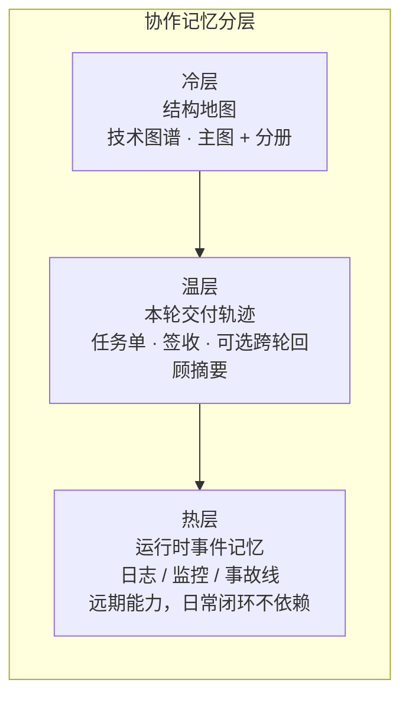
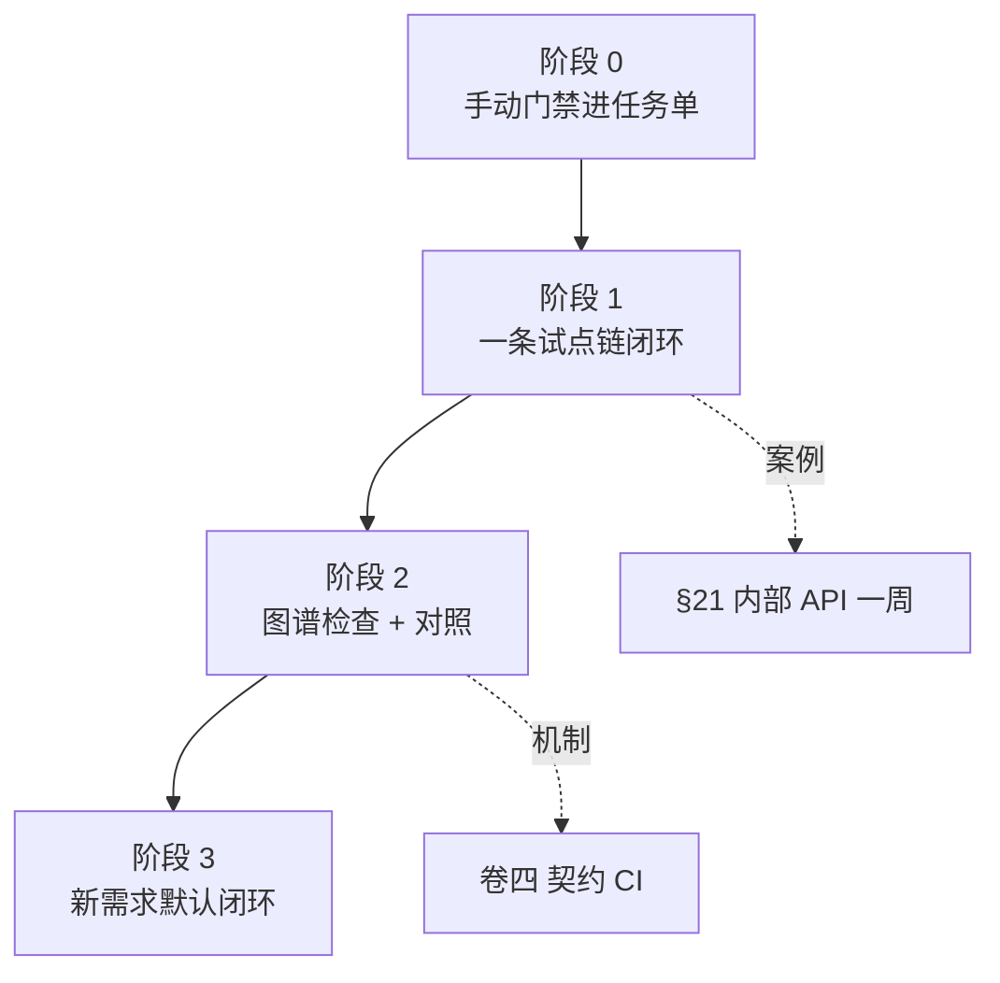

<div class="md-table-wrap">
<table>
<thead><tr>
<th>卷</th>
<th>副标题（连载）</th>
<th>你得到什么</th>
</tr></thead>
<tbody>
<tr>
<td>—</td>
<td><a href="https://cloud.tencent.com/developer/article/2681553">从「更会写」到「敢合并」</a></td>
<td>从「更会写」到「敢合并」· 15 分钟导读</td>
</tr>
<tr>
<td><a href="https://cloud.tencent.com/developer/article/2675471">卷一</a></td>
<td>怎样才算「做完」</td>
<td>动机、双轨总览、最小起步</td>
</tr>
<tr>
<td><a href="https://cloud.tencent.com/developer/article/2676250">卷二</a></td>
<td>技术图谱</td>
<td>子图、读法对照、图谱 CI</td>
</tr>
<tr>
<td><a href="https://cloud.tencent.com/developer/article/2678669">卷三</a></td>
<td>Harness 与 SDD</td>
<td>实践 SDD 的 Harness 协作流程（任务单、签收、阶段流）</td>
</tr>
<tr>
<td><a href="https://cloud.tencent.com/developer/article/2680278">卷四</a></td>
<td>闭环交付与经验沉淀</td>
<td>专题流水线、跨轮回顾摘要</td>
</tr>
<tr>
<td><a href="https://cloud.tencent.com/developer/article/2681115">卷五</a></td>
<td>存量怎么落地</td>
<td>案例机制、FAQ、阶段 0～3、诚实边界</td>
</tr>
</tbody>
</table></div>
## 目录

<div class="md-table-wrap">
<table>
<thead><tr>
<th>节</th>
<th>标题</th>
</tr></thead>
<tbody>
<tr>
<td>—</td>
<td>摘要</td>
</tr>
<tr>
<td><strong>21</strong></td>
<td>存量案例：后端横切改动的一周</td>
</tr>
<tr>
<td><strong>22</strong></td>
<td>存量案例：前端 BFF + 契约类需求</td>
</tr>
<tr>
<td><strong>23</strong></td>
<td>常见误区 FAQ（含 §23.13 业界说法对齐）</td>
</tr>
<tr>
<td><strong>24</strong></td>
<td>诚实边界：不能外推成什么</td>
</tr>
<tr>
<td><strong>25</strong></td>
<td>存量项目渐进落地</td>
</tr>
<tr>
<td><strong>26</strong></td>
<td>结语（系列收束）</td>
</tr>
</tbody>
</table></div>
<hr />

## 摘要

卷一～四讲的是 **框架**：意图 / 成果 / 验收、技术图谱、任务单与签收、**专题收尾**（一轮交付合并后的归档，卷四 §17）。若你的仓库已经跑了很多年，常见状态是：**文档与代码分叉、CI 不全、不敢让 Agent 碰核心路由**——卷五专门回答：**存量项目怎样用「一周量级」试通一条链，而不是两周铺满全仓。**

**本卷三件事**：

1. **两则匿名周记案例**（§21 后端横切 · §22 全栈契约）——情节虚构化，只讲机制；
2. **FAQ**（§23）——含卷三读者常问的 **冷/温/热 ≠ 架构三层** 对照表；
3. **渐进路线**（§25）——阶段 0～3，与卷一 §6 最小起步衔接。

**本卷立场（与卷一～四同向，卷五说透）**：闭环是为了让 AI Coding **更准确、更敢合**——**不是**在「人本来就能较快做完」的事上强行多走 Agent、多填表、多改图。人把住 **关键节点**（任务单、合并前检查、签收、高敏复检）；试点链上沉淀 **示范性样板**（完整 PR 留档，供 Agent 模仿），日常 **大部分实现与图谱增量由 Agent 按样板起草、人审 diff**（**示范性** = 可模仿、可随栈迭代，**不是**一成不变的标准答案）。

**范例栈说明**：案例基于笔者在用的 **Python 后端 API + 可选 Next.js BFF** 双仓组合；**不是**「React 单体 + Node 一把梭」教程。全栈读者请按自己的仓拆成 **契约 + 分栈合并前命令**（卷一 §6）。

若你**尚无**合并前验收（CI 或等价手动门禁），请从 **§25 阶段 0** 或卷一 §6 开始，不要跳过「验得动」。

<hr />

## 21. 存量案例：后端横切改动的一周

<blockquote>
<p><strong>本节要回答</strong>：在 <strong>几乎没活图谱、CI 可能不全</strong> 的后端仓，如何用 <strong>一条非核心链路</strong> 跑通卷一～三的最小闭环。</p>
</blockquote>
以下情节 **匿名化**；读者不必与任何真实仓库一一对应。

### 21.1 背景：为什么选「内部工具 API」当第一条链

**示例栈**：多模块 **Python 后端 API**（问答、入库、管理类路由并存）；向量检索与业务库在概念上并存，但 **本案例不展开 RAG 细节**。

**存量阻力（常见）**：


<div class="md-table-wrap">
<table>
<thead><tr>
<th>现象</th>
<th>后果</th>
</tr></thead>
<tbody>
<tr>
<td>文档里的端点列表与代码不一致</td>
<td>Agent 改 A 仍按旧文档理解 B</td>
</tr>
<tr>
<td>合并前检查不完整或无人看</td>
<td>「聊过了」就合，心里没底</td>
</tr>
<tr>
<td>核心用户链路不敢交给 Agent</td>
<td>框架永远停在 PPT</td>
</tr>
</tbody>
</table></div>
**试点选链（定稿原则）**：第一条走 **内部工具 / 观测 / 配置类 API**——横切、可测、**不直接碰登录 / 支付**。推广顺序建议：**内部 → 后台 → 登录 → 支付**（先非核心，再碰用户面）。

本案例假设产品要在 **内部健康检查接口** 上补一项 **结构化错误码** 与 **契约字段对齐**（与卷四 §17 同类：**门牌号** = 契约/入口清单与代码一致，但本节 **不演 CI 红**，只走通 happy path + 一条诚实切口）。

### 21.2 Day 0～1：先「验得动」

**目标**：合并前必须能回答「敢不敢合」——没有 CI 也要 **手动门禁**（卷三 §14.1 · 卷一 §6）。


<div class="md-table-wrap">
<table>
<thead><tr>
<th>产出</th>
<th>内容</th>
</tr></thead>
<tbody>
<tr>
<td>合并前命令清单</td>
<td>与 PR 相同的 <code>pytest</code> 子集 + lint（示例；以你仓为准）</td>
</tr>
<tr>
<td>任务单字段</td>
<td>验收 3 条 · 非范围 2 条 · 失败路径至少 1 条</td>
</tr>
<tr>
<td>书面习惯</td>
<td>合并前自勾表拍照或 Markdown 留档（一人团队 <strong>不可省</strong>）</td>
</tr>
</tbody>
</table></div>
**诚实切口**：该示例仓当时 **尚未** 配齐契约/锚点自动检查；Week 1 只要求 **单测绿 + 书面自勾**。全量 **入口清单** 检查放在 **§25 阶段 2**，不在第一周强上。

### 21.3 Day 2～3：再「有地图」——70 分即可

按卷二 §8.2～8.3  checklist，只画 **一条链**：

1. **主图** 上标出「内部工具 API」入口方块（不必画满 RAG / 全库）；
2. **一篇分册**（子图）展开：该路由依赖哪些模块、改坏会影响谁；
3. 任务单写一行 **图谱入口**（卷二 §8.3）。

**不必** 第一周补全全仓子图。主图 + 一篇分册 = **70 分即可开工**。

### 21.4 Day 4～5：敢改 + 签收

**任务单（节选 · 虚构）**


<div class="md-table-wrap">
<table>
<thead><tr>
<th>字段</th>
<th>内容</th>
</tr></thead>
<tbody>
<tr>
<td><strong>意图</strong></td>
<td>内部健康检查接口返回统一错误码形状</td>
</tr>
<tr>
<td><strong>非范围</strong></td>
<td>不改统一聊天流 · 不动登录</td>
</tr>
<tr>
<td><strong>图谱入口</strong></td>
<td>分册：<code>10_flow_internal_health.md</code>（示例文件名）</td>
</tr>
<tr>
<td><strong>验收</strong></td>
<td>单测绿 + 合并前命令全绿 + 书面签收</td>
</tr>
<tr>
<td><strong>失败路径</strong></td>
<td>缺必填字段 → 400（单测覆盖）</td>
</tr>
</tbody>
</table></div>
**实现**：人冻结任务单；Agent 按分册改 handler 与单测。改完对照 **审查自勾表 + CI（或手动等价）**。

**签收（本案例 · 小团队）**：

本案例动的是 **内部工具 API**：**作者自检 + CI（或手动门禁）+ 自勾表落盘**即可，不是「感觉对了」。**若改动触及对外 API、核心路由或契约清单**，仍须 **独立复检**（卷三 §12.5 精神）——**书面记录不可省**。

### 21.5 一周结束后：刻意不做什么


<div class="md-table-wrap">
<table>
<thead><tr>
<th>没做</th>
<th>为什么可以接受</th>
</tr></thead>
<tbody>
<tr>
<td>全仓图谱</td>
<td>阶段 1 只证明 <strong>一条链</strong> 可闭环</td>
</tr>
<tr>
<td>跨轮回顾摘要 / 知识库编译</td>
<td>卷四 §18 可选（跨轮回顾摘要）；Week 1 不展开</td>
</tr>
<tr>
<td>对照实验数字</td>
<td>不外推；卷二 §9 题集另论</td>
</tr>
<tr>
<td>强制踩坑库检索</td>
<td>可选失败案例备忘；<strong>非</strong>系列标配</td>
</tr>
<tr>
<td>全仓「人手永久维护图谱」</td>
<td>阶段 1 要的是 <strong>示范性样板 PR</strong>，不是维护制度本身</td>
</tr>
</tbody>
</table></div>
**一周真正要留下的**：一条可检索的 **示范性样板**（代码 + 最小图 + 任务单 + 签收）；下一轮同类改动让 Agent **按该样板** 改实现与图，人审 diff——**不是**证明「以后每条 API 都靠人手绘全仓图」。

**读者可带走的 3 条检查项**：

1. 合并前命令是否 **写进任务单** 且本轮 **跑过**？
2. 是否 **只选一条非核心链** 并写清图谱入口？
3. 合并后是否留下 **可检索的书面签收**（哪怕只有自勾表）？

### 21.6 与卷四的关系

卷四用 **虚构专题 + 契约 CI 红** 讲 **专题收尾** 与失败分支；本节用 **更小的存量切口** 讲 **第一周怎么动起来**。两条故事 **互补**：本节 happy path；卷四 §17.4 主失败分支。

<hr />

## 22. 存量案例：前端 BFF + 契约类需求

<blockquote>
<p><strong>本节要回答</strong>：全栈存量里 <strong>前端 BFF</strong> 如何与 <strong>后端契约 / 技术图谱</strong> 对齐；与 §21 的差异是 <strong>跨端契约同步</strong>，不是再讲一条纯后端 RAG 链。</p>
</blockquote>
以下情节 **匿名化**；范例为 **Python 后端 API + Next.js BFF** 双仓，**不是** React 单体一把梭教程。

### 22.1 场景：后端已改，前端还在按旧字段解析

**背景**：产品要在 **统一聊天流** 上调整某一 SSE 事件的字段名与错误形状（与卷四 §17.4 **同类机制**，本节 **不重演** CI 红，侧重 **双仓怎么分工**）。

**常见卡点**：


<div class="md-table-wrap">
<table>
<thead><tr>
<th>卡点</th>
<th>后果</th>
</tr></thead>
<tbody>
<tr>
<td>后端契约清单已更新，BFF 类型与消费逻辑仍旧</td>
<td>本地 lint 过、联调才炸</td>
</tr>
<tr>
<td>Agent 只改前端页面代码</td>
<td>不知道 Python 侧 <strong>契约/锚点</strong> 已变</td>
</tr>
<tr>
<td>两仓各开 PR、无顺序</td>
<td>双 PR 死锁或「文档 PR 等代码 PR」卡死（卷四 §17.4 已强调 <strong>同 PR 原子提交</strong>；跨仓用 <strong>串行</strong>）</td>
</tr>
</tbody>
</table></div>
### 22.2 任务单：把「跨端」写进非范围

**任务单（节选 · 虚构）**


<div class="md-table-wrap">
<table>
<thead><tr>
<th>字段</th>
<th>内容</th>
</tr></thead>
<tbody>
<tr>
<td><strong>意图</strong></td>
<td>BFF 按后端新 SSE 字段消费；页面展示一致</td>
</tr>
<tr>
<td><strong>非范围</strong></td>
<td><strong>本期不动</strong> 后端 handler（后端已在上一 PR 合入）；或反向：本期 <strong>只改后端</strong>，BFF 跟进另开</td>
</tr>
<tr>
<td><strong>图谱入口</strong></td>
<td>后端主图「统一聊天」分册 + 前端「BFF 代理层」分册（各仓各一行）</td>
</tr>
<tr>
<td><strong>验收</strong></td>
<td>前端 <code>lint</code> + <code>test</code> + <code>build</code> 全绿；联调脚本通过；书面签收</td>
</tr>
<tr>
<td><strong>失败路径</strong></td>
<td>SSE 缺字段 → 前端降级提示（单测或契约测试覆盖）</td>
</tr>
</tbody>
</table></div>
**关键**：**非范围** 必须写清 **动哪一端、哪一端冻结**——否则 Agent 会「顺手改后端」导致契约再次分叉。

### 22.3 串行 PR：先后端，再 BFF（一人团队也适用）


<div class="md-table-wrap">
<table>
<thead><tr>
<th>顺序</th>
<th>做什么</th>
<th>为什么</th>
</tr></thead>
<tbody>
<tr>
<td><strong>1</strong></td>
<td>后端 PR：代码 + 契约/锚点 + 单测 + 结构图（若需要）</td>
<td>先定 <strong>门牌号</strong>（卷四 §17）</td>
</tr>
<tr>
<td><strong>2</strong></td>
<td>后端 PR 合入并完成书面签收</td>
<td>BFF 才有稳定契约可读</td>
</tr>
<tr>
<td><strong>3</strong></td>
<td>前端/BFF PR：类型、代理、页面消费</td>
<td>跟已合并的后端对齐</td>
</tr>
<tr>
<td><strong>4</strong></td>
<td>前端合并前检查全绿 + 签收</td>
<td>与卷一 §6 分栈命令一致</td>
</tr>
</tbody>
</table></div>
一人团队可以 **同一周串行**，不必假扮「双评审委员会」；但 **两轮都要有书面记录**（§23.5）。


<blockquote>
<p>若平台不渲染 Mermaid，可按上表 <strong>顺序 1→4</strong> 执行即可。</p>
</blockquote>
**切勿**：后端 PR 未合就改 BFF 去「凑」旧字段，再在另一个仓开「只改文档」的 PR 等后端——卷四 §17.4 的 **双 PR 死锁** 在跨仓场景同样成立。

### 22.4 前端合并前检查（概念级）

与卷一 §6 一致，**按栈写死**，示例：

```text
lint → test → build
```

有 E2E 再加一步；**无 CI** 则写入任务单当 **手动门禁**。BFF 层另可增加 **契约测试**（消费后端发布的错误形状表），名称因项目而异，公众稿只记 **机制**。

### 22.5 与 §21、卷四 §17 怎么分工


<div class="md-table-wrap">
<table>
<thead><tr>
<th>篇 / 节</th>
<th>讲什么</th>
</tr></thead>
<tbody>
<tr>
<td><strong>§21</strong></td>
<td>存量后端 <strong>第一周</strong> happy path（内部 API 试点）</td>
</tr>
<tr>
<td><strong>卷四 §17.4</strong></td>
<td>后端专题 <strong>契约 CI 红</strong> + 同 PR 修绿</td>
</tr>
<tr>
<td><strong>本节 §22</strong></td>
<td><strong>双仓契约跟进</strong>、任务单非范围、串行 PR</td>
</tr>
</tbody>
</table></div>
读者若只做后端，§21 + 卷四 足够；若全栈，**加上本节** 再对照 §25 阶段 1 的「前后端可并行不同链」。

### 22.6 诚实切口


<div class="md-table-wrap">
<table>
<thead><tr>
<th>没做 / 不宣称</th>
<th>说明</th>
</tr></thead>
<tbody>
<tr>
<td>自动双仓 parity 流水线</td>
<td>范例 <strong>手工</strong> 任务单 + 串行纪律，非开箱 monorepo 魔法</td>
</tr>
<tr>
<td>协作记录量减少幅当卷五 KPI</td>
<td>卷四 §18.4 对照实验 <strong>不外推</strong>（§24）</td>
</tr>
<tr>
<td>前端覆盖所有页面</td>
<td>只改 <strong>统一聊天</strong> 相关 BFF 路径</td>
</tr>
</tbody>
</table></div>
<hr />

## 23. 常见误区 FAQ

<blockquote>
<p><strong>本节要回答</strong>：存量读者在试框架时最常卡住的 <strong>概念与顺序</strong> 问题。每条可 <strong>单独摘发</strong>；若你刚读完卷三又对「冷/温/热」犯迷糊，<strong>先看 §23.1 对照表</strong>（<strong>不改卷三已发正文</strong>，以本卷为准）。</p>
</blockquote>
### 23.1 冷 / 温 / 热：不是架构三层

卷三 §11.2.1、§14.8 用 **冷、温、热** 比喻 **协作里信息放哪、留多久**。不少读者会下意识对齐成「架构分层」或「代码能不能改」——**本系列不是这个意思**。


<div class="md-table-wrap">
<table>
<thead><tr>
<th>常见误解</th>
<th>本系列实际指什么</th>
</tr></thead>
<tbody>
<tr>
<td>冷 = 架构层、温 = 契约层、热 = 实现层</td>
<td><strong>否</strong>。冷/温/热是 <strong>协作记忆分层</strong>，不是软件三层架构。</td>
</tr>
<tr>
<td>冷 = 只读代码、温 = 可改文档</td>
<td><strong>否</strong>。冷层 = <strong>结构地图</strong>（卷二 <strong>技术图谱</strong>：主图 + 子图）；温层 = <strong>本轮交付轨迹</strong>（任务单、书面签收、可选 <strong>跨轮回顾摘要</strong>）。</td>
</tr>
<tr>
<td>热 = 线上监控大盘、告警大屏</td>
<td><strong>相关但不等同</strong>。热层 = <strong>运行时事件记忆</strong>（日志聚合、事故时间线等）；<strong>远期</strong>能力，日常闭环 <strong>不依赖</strong> 热层。卷三 §14.8 只做划界，卷五 <strong>不展开</strong> 运维细节。</td>
</tr>
</tbody>
</table></div>
**一句收束**：

- **冷层** = 地图（改哪里、从哪进、会影响谁）→ 卷二；  
- **温层** = 轨迹（谁定了什么、何时敢合并、**收尾后**怎么回顾）→ 卷三、卷四；  
- **热层** = 事件记忆（可选、远期）→ 本卷不教你怎么搭监控栈。

若团队内部已有「架构冷/温/热」别种说法，请在 README 或术语表 **写清映射**，避免和本系列混用。

**分层示意图**（协作记忆，**不是**架构三层；自下而上为常用叠放顺序）：



### 23.2 先搭协作流程，还是先画图谱？

**不必二选一，但要有顺序感。**


<div class="md-table-wrap">
<table>
<thead><tr>
<th>阶段</th>
<th>先做啥</th>
<th>说明</th>
</tr></thead>
<tbody>
<tr>
<td><strong>0</strong></td>
<td><strong>验得动</strong></td>
<td>合并前命令清单（有 CI 用 CI，没有就 <strong>手动门禁</strong> 写进任务单）——卷一 §6、卷三 §14.1</td>
</tr>
<tr>
<td><strong>1</strong></td>
<td><strong>一条链 + 任务单 + 最小图</strong></td>
<td>试点链闭环一轮；主图 + <strong>一篇</strong> 分册即可开工（卷二 §8.2～8.3）</td>
</tr>
<tr>
<td><strong>2 起</strong></td>
<td>图谱检查、对照、可选跨轮回顾摘要</td>
<td>卷二 §9、卷四 §18</td>
</tr>
</tbody>
</table></div>
**误区**：没 CI、没任务单字段，先画满全仓图谱——图会很快 **和代码分叉**，没人敢用。  
**误区**：只有流程、没有图谱入口——Agent 仍易 **改错范围**（卷一 §2.3 叠放）。

### 23.3 协作留痕会不会越积越厚？

**会涨，这是正常现象。** 任务单、审查记录、对话导出都会变多。

本系列的应对是 **分层**，不是「别留痕」：


<div class="md-table-wrap">
<table>
<thead><tr>
<th>层级</th>
<th>作用</th>
<th>是否必选</th>
</tr></thead>
<tbody>
<tr>
<td>任务单 + 签收</td>
<td><strong>本轮交付依据</strong>（验收勾了什么、谁签收，<strong>以它为准</strong>）</td>
<td>必选</td>
</tr>
<tr>
<td>技术图谱</td>
<td>结构 <strong>地图</strong>（改哪里、影响谁）</td>
<td>试点链起就要有入口</td>
</tr>
<tr>
<td>跨轮回顾摘要</td>
<td>跨轮 <strong>蒸馏</strong>、少翻 <strong>一整轮旧执行留痕全文</strong></td>
<td>可选（卷四 §18）</td>
</tr>
</tbody>
</table></div>
笔者在后端示例仓做过 **跨轮回顾对照**（字符量降幅、失败样本、**不可外推** 边界）——见卷四 §18.4；**不是**「装了摘要就不用图谱」。降幅度量的是 **回顾同一决策时少翻多少材料**（多为字符量等 **代理指标**），**不是** 代码质量或全行业生产力提升 **61%～77%**（§24.2）。

### 23.4 不会写导出脚本，图谱怎么起步？

**先「表格 + 手画」，再自动化。**

1. 用表格列：**入口 / 依赖谁 / 改坏会影响谁**（卷二 §8.2 新项目 vs 存量）；
2. 挑 **一条** 核心链，画一张 Mermaid 主图 + 一篇分册；
3. 任务单写 **图谱入口** 一行；
4. 有精力再接 PR 改图提醒、export/入口清单 检查（卷二 §9.5）。

**误区**：等「完美工具链」再动手——存量仓往往 **永远等不到**。

### 23.5 一人团队，审查和签收怎么做？

**可以没有第二个人点 Approve，但不能没有「验收 + 书面落盘」。**


<div class="md-table-wrap">
<table>
<thead><tr>
<th>做法</th>
<th>说明</th>
</tr></thead>
<tbody>
<tr>
<td>作者自检</td>
<td>对照任务单验收清单逐条勾</td>
</tr>
<tr>
<td>合并前检查</td>
<td>CI 全绿，或 <strong>与 PR 相同的手动命令</strong></td>
</tr>
<tr>
<td>自勾表（自我检查勾选清单）</td>
<td>Markdown、PR 描述、内部笔记均可；要 <strong>可检索</strong></td>
</tr>
<tr>
<td>独立复检</td>
<td><strong>动对外 API、流式协议、契约清单、核心路由</strong> 时，建议 <strong>另起一行</strong> 对照任务单与 CI 日志（卷三 §12.5 精神）——一人也可 <strong>间隔一段时间再看一遍</strong>，关键是 <strong>书面</strong></td>
</tr>
</tbody>
</table></div>
§21 案例：内部路由可自检；§22 强调 **跨端契约** 时更要写清 **非范围**。

**附册 B**（规划）将收 **Blocking 三行模板、双轨 PR** 等可复制清单；正文 **不展开** 内部编号。

### 23.6 图谱会不会过时？要不要「半自动」？

**会过时；目标是降漂移，不是归零维护，更不是「全仓人手永久绘图」。**

#### 试点之后的三层分工

<div class="md-table-wrap">
<table>
<thead><tr>
<th>层</th>
<th>谁</th>
<th>做什么</th>
</tr></thead>
<tbody>
<tr>
<td><strong>约定与拓扑</strong></td>
<td>人</td>
<td>边标记、锚点约定（卷二协议）；<strong>低频</strong></td>
</tr>
<tr>
<td><strong>示范性样板</strong></td>
<td>人 + Agent（阶段 1）</td>
<td>一条链上 <strong>1～2 个完整 PR</strong> 留档（代码 + 图 + 清单 + 任务单 + 签收），供后续模仿</td>
</tr>
<tr>
<td><strong>日常</strong></td>
<td><strong>Agent 起草 + 人审</strong></td>
<td>改接口的 <strong>同一 PR</strong> 内更新分册/清单；人审图 diff；CI 查 <strong>门牌号</strong>（契约/入口清单与代码一致）</td>
</tr>
</tbody>
</table></div>
「示范性」表示 **可模仿的节奏**，不是唯一金牌模板；换栈、换仓应 **重定或重审** 样板。

#### 常见做法对照

<div class="md-table-wrap">
<table>
<thead><tr>
<th>做法</th>
<th>现实预期</th>
</tr></thead>
<tbody>
<tr>
<td>阶段 1 沉淀 <strong>示范性样板</strong></td>
<td><strong>一次性（每条试点链）</strong>；不是「每周手绘全仓」</td>
</tr>
<tr>
<td>日常改图</td>
<td><strong>Agent 按样板改</strong> 图谱原稿（流程图维护用 Markdown）/ 清单行 + <strong>人审</strong>；人直接改仍允许（小改动、人更快时）</td>
</tr>
<tr>
<td>CI 查契约/锚点、export/入口清单</td>
<td><strong>门牌号</strong> 与代码一致（卷二 §9.5、卷四 §17）；<strong>不</strong> 等于行为全对（§23.7）</td>
</tr>
<tr>
<td>CI 查 <strong>叙述层</strong></td>
<td>除入口清单外，要求关键端点/表名等在 <strong>图谱 Markdown 正文</strong> 能搜到（避免「清单有、人读图没有」）。<strong>简例</strong>：在分册 <code>10_flow_*.md</code> 或 <code>.ai.md</code> 中写明 <code>/api/v1/chat/stream</code>，CI 用 <code>grep</code>/脚本检查该字符串是否出现在约定图谱文件内——不必绑某一 workflow 名</td>
</tr>
<tr>
<td>「半自动图谱」</td>
<td><strong>Agent 起草 + 人审 + 机器查</strong>（清单 + 导出一致性 + 叙述层）；<strong>不说</strong>「无人审查、单独 PR 只改全仓图已成熟」</td>
</tr>
</tbody>
</table></div>
**勿误解**：卷二说的「PR 顺手改图」，在存量阶段 1 之后应读成 **「同 PR、按示范性样板更新图与清单」**——维护量主要在 **试点建样板**，不是每条需求都从零画主图。

稳态维护预算大约 **10%～15%**（**2～5 人**团队；**≤2 人**目标 **≤10%**），前提是 **只维护试点链与按需补分册**，**非**全仓手绘、**非** KPI、**非**对读者的承诺；**>20%** 应减项或加强自动化（§25.4、§24）。**样本口径（笔者示例仓）**：约 **3 名后端**、每周约 **5～8 个任务**、**2 条** 试点链上的任务单/签收/局部图维护（**非 KPI**，勿外推团队规模或栈类型）。

**量法（粗估，答辩用）**：在任务单或周记里把「改 export/入口、对齐契约、补分册」与「写业务功能」**分开粗记**占比——**不是**审计级工时；可迁移的是 **「有维护成本、过高要减项」** 的纪律，**不是** 抄具体百分比。

### 23.7 契约检查绿了，是不是就算对了？

**不一定。门牌号（契约/入口清单）对了，具体行为逻辑仍可能错。**


<div class="md-table-wrap">
<table>
<thead><tr>
<th>检查类型</th>
<th>大致管什么</th>
</tr></thead>
<tbody>
<tr>
<td>契约 / 锚点 / 入口清单</td>
<td>文档声明的端点、字段、事件名与代码 <strong>一致</strong></td>
</tr>
<tr>
<td>单测 / 集成测</td>
<td>行为、边界、失败路径</td>
</tr>
</tbody>
</table></div>
卷四 §17.4 主失败分支：**契约检查红** → 同 PR 修文档+代码+测试；**契约绿了、pytest 仍红** → 回到实现与失败路径（卷四 §17 副分支一句）。

### 23.8 和 Jira / 飞书工单冲突吗？

**叠加，不替换。**


<div class="md-table-wrap">
<table>
<thead><tr>
<th>工具</th>
<th>典型回答的问题</th>
</tr></thead>
<tbody>
<tr>
<td>产品需求单 / 业务工单</td>
<td>用户要什么、优先级、排期</td>
</tr>
<tr>
<td>本系列任务单</td>
<td><strong>工程交付</strong>：验收、非范围、失败路径、测试策略、图谱入口</td>
</tr>
</tbody>
</table></div>
习惯做法：工单号可以写在任务单 **背景** 一行；**合并门禁** 仍是 **机器绿 + 书面签收**，不是「工单关了就算交付」。

### 23.9 Auto / 换模型，靠什么稳住输出？

卷一 §0 写过：**Cursor Pro + Auto**、预算有限、模型会切——因此更信 **流程 + 机器验收 + 任务单字段**，而不是赌某次 Prompt。


<div class="md-table-wrap">
<table>
<thead><tr>
<th>手段</th>
<th>说明</th>
</tr></thead>
<tbody>
<tr>
<td>任务单字段固定</td>
<td>意图 / 成果 / 验收、非范围、失败路径 <strong>不随模型变</strong></td>
</tr>
<tr>
<td>合并前检查全绿</td>
<td>与 PR 相同命令</td>
</tr>
<tr>
<td>高敏改动复检</td>
<td>流式协议、对外 API、契约变更</td>
</tr>
<tr>
<td>换模型前自检</td>
<td><strong>可选</strong> 几条定性问题 + 小场景试跑（<strong>附册 C</strong> 规划）；结果 <strong>仅供内部讨论</strong>，<strong>不作</strong> merge KPI、不设「模型成功率」考核</td>
</tr>
</tbody>
</table></div>
### 23.10 可以不做跨轮回顾摘要吗？

**可以。** 新需求开工仍靠 **图谱 + 任务单**；**跨轮回顾摘要**（卷四 §18 的编译式回顾页）服务 **跨很多轮之后** 的复盘，不是开工必读。

若你 **连任务单与 CI 门禁都还没跑通**，请先 §25 阶段 0 或卷一 §6，**不要** 先上 **摘要编译入库** / LLM Wiki 类方案。

**与 Andrej Karpathy 提出的 LLM Wiki 相比**：同样强调 **编译原始材料、而非每次从长对话重新理解**；本系列的 **跨轮回顾摘要** 定位更窄——**工程专题归档与决策摘要**（Epic / 专题 **合之后**），**不是** 通用领域百科；**敢不敢合并** 仍只看 **规格、合并前检查、书面签收**，不看摘要写得多漂亮。可与图谱（冷）、任务单（温）**互补**。

### 23.11 一定要装 OpenSpec、ast-grep 吗？

**不必。** 公众稿只承诺本系列已反复用的 **能力等价物**：

- 任务单字段（验收、非范围、失败路径、测试策略）；  
- 合并前 **pytest / lint** 类检查；  
- 契约/锚点 **清单 + CI**（机制名即可，不绑某一文件名）。

其它工具若你团队已成熟，可自行 **映射** 到上述能力；**不要** 把未普及工具写成本文标配（§24 展开）。

### 23.12 读完卷三仍懵：下一步读哪？


<div class="md-table-wrap">
<table>
<thead><tr>
<th>你的状态</th>
<th>建议</th>
</tr></thead>
<tbody>
<tr>
<td>冷/温/热晕</td>
<td><strong>本节 §23.1</strong> 对照表</td>
</tr>
<tr>
<td>老项目、没 CI</td>
<td>§25 阶段 0 · §21 案例</td>
</tr>
<tr>
<td>全栈、前后端契约</td>
<td>§22 · 卷四 §17</td>
</tr>
<tr>
<td>想抄模板</td>
<td>卷一 §6 任务单 · 卷三 §11；<strong>附册 B</strong>（规划）</td>
</tr>
<tr>
<td>和 OpenAI / Karpathy 说法怎么对齐</td>
<td><strong>本节 §23.13</strong></td>
</tr>
</tbody>
</table></div>
### 23.13 和业界说法（Harness / SDD / 效能指标）怎么对齐？

<blockquote>
<p>本节把 <strong>方法论地图 §3.1 / §5 / §9</strong> 与卷四 §18.4 收成 <strong>存量读者 FAQ</strong>；更全外链对照由系列维护者在仓库 Issue / 讨论区补充（公众稿以本节表为准）。</p>
</blockquote>
<div class="md-table-wrap">
<table>
<thead><tr>
<th>若读者问…</th>
<th>本系列口径（一句话）</th>
</tr></thead>
<tbody>
<tr>
<td><strong>Harness 是什么？</strong></td>
<td><strong>两层</strong>：业界 <strong>Harness Engineering</strong>（环境、工具、检查门）+ 连载 <strong>Harness 协作流程</strong>（任务单、阶段流、签收）。<strong>不是</strong> 某商业产品；<strong>不</strong> 定义 Inform / Constrain / Verify（三支柱 <strong>归属 SDD</strong>）。</td>
</tr>
<tr>
<td><strong>为何 SDD 和 Harness 两个词？</strong></td>
<td><strong>SDD</strong> = 合同 + 验收标准；<strong>Harness</strong> = 闸机、巡检、签字。前者定 <strong>交付与验收</strong>，后者 <strong>落实</strong> 到 Agent 协作。</td>
</tr>
<tr>
<td><strong>和 OpenAI Harness 文一样吗？</strong></td>
<td><strong>同向</strong>（人掌舵、CI、仓库可读性）；我们还强调 <strong>图谱轨</strong>、<strong>Epic 三要素</strong>、<strong>数字不外推</strong>。</td>
</tr>
<tr>
<td><strong>和 Karpathy LLM Wiki 一样吗？</strong></td>
<td><strong>同哲学</strong>（编译中间表示）；我们是 <strong>专题收尾决策摘要</strong>，<strong>不替代</strong> CI 与签收（§23.10）。</td>
</tr>
<tr>
<td><strong>61%～77% 降幅什么意思？</strong></td>
<td><strong>少翻回顾材料</strong>（代理指标），<strong>不是</strong> 质量或生产力提升；见卷四 §18.4、§23.3、§24.2。</td>
</tr>
<tr>
<td><strong>10%～15% 图谱维护？</strong></td>
<td>笔者试点 <strong>目标区间</strong>，<strong>非 KPI、非承诺</strong>；过高减项；量法见 §23.6。</td>
</tr>
<tr>
<td><strong>Wilson「十二种测错」？</strong></td>
<td><strong>同向</strong>：禁止把代理指标、自报调查当全行业证据；本系列 <strong>已写边界</strong>。</td>
</tr>
<tr>
<td><strong>维护者拒收 AI PR？</strong></td>
<td><strong>支持性旁证</strong>：说明 <strong>人审与签收</strong> 必要；<strong>不是</strong> 用他们论证我们的数字。</td>
</tr>
</tbody>
</table></div>
**与 George Hotz 类「Agent 灾难论」**：他常批评 **无约束 Agent**；本系列问的是 **有闸协作下能否稳定交付**，且 **不主张** 全自动替代程序员（§24.2）。**不同层面**，可并存。

<hr />

## 24. 诚实边界：不能外推成什么

<blockquote>
<p><strong>本节要回答</strong>：卷一 §5「诚实边界」的 <strong>展开版</strong>——哪些话本文 <strong>没有</strong> 说、读者 <strong>不应</strong> 自行外推。</p>
</blockquote>
### 24.1 卷一已说 · 卷五补什么


<div class="md-table-wrap">
<table>
<thead><tr>
<th>卷一 §5 已强调</th>
<th>卷五补什么</th>
</tr></thead>
<tbody>
<tr>
<td>方法在 <strong>已建模图谱 + 有限对照</strong> 上验证</td>
<td>范例栈 = <strong>Python 后端 + 可选 Next/BFF</strong>；<strong>不是</strong> 任意语言/任意 monorepo 开箱即用</td>
</tr>
<tr>
<td>换模型、换仓应 <strong>重测</strong></td>
<td>卷二 §9、卷四 §18 的数字 <strong>带题集与单仓边界</strong></td>
</tr>
<tr>
<td>降低风险、<strong>不保证零事故</strong></td>
<td>§21–§22 <strong>匿名案例</strong> 只证明机制可试通，<strong>不是</strong> 全行业 KPI</td>
</tr>
<tr>
<td>尚无 CI → 手动门禁</td>
<td>§25 <strong>阶段 0</strong> 操作化</td>
</tr>
</tbody>
</table></div>
### 24.2 不能外推清单（公众版）


<div class="md-table-wrap">
<table>
<thead><tr>
<th>请勿外推为…</th>
<th>实际范围（诚实表述）</th>
</tr></thead>
<tbody>
<tr>
<td>「有图谱就不会幻觉 / 零 bug」</td>
<td><strong>降</strong> 漏改与漂范围；<strong>仍要</strong> 单测、失败路径、签收</td>
</tr>
<tr>
<td>「契约/锚点 CI 绿了 = 零维护图谱」</td>
<td><strong>Agent 按样板改图 + 人审 + 机器查</strong>；漂移 <strong>降低</strong>，不是归零（§23.6）</td>
</tr>
<tr>
<td>「闭环 = 凡改必用 Agent」</td>
<td>人更快且风险可控时 <strong>可人直接改</strong>；关键节点与门禁 <strong>按风险</strong> 保留，不为用 AI 而用 AI</td>
</tr>
<tr>
<td>「跨轮回顾摘要 / Skill / Wiki 可替代 CI」</td>
<td>习惯与回顾 <strong>不替代</strong> 合并前机器验收（卷四 §18）</td>
</tr>
<tr>
<td>「对照实验降幅 → 全行业普适」</td>
<td>须在 <strong>声明题集 + 单仓 + 场景</strong> 内解读（卷二 §9 · 卷四 §18.4）</td>
</tr>
<tr>
<td>「61%～77% = 代码质量或生产力提升」</td>
<td>降幅指 <strong>回顾材料减少</strong>（字符量等代理），<strong>不是</strong> 质量 KPI（§23.3）</td>
</tr>
<tr>
<td>「两周铺满全仓数字孪生」</td>
<td>§25 阶段 0～3 <strong>渐进</strong>；入口过多应 <strong>停铺</strong></td>
</tr>
<tr>
<td>「OpenSpec / Ralph / ast-grep 为本系列标配」</td>
<td>公众稿只写 <strong>能力等价物</strong>（任务单 + pytest/lint + 契约检查）</td>
</tr>
<tr>
<td>「GitHub Approve 点一下 = 本系列交付」</td>
<td><strong>CI 绿 + 书面签收落盘</strong> 才算交付关（卷三 §12）</td>
</tr>
<tr>
<td>「增量图谱 CI 已成熟，可直接照搬」</td>
<td>现阶段建议 <strong>全量</strong> export/入口清单 + 叙述层检查（卷二 §9.5）；<strong>增量</strong> 图谱 CI <strong>未</strong> 作公众稿承诺，勿误以为「完全不支持检查」</td>
</tr>
<tr>
<td>「维护成本可忽略」</td>
<td>稳态约 <strong>10%～15%</strong>（2～5 人团队；≤2 人 <strong>≤10%</strong>）；<strong>&gt;20%</strong> 应减项（§25.4）</td>
</tr>
<tr>
<td>「merge 模型成功率 / 15 分钟响应」 等 KPI</td>
<td><strong>不设</strong>；可选定性自检见 <strong>附册 C</strong>（规划）</td>
</tr>
<tr>
<td>「强制踩坑库 / 每任务先检索失败案例库」</td>
<td><strong>可选</strong> 匿名化备忘；<strong>非</strong> 标配</td>
</tr>
<tr>
<td>「Agent 自动开 PR 只改图谱即可合」</td>
<td><strong>禁止</strong> 双 PR 死锁式操作（卷四 §17.4）</td>
</tr>
</tbody>
</table></div>
### 24.3 换模型、换仓库、个人与团队


<div class="md-table-wrap">
<table>
<thead><tr>
<th>情况</th>
<th>建议</th>
</tr></thead>
<tbody>
<tr>
<td><strong>换模型 / Auto</strong></td>
<td>任务单字段与 CI <strong>不变</strong>；高敏改动 <strong>复检</strong>（§23.9）</td>
</tr>
<tr>
<td><strong>换仓库</strong></td>
<td>重画最小图、重定合并前命令、<strong>重跑</strong> 对照（若有）再谈指标</td>
</tr>
<tr>
<td><strong>个人</strong></td>
<td>可缩 <strong>评审形式</strong>（自检 + 自勾表），<strong>不可缩</strong> 验收、非范围、失败路径</td>
</tr>
<tr>
<td><strong>团队</strong></td>
<td>书面签收可多人；机制相同</td>
</tr>
</tbody>
</table></div>
### 24.4 与独立篇、附册的边界

- **冷/温/热** 协作分层 vs 架构三层：以 **§23.1** 为准；更深探讨计划以独立短文连载（**非** 本系列卷号）。  
- **附册 A–C**（术语 / 模板 / 延伸阅读）：随系列 **附册** 连载（§26），**不** 占卷五正文篇幅。

<hr />

## 25. 存量项目渐进落地

<blockquote>
<p><strong>本节要回答</strong>：老项目 <strong>先做什么、后做什么、做到哪一步可以停</strong>——收成可执行路线，与卷一 §6、§21 案例、§23 FAQ 对齐。</p>
</blockquote>
**新项目** 可从卷一 §6 直接试；**本节默认** 你已有多年代码、文档分叉、CI 可能不全。

**落实原则**：阶段 1 的目标是 **示范性样板** + **敢合并**；不是给团队加一套「比人手写更累」的文书运动。若某步 **明显** 比资深工程师直接改更慢、更乱，应 **缩范围或先不用 Agent**（任务单与门禁仍可按风险保留），见摘要「本卷立场」。

### 25.1 先排阻力：跳过哪步会白做


<div class="md-table-wrap">
<table>
<thead><tr>
<th>优先级</th>
<th>要先解决的</th>
<th>若跳过会怎样</th>
</tr></thead>
<tbody>
<tr>
<td><strong>P0</strong></td>
<td>合并前 <strong>验得动</strong>（CI 或 <strong>手动门禁</strong> 写进任务单）</td>
<td>Agent 改完无法判断敢不敢合；图谱与流程都落不了地</td>
</tr>
<tr>
<td><strong>P1</strong></td>
<td><strong>一条链</strong> 跑通任务单闭环（意图 / 成果 / 验收 + 书面签收）</td>
<td>图会变成「没人敢用的 PPT」</td>
</tr>
<tr>
<td><strong>P2</strong></td>
<td>该链路的 <strong>最小主图 + 一篇分册</strong></td>
<td>仍易改错范围、漏依赖</td>
</tr>
<tr>
<td><strong>P3</strong></td>
<td>读图习惯 / 对照验证（可选）</td>
<td>指标不可信、难说服团队推广</td>
</tr>
<tr>
<td><strong>P4</strong></td>
<td>跨轮回顾摘要、经验卡片（可选）</td>
<td>留痕变长；<strong>不挡</strong> 前四步</td>
</tr>
</tbody>
</table></div>
**口诀**：**能合 → 能闭环一条链 → 有入口图 → 再谈优化与摘要**。

### 25.2 四阶段路线（0 → 3）




#### 阶段 0：验得动（无 CI 也能开始）

**目标**：任何一轮合并前，都能说出 **「跑过哪些命令、谁勾了验收」**。


<div class="md-table-wrap">
<table>
<thead><tr>
<th>动作</th>
<th>产出</th>
</tr></thead>
<tbody>
<tr>
<td>列出合并前命令</td>
<td>如 <code>pytest</code> 子集 + lint + build（按栈调整）</td>
</tr>
<tr>
<td>写进 <strong>任务单</strong> 与仓库 README</td>
<td>与卷三 §14.1「无 CI 降级」一致</td>
</tr>
<tr>
<td>无流水线时</td>
<td>PR 描述或自勾表 <strong>拍照/存档</strong>，当作 <strong>手动门禁</strong></td>
</tr>
</tbody>
</table></div>
**时间**：通常 **1～2 天** 能定稿清单；不必等「先把 CI 搭完美」。

#### 阶段 1：一条试点链 + 一轮闭环 + 示范性样板

**目标**：证明 **框架在存量仓能跑通一次**，并留下 **示范性样板**（供 Agent 模仿），而不是画满全仓图。


<div class="md-table-wrap">
<table>
<thead><tr>
<th>动作</th>
<th>说明</th>
</tr></thead>
<tbody>
<tr>
<td><strong>选链</strong></td>
<td>优先 <strong>内部工具 / 观测 / 配置类 API</strong>；顺序：<strong>内部 → 后台 → 登录 → 支付</strong>（§21）</td>
</tr>
<tr>
<td><strong>任务单</strong></td>
<td>验收、非范围、失败路径、测试策略、图谱入口</td>
</tr>
<tr>
<td><strong>最小图</strong></td>
<td>主图 1 张 + 分册 1 篇（70 分即可，卷二 §8.2）</td>
</tr>
<tr>
<td><strong>签收</strong></td>
<td>CI 或手动全绿 + <strong>书面落盘</strong>（§23.5）</td>
</tr>
<tr>
<td><strong>示范性样板</strong></td>
<td>将本轮 PR（代码 + 图 + 清单 + 任务单 + 签收）整理为 <strong>可检索范例</strong>；下一轮同类需求 <strong>优先让 Agent 按此起草</strong></td>
</tr>
</tbody>
</table></div>
**时间**：**约一周**（与 §21 周记同量级）；团队小可拆成两周，但 **范围勿扩** 成「顺便改五条链」。

#### 阶段 2：图谱检查与对照（可选增强）

**目标**：把 **门牌号** 与代码绑紧，降低文档漂移。


<div class="md-table-wrap">
<table>
<thead><tr>
<th>动作</th>
<th>说明</th>
</tr></thead>
<tbody>
<tr>
<td>契约/锚点清单 + PR 同改</td>
<td>卷四 §17 主失败分支所演机制</td>
</tr>
<tr>
<td>export / 入口清单 + <strong>叙述层</strong> 检查接入 CI</td>
<td>卷二 §9.5；<strong>Agent 按示范性样板改图 + 人审</strong>；示例后端仓库内已有同类操作指引（不对读者承诺路径）</td>
</tr>
<tr>
<td>对照实验</td>
<td>仅在 <strong>声明题集 + 单仓</strong> 内谈命中率/token（卷二 §9）</td>
</tr>
</tbody>
</table></div>
**诚实边界**：**不是**「上了检查就零维护」；日常改图以 **Agent 起草、人审** 为主（§23.6），人全手绘全仓 **不是** 目标态。

#### 阶段 3：新需求默认闭环；老代码按需补图

**目标**：**新活** 走任务单 + 图谱入口 + 合并前检查；**老代码** 不追求一次铺满数字孪生。


<div class="md-table-wrap">
<table>
<thead><tr>
<th>动作</th>
<th>说明</th>
</tr></thead>
<tbody>
<tr>
<td>新需求默认</td>
<td>任务单、失败路径、测试策略成习惯</td>
</tr>
<tr>
<td>老模块</td>
<td>仅在被这次改动波及时 <strong>补分册</strong></td>
</tr>
<tr>
<td>不求全仓</td>
<td>卷二 §8.6：入口过多且无人维护时 <strong>停止铺图</strong></td>
</tr>
</tbody>
</table></div>
### 25.3 双轨并存：旧流程和新闭环共存多久？

存量仓几乎总有 **「老需求仍走口头 + diff 瞄一眼」**。建议：


<div class="md-table-wrap">
<table>
<thead><tr>
<th>规则</th>
<th>说明</th>
</tr></thead>
<tbody>
<tr>
<td><strong>试点链</strong></td>
<td>明确命名（如「内部健康检查 API」），<strong>只在这条链</strong> 上强制任务单 + 门禁</td>
</tr>
<tr>
<td><strong>扩链条件</strong></td>
<td>同一链路 <strong>连续 2 轮</strong> 合并前检查全绿 + 签收 <strong>无返工</strong>，再选下一条</td>
</tr>
<tr>
<td><strong>其它链路</strong></td>
<td>仍可走旧路；<strong>不要</strong> 未试点就全仓强制 <strong>任务单与验收字段</strong>（卷三）</td>
</tr>
</tbody>
</table></div>
这样既不让团队窒息，也能让 **证据** 说话（「这条链确实更稳」）。

### 25.4 维护成本：稳态大概占多少工程时间？


<div class="md-table-wrap">
<table>
<thead><tr>
<th>规模</th>
<th>估算参考（笔者实践口径，<strong>非</strong>承诺性 KPI）</th>
</tr></thead>
<tbody>
<tr>
<td><strong>2～5 人</strong>团队</td>
<td>稳态 <strong>10%～15%</strong> 用于 <strong>试点链</strong> 任务单、签收、清单/局部图与 occasional 对照（笔者示例仓约 3 名后端，<strong>非</strong> KPI）</td>
</tr>
<tr>
<td><strong>≤2 人</strong></td>
<td>目标 <strong>≤10%</strong>；过高则 <strong>减项</strong></td>
</tr>
<tr>
<td><strong>&gt;20%</strong></td>
<td>减 <strong>跨轮回顾摘要</strong> 铺量、减子图扩张，或加强 <strong>示范性样板 + Agent 改图</strong> 与 CI 自动化</td>
</tr>
</tbody>
</table></div>
上述比例为 **稳态持续维护** 的增量工程时间，**不含** 第一条试点链建 **示范性样板** 的一次性投入（约一周，§21 / 阶段 1）。

**不是**「一次建好永久归零」，也 **不是**「全仓人手维护」的预算。若负责人把图谱当 **无人认领的文档坟场**，或 **无样板却强迫每条需求重画主图**，任何比例都会失控——需要 **Owner**（哪怕兼职）。

### 25.5 何时不要追求「全仓图谱」

出现以下 **任一** 情况，宜 **暂停铺图**，只维护试点链：

- 对外入口 **>20** 且半年无人愿意改图；  
- 业务方明确 **不要** 工程地图，只要排期；  
- 链路已下线或极少调用，补图 **无消费者**；  
- 团队连阶段 0 都未做到（合并前命令都说不清）。

这与卷一 §5「纸上谈兵」边界一致：**先一条链跑通**，再谈推广。

### 25.6 全栈 / 双仓：前后端可以不同步阶段


<div class="md-table-wrap">
<table>
<thead><tr>
<th>仓</th>
<th>建议</th>
</tr></thead>
<tbody>
<tr>
<td><strong>后端 API</strong></td>
<td>阶段 1 常先做（§21）</td>
</tr>
<tr>
<td><strong>前端 BFF</strong></td>
<td>可 <strong>并行另一条链</strong>，或等契约类需求时做阶段 1（§22）</td>
</tr>
<tr>
<td><strong>契约类需求</strong></td>
<td>任务单写清 <strong>跨端非范围</strong>；后端契约与 BFF 类型 <strong>串行 PR</strong> 更稳</td>
</tr>
</tbody>
</table></div>
范例栈为 **Python 后端 + Next.js BFF** 双仓，**不是** 单体 React 教程；合并前命令按 **分栈** 写（卷一 §6）。

### 25.7 阶段自检清单（可复制）

```markdown
## 存量落地自检（当前阶段：0 / 1 / 2 / 3）

- [ ] 合并前命令已写入任务单且本轮跑过
- [ ] 试点链路已命名且非核心用户面
- [ ] 主图 + 至少一篇分册 / 或表格版入口清单
- [ ] 最近一轮有书面签收（含一人团队自勾表）
- [ ] （阶段 2+）契约/锚点检查与 PR 同改纪律已试过
- [ ] （阶段 3）新需求默认挂图谱入口
```

<hr />

## 26. 结语（系列收束）

五卷一条线：**在预算与模型不稳定的现实下，用「地图 + 交接单」把 AI 改动做成可验收的交付**。


<div class="md-table-wrap">
<table>
<thead><tr>
<th>卷</th>
<th>你带走的一句话</th>
</tr></thead>
<tbody>
<tr>
<td><strong>卷一</strong></td>
<td>意图 / 成果 / 验收；图谱与协作流程 <strong>叠放</strong></td>
</tr>
<tr>
<td><strong>卷二</strong></td>
<td>技术图谱：先看地图再动手</td>
</tr>
<tr>
<td><strong>卷三</strong></td>
<td>任务单、书面签收、合并前必绿</td>
</tr>
<tr>
<td><strong>卷四</strong></td>
<td>专题跑通、<strong>收尾归档</strong>；（可选）<strong>跨轮回顾摘要</strong> <strong>少翻留痕</strong></td>
</tr>
<tr>
<td><strong>卷五</strong></td>
<td>存量 <strong>先验得动、再一条链、再渐进</strong>；<strong>别外推</strong> 成「两周全仓奇迹」</td>
</tr>
</tbody>
</table></div>
### 从哪里开始读


<div class="md-table-wrap">
<table>
<thead><tr>
<th>你是谁</th>
<th>建议入口</th>
</tr></thead>
<tbody>
<tr>
<td><strong>新项目 / 愿意从零试</strong></td>
<td>卷一 §6 最小起步 → 卷二 §8.2 第一份图</td>
</tr>
<tr>
<td><strong>老项目 / 有历史包袱</strong></td>
<td>本节卷五 §25 阶段 0 → §21 案例</td>
</tr>
<tr>
<td><strong>全栈、契约常分叉</strong></td>
<td>§22 + 卷四 §17</td>
</tr>
<tr>
<td><strong>读完卷三仍懵冷/温/热</strong></td>
<td><strong>§23.1</strong> 对照表（<strong>不改</strong> 卷三已发正文）</td>
</tr>
<tr>
<td><strong>想抄清单</strong></td>
<td>卷一 §6 模板 · 卷三 §11；<strong>附册 B</strong>（规划）</td>
</tr>
</tbody>
</table></div>
### 系列之后

- **附册**（术语、Blocking 模板、模型自检等）将 **另行连载**，**不** 占用卷六编号。  
- **方法论**（对外无卷号）：建议应聘 / 评审岗 **先读框架** 再进卷一～五：[从「更会写」到「敢合并」](https://cloud.tencent.com/developer/article/2681553)。  
- 正文与连载稿：[GitHub · ai-coding-closed-loop-articles](https://github.com/Cyning12/ai-coding-closed-loop-articles)（卷一～五链见该仓 README；腾讯云已发见各卷文首）。

欢迎 Issue / 讨论与 fork；实践反馈会反哺 **附册与勘误**，卷三正文 **不因** 单条评论而改版。

<hr />

*许可：CC BY 4.0 · 署名可转载与改编 · 系列文稿：[ai-coding-closed-loop-articles](https://github.com/Cyning12/ai-coding-closed-loop-articles)*
