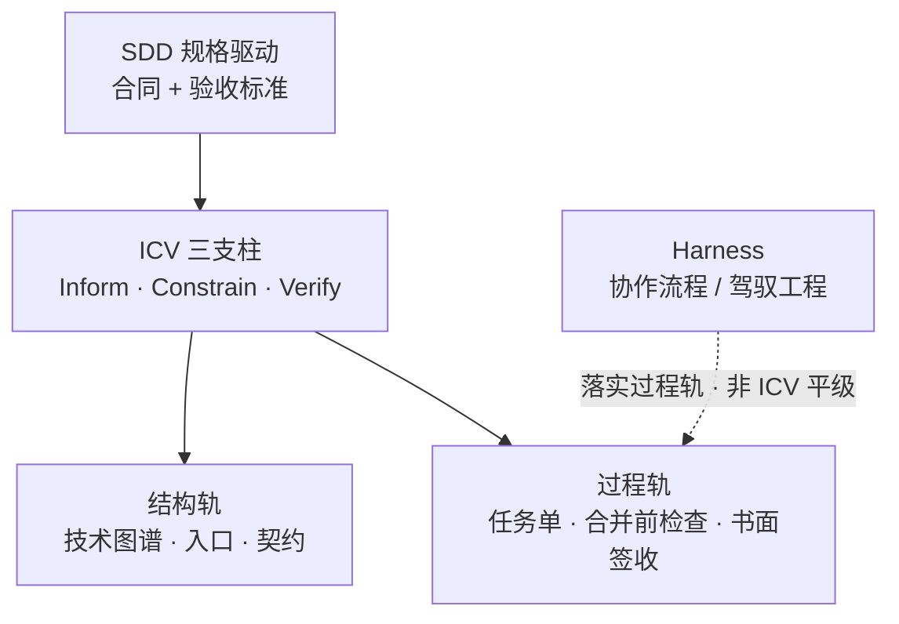
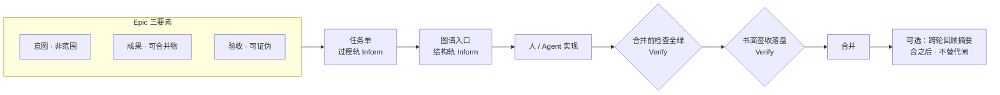

<blockquote>
<p><strong>过程轨、结构轨与 Epic 验收如何叠放</strong> 系列《AI 编程可闭环协作》· <strong>方法论地图</strong></p>
</blockquote>
## 目录

<div class="md-table-wrap">
<table>
<thead><tr>
<th>节</th>
<th>标题</th>
</tr></thead>
<tbody>
<tr>
<td>—</td>
<td>摘要</td>
</tr>
<tr>
<td>1</td>
<td>问题陈述：失败常不在模型</td>
</tr>
<tr>
<td>2</td>
<td>双主轴：过程轨与结构轨</td>
</tr>
<tr>
<td>3</td>
<td>SDD 三支柱：Inform · Constrain · Verify</td>
</tr>
<tr>
<td>4</td>
<td>Epic：意图 · 成果 · 验收</td>
</tr>
<tr>
<td>5</td>
<td>记忆轨与 Skill 的边界</td>
</tr>
<tr>
<td>6</td>
<td>L3 → L2 → L1：什么能抄、什么不能</td>
</tr>
<tr>
<td>7</td>
<td>与 TDD、Code Review、DevOps 的关系</td>
</tr>
<tr>
<td>8</td>
<td>阅读地图：五卷各答什么</td>
</tr>
<tr>
<td>9</td>
<td>诚实边界：本系列不承诺什么</td>
</tr>
<tr>
<td>10</td>
<td>结语</td>
</tr>
</tbody>
</table></div>
<hr />

## 摘要

AI 写代码的交付质量，常见瓶颈 **不在模型够不够强**，而在两件事没补齐：**改哪里、会影响谁** 的结构化上下文，以及 **何时算做完、凭什么合并** 的验收闭环。

本方法论用两条 **正交轨道** 叠放：

**结构轨**（技术图谱：入口、依赖、契约与机器可核对）回答「从哪进、动哪片」；

**过程轨**（任务单、书面签收、合并前检查等 **协作落点**）与 **结构轨**（技术图谱）如何叠放，后文 **§2** 说明；**Inform / Constrain / Verify** 三支柱源于 **规格驱动开发（SDD）**，后文 **§3** 展开。**Harness** 一词在本系列中指两种相近概念：业界讨论的 **Harness Engineering**（驾驭工程），以及本连载具体化的 **「Harness 协作流程」**（任务单、阶段流、合并前检查等）。后者是 **实践 SDD 的一种工程化路径**，**不是** 三支柱的定义来源。

过程轨回答「本趟敢不敢合、谁负责」。一轮有边界的交付（下文称 **Epic**）至少具备 **意图、成果、验收** 三要素；缺验收就不算收尾。

合完之后，可把教训 **可选** 蒸馏成经验卡片、团队 Skill 或 **跨轮回顾摘要**——它们像路口上的警示牌，**不替代** 地图与关卡。操作实例、对照实验与存量案例在连载 **[卷一](https://cloud.tencent.com/developer/article/2675471)～[卷五](https://cloud.tencent.com/developer/article/2681115)**；本文只给 **可迁移的原则地图**。

<hr />

## 1. 问题陈述：失败常不在模型

许多团队已经习惯：自然语言描述需求 → Agent 改文件 → 人眼看 diff → 合并。然而即便换用更强、更贵的模型，往往仍会遇到：


<div class="md-table-wrap">
<table>
<thead><tr>
<th>现象</th>
<th>根因（简化）</th>
</tr></thead>
<tbody>
<tr>
<td>改 A 漏 B，联调才爆</td>
<td>Agent <strong>不知道系统结构</strong> 与依赖</td>
</tr>
<tr>
<td>同一需求反复解释</td>
<td>没有可复用的 <strong>规格与任务依据</strong></td>
</tr>
<tr>
<td>PR 能合但心里没底</td>
<td>缺少 <strong>书面签收</strong> 与 <strong>自动化验收</strong></td>
</tr>
<tr>
<td>对话很长、账单很高</td>
<td><strong>整仓或整段文档</strong> 灌给模型</td>
</tr>
</tbody>
</table></div>
这些问题与「会不会写代码」有关，却 **不能** 单靠 Prompt 技巧或事后炼 Skill 根治：Skill 记住的是 **习惯与教训**，若在一次任务中 **既没有技术图谱，也没有验收门禁**，仍可能漏改、仍不敢合并。

**与模型能力解耦**：同一份任务单、同一张子图、同一套合并前检查，换 Auto 里不同档位的模型，交付口径仍可对齐——工具会变，**意图 / 成果 / 验收** 不应随模型脾气漂移。评测与 Mentor 类工作尤其需要这一点：你要教的是 **可测的题面 + 可签收的结论 + 可复盘的轨迹**，而不是某次对话里模型「看起来懂了」。

<hr />

## 2. 双主轴：过程轨与结构轨

<blockquote>
<p><strong>与 §3 的分工</strong>：<strong>双轨</strong> 是本系列的两类 <strong>落点</strong>（图谱 × 协作执行）；<strong>Inform / Constrain / Verify</strong> 来自 <strong>SDD</strong>（§3）。<strong>Harness</strong> 是落实 SDD 的 <strong>工具/纪律层之一</strong>（任务单、阶段流、CI），勿与 SDD、勿与「过程轨」混成同一个词。</p>
</blockquote>
### 2.1 各答一问


<div class="md-table-wrap">
<table>
<thead><tr>
<th>轨道</th>
<th>回答的问题</th>
<th>典型载体</th>
</tr></thead>
<tbody>
<tr>
<td><strong>过程轨</strong></td>
<td>怎么协作、何时人审、<strong>本趟能否合并</strong></td>
<td>任务单、审查记录、合并前检查全绿</td>
</tr>
<tr>
<td><strong>结构轨</strong></td>
<td>系统长什么样、<strong>从哪进、影响面在哪</strong></td>
<td>技术图谱（主图 + 子图 + 契约/入口清单 + CI）</td>
</tr>
</tbody>
</table></div>
<blockquote>
<p><strong>说明</strong>：结构轨表格中的 <strong>CI</strong> 指 <strong>图谱 CI</strong>——入口清单、契约锚点等 <strong>结构文档与代码一致性</strong> 的自动检查，不是替代合并前业务测试的流水线。</p>
</blockquote>
两条轨 **正交**：同一 Epic 里，你可以既有「图谱入口：从登录子图进入」，又有「验收：单测 + lint 全绿 + Tech Lead 书面签收」——**指标不混表**（不能用「对话很短」代替「检查绿了」）。

### 2.2 只炼 Skill 或只上 CI，各缺什么


<div class="md-table-wrap">
<table>
<thead><tr>
<th>做法</th>
<th>补上了什么</th>
<th>仍容易缺什么</th>
</tr></thead>
<tbody>
<tr>
<td><strong>只做 Skill / Rules</strong></td>
<td>个人或团队的 <strong>提问与编码习惯</strong></td>
<td><strong>改哪、影响谁</strong>；当次任务 <strong>书面验收</strong></td>
</tr>
<tr>
<td><strong>只做 CI / DevOps</strong></td>
<td>合并前的 <strong>机器背压</strong></td>
<td>Agent 开工前 <strong>挂错入口</strong>；任务 <strong>非范围</strong> 与 <strong>失败路径</strong> 未写清</td>
</tr>
<tr>
<td><strong>只写 Wiki / 产品文档</strong></td>
<td>业务规则与背景</td>
<td><strong>与代码同步</strong> 的工程入口与契约；<strong>签收纪律</strong></td>
</tr>
</tbody>
</table></div>
本系列主张：**结构进图谱**；**过程侧按 SDD 三支柱落实**（任务单、签收、合并前检查，见 §3），其中 **Harness 协作流程** 是常用 **工具层**；合完后 **可选** 把习惯与决策炼进 Skill 或 **跨轮回顾摘要**（详见 §5）。

### 2.3 一段比喻（可选理解，非规范定义）

可以把协作想成工地运输：**技术图谱** 是带方向的道路图，规定从哪扇门进、会连到哪些工区；Agent 默认只领 **一小张局部地图**（具体形式见连载 [卷二 §9](https://cloud.tencent.com/developer/article/2676250)），而不是背下整座城市。**关卡** 对应 SDD 三支柱里的 **Verify**（及过程轨上的签收）：检查绿了没有、审查签了没有，过关才上主路。经验卡片或 Skill 是路口上的 **警示牌**——目的地仍在图上的 **入口节点**，不在牌子上。

<hr />

## 3. SDD 三支柱：Inform · Constrain · Verify

**规格驱动开发（Spec-Driven Development，SDD）** 强调 **先规格、后实现**：用可执行的说明（Spec / 任务单）明确行为边界，再改代码，并以检查证明对齐。[卷一](https://cloud.tencent.com/developer/article/2675471)的 **意图 · 成果 · 验收** 与 SDD 同向；[卷三](https://cloud.tencent.com/developer/article/2678669)标题里的 **「Harness 与 SDD」** 指：**SDD 是上层方法论**，**Harness**（协作流程、阶段流、合并前检查）是 **把 SDD 落到 AI 协作里的一种工程化路径**——**不是** 三支柱的定义来源。

**Inform（告知）· Constrain（约束）· Verify（验证）** 是 SDD 语境下组织协作的 **三支柱**（[卷一](https://cloud.tencent.com/developer/article/2675471)写作「告知 · 约束 · 验证」）。它们回答：开工前 **告知** 够不够、执行中 **约束** 能否核对、合并前 **验证** 能否重复。本系列 **不发明** 第四支柱；**双轨**（§2）只是把 SDD 三支柱 **落实** 到两类落点：

```text
SDD（规格驱动 · 上层方法论）
  └── ICV 三支柱（Inform / Constrain / Verify）
          ├──► 结构轨 · 技术图谱
          └──► 过程轨 · 任务单、签收、合并前检查
（过程轨上常经 Harness 协作流程、Harness Engineering 等工具落实，非 ICV 的子节点）
```

**图 1 · SDD、ICV、双轨与 Harness 的归属**（Harness **落实** 过程轨，**不是** 与 ICV 平级的第四支柱）：



<div class="md-table-wrap">
<table>
<thead><tr>
<th>支柱（SDD / ICV）</th>
<th>含义（读者向）</th>
<th>过程轨落点</th>
<th>结构轨（图谱）落点</th>
</tr></thead>
<tbody>
<tr>
<td><strong>Inform</strong></td>
<td>开工前说清读什么、范围与依据</td>
<td>任务单：背景、<strong>非范围</strong>、依赖说明</td>
<td><strong>图谱入口</strong>；查询子图而非整仓灌文档</td>
</tr>
<tr>
<td><strong>Constrain</strong></td>
<td>边界与失败行为可规则化</td>
<td><strong>失败路径</strong>、测试策略、拒开工清单</td>
<td>契约/入口清单；图谱与代码 <strong>门牌号一致</strong></td>
</tr>
<tr>
<td><strong>Verify</strong></td>
<td>合并前可重复验证、可追责</td>
<td><strong>合并前检查全绿</strong>、<strong>书面签收落盘</strong></td>
<td>export/入口/叙述层 CI；读法对照 <strong>带题集边界</strong></td>
</tr>
</tbody>
</table></div>
### 3.1 易混：SDD 与 Harness Engineering（驾驭工程）

二者 **协同**，但 **不是同一套东西**。SDD 讨论里也会出现「约束」「验证」等词，通常指 **规格本身应具备的特征**；而 ICV 在本系列中指 **工程里可执行的组件与纪律**（任务单字段、CI、签收），勿混读。


<div class="md-table-wrap">
<table>
<thead><tr>
<th>维度</th>
<th><strong>SDD（规格驱动开发）</strong></th>
<th><strong>Harness Engineering（驾驭工程）</strong></th>
</tr></thead>
<tbody>
<tr>
<td><strong>起源</strong></td>
<td>传统软件工程：用契约与规格管理复杂性</td>
<td>近年围绕 LLM 的 <strong>外部工程化</strong> 讨论（如 Mitchell Hashimoto 提出概念、OpenAI Codex 团队实践等业界叙事）</td>
</tr>
<tr>
<td><strong>核心</strong></td>
<td>先写清 Spec，再实现，保证实现与规格对齐</td>
<td>围绕 LLM 建 <strong>外部工程系统</strong>，引导、约束、验证 AI，把不稳定产出变成可合并交付</td>
</tr>
<tr>
<td><strong>典型口号</strong></td>
<td>先想后做，规格即契约</td>
<td>模型能力趋同时，<strong>工程系统（Harness）</strong> 决定能否稳定交付</td>
</tr>
<tr>
<td><strong>与本连载</strong></td>
<td><strong>Epic 三要素、任务单、验收</strong> 的 <strong>方法论父层</strong>；<strong>ICV 三支柱归属此处</strong></td>
<td><a href="https://cloud.tencent.com/developer/article/2678669">卷三</a> <strong>Harness 协作流程</strong>、CI、书面签收等 <strong>实践层之一</strong></td>
</tr>
<tr>
<td><strong>关系</strong></td>
<td>定义「要交付什么、如何验收」</td>
<td><strong>实践 SDD 的工具之一</strong>；可与 SDD、敏捷等 <strong>并行叠加</strong>，非替代 SDD</td>
</tr>
</tbody>
</table></div>
<blockquote>
<p>Harness Engineering「典型口号」一句为 <strong>业界讨论</strong>，非本系列独创。</p>
</blockquote>
**为何容易混（三条）**：

1. SDD 讨论里也会出现「约束」「验证」——多指 **规格应具备的特征**，不是 Harness 里的工程组件名。  
2. **Harness 是实践 SDD 的路径之一**（尤其把 Verify 落到 CI、签收），**不是** Inform / Constrain / Verify 的定义来源。  
3. **Harness Engineering** 更像 **独立工程话语**，可与多种开发流程结合；本连载的「Harness 协作流程」与之同向，但落盘在 **任务单 + 阶段流 + 检查**，不绑定某一商业产品。

<blockquote>
<p><strong>类比（秒懂）</strong>：<strong>SDD</strong> ≈ <strong>合同 + 验收标准</strong>；<strong>Harness</strong> ≈ 工地 <strong>闸机、巡检、签字</strong>——前者定交付与怎么验，后者把纪律落到协作现场（见图 1）。</p>
<p>「Harness」兼指业界 <strong>Harness Engineering</strong> 与本连载 <strong>任务单 + 阶段流 + 检查</strong>（<a href="https://cloud.tencent.com/developer/article/2678669">卷三</a>）。<strong>图谱轨</strong> 服务 SDD 的 Inform / Constrain（读哪里、契约一致）。</p>
</blockquote>
**Verify 加厚（评测向）**：Mentor 或评测团队关心的是 **验收证据**——验收项能否被测试或检查 **证伪**；协作过程是否留下 **可复盘轨迹**（谁、何时、基于什么材料签收）。这与「多堆对话日志当训练数据」不是一回事：日志若没有对齐 **意图 / 成果 / 验收**，很难还原「当时什么叫做完」。

**轨迹表述（抽象）**：开工前有任务依据；合并前有检查结论；关键节点有 **书面记录**（可检索，而非仅聊天窗口）。**不用** 合并率、单次 token 账单或「感觉差不多」充当 Epic 收尾标准。

**与「只堆对话数据」的边界**：训练或评测若只收集长对话，往往难以还原 **当时** 的验收标准与非范围。过程轨要求把 **可失败** 的验收项写进任务单，并把 **检查结论与签收** 留在仓库可检索处——这样事后分析的是 **交付决策链**，而不是聊天记录里的语气与猜测。

**粒度对照（Mentor 向）**：


<div class="md-table-wrap">
<table>
<thead><tr>
<th>粒度</th>
<th>是什么</th>
<th>三要素是否必填</th>
</tr></thead>
<tbody>
<tr>
<td><strong>题集 / 作业</strong></td>
<td>评测用的一题或一组题</td>
<td>每题应有可测意图、可验收成果</td>
</tr>
<tr>
<td><strong>Epic / 专题</strong></td>
<td>工程上一包有边界的交付</td>
<td><strong>必填</strong> 验收；可有多个 PR</td>
</tr>
<tr>
<td><strong>单次工单 / task</strong></td>
<td>Epic 内的实现单元</td>
<td>继承 Epic 验收；可再加局部清单</td>
</tr>
</tbody>
</table></div>
<hr />

## 4. Epic：意图 · 成果 · 验收

**Epic** 在本文中指：**有边界的一包工程交付**，而不是和模型无限续聊。它可以对应产品上的一个主题，也可以对应仓库里 **一条任务链**（一个主任务单 + 若干关联子任务）。再小的单次改动，也建议 **具备三要素**（可写在同一张任务单里）：


<div class="md-table-wrap">
<table>
<thead><tr>
<th>要素</th>
<th>是什么</th>
<th>缺了会怎样</th>
</tr></thead>
<tbody>
<tr>
<td><strong>意图</strong></td>
<td>要达成什么、<strong>明确不做</strong>什么</td>
<td>Agent 与人都易 <strong>范围漂移</strong></td>
</tr>
<tr>
<td><strong>成果</strong></td>
<td>可合并的代码、配置、文档、规则变更</td>
<td>「聊过了」但 <strong>无可合并物</strong></td>
</tr>
<tr>
<td><strong>验收</strong></td>
<td>测试/检查通过 + 审查签收 + 关键结论可追溯</td>
<td><strong>不敢合</strong> 或合了无法复盘</td>
</tr>
</tbody>
</table></div>
**任务单** 是 Epic 内更小工单的常见载体；**验收不可省**。任务单 + 签收在本系列里也称 **本轮交付依据**（即本轮 **唯一可信的「做完」依据**——以书面记录与检查为准，而非聊天结论）。

**专题收尾**（合并后的归档、可选摘要编译）属于 **合之后** 的纪律，见连载[卷四](https://cloud.tencent.com/developer/article/2680278)；**合并本身不自动生成** 跨轮回顾摘要。

**图 2 · 一轮 Epic 的简化交付链**（端到端心智模型；**不是** [卷三](https://cloud.tencent.com/developer/article/2678669)完整阶段流或[卷二](https://cloud.tencent.com/developer/article/2676250)主图+子图细节）：



### 4.1 迷你题集示例（虚构 · 泛化）

下面 **一题** 展示「题集 / 作业」应如何写清三要素——**可迁移写法**，**不是** 某仓库的真题，**不可整包照搬**为你们的基准集（见 §6）。

**题：为公开 HTTP API 增加按 IP 的速率限制**


<div class="md-table-wrap">
<table>
<thead><tr>
<th>要素</th>
<th>内容</th>
</tr></thead>
<tbody>
<tr>
<td><strong>意图</strong></td>
<td>降低滥用风险；对内部批处理通道 <strong>不适用</strong> 限流；<strong>非范围</strong>：不改鉴权模型、不改计费</td>
</tr>
<tr>
<td><strong>成果</strong></td>
<td>限流中间件 + 可配置阈值；统一错误响应形状；更新对外接口说明</td>
</tr>
<tr>
<td><strong>验收</strong></td>
<td>超限返回约定状态码；单测覆盖边界与过期配置；配置缺失时 <strong>使用默认值并记录告警</strong>（失败路径可复述；*仅为示例，非强制行为*）；合并前检查全绿；审查书面签收</td>
</tr>
</tbody>
</table></div>
评测读者可据此检查：题面是否 **可测**、预期结果是否 **可验收**、失败是否 **可记录**——而不是只有「模型改得像样」。

<hr />

## 5. 记忆轨与 Skill 的边界

**Skill**、编辑器 Rules、经验卡片，在本框架里属于 **习惯层或 Constrain 的延伸**：减少重复 Prompt，统一命名与测试顺序。**它们不替代**：

- **结构轨**：改架构仍要 **改图谱**（PR 顺手维护），不能只加 Skill；
- **过程轨**：**合并前检查 + 书面签收** 不能省——在平台上点一下 Approve **不等于** 本系列意义上的交付。

**跨轮回顾摘要**（从已收尾材料 **编译** 出的 Epic 级决策页）帮助半年后少翻冗长留痕；**不是** 产品 Wiki 全文，**不能** 代替图谱做影响分析。与 **LLM Wiki**、PRD 的分工，**连载[卷四](https://cloud.tencent.com/developer/article/2680278)** 有表；此处只记一句：**摘要/Wiki 层不替代「敢不敢合」的闸。**

**冷 / 温 / 热** 在连载里指 **协作记忆分层**（结构地图 / 协作轨迹 / 远期运行时记忆），**不是** 软件架构里的三层。**不是** 架构冷层、温层、热层——若团队内部另有同名术语，请在术语表写清映射，避免与系列混用（详见 [卷五 §23.1](https://cloud.tencent.com/developer/article/2681115)；总论不展开）。

<hr />

## 6. L3 → L2 → L1：什么能抄、什么不能


<div class="md-table-wrap">
<table>
<thead><tr>
<th>层级</th>
<th>是什么</th>
<th>能否迁移</th>
</tr></thead>
<tbody>
<tr>
<td><strong>L3 原则</strong></td>
<td>SDD 三支柱（ICV）、双轨叠放、Epic 三要素、验收纪律</td>
<td><strong>可讲可教到</strong> 其他项目（SDD/ICV 可迁移；Harness 落盘与具体仓库路径、实验数字不可整包抄）</td>
</tr>
<tr>
<td><strong>L2 做法</strong></td>
<td>任务单字段名、合并前命令集合、图谱目录习惯</td>
<td>须 <strong>按栈改写</strong>（前端/后端/单体各不相同）</td>
</tr>
<tr>
<td><strong>L1 实例</strong></td>
<td>某仓路径、某次对照实验数字、gold 题集命中率</td>
<td><strong>不可整包外推</strong> 到全行业或其他仓</td>
</tr>
</tbody>
</table></div>
回应「能直接复制你们仓库吗」：**能抄纪律与题集写法，不能抄整包数字与目录。** 原则（L3）是离职后个人对多条项目实践的 **归纳**；此前所在团队 **并未** 形成与本文等价的完整体系——本文是可迁移的 **通用工程协作框架**，不是某司内部制度说明。

<hr />

## 7. 与 TDD、Code Review、DevOps 的关系

- **TDD / 单测**：仍负责「行为对不对」；本方法论负责「这次改动 **有没有测试策略**、失败路径写没写、敢不敢合并」。契约检查绿了，**仍可能** 行为逻辑错——门牌号对了，屋里逻辑还要靠测试（连载[卷五](https://cloud.tencent.com/developer/article/2681115) FAQ 有对照）。
- **Code Review**：过程轨（Verify + Inform）把「聊过」变成 **可检索的审查记录**；图谱让 Reviewer 更快看 **影响面**。
- **CI/CD**：Verify 的硬背压；Agent 自检 **不能** 代替流水线。
- **Jira / 飞书工单**：产品沟通层；任务单是 **工程交付依据**——宜 **叠加**，不宜再搞第三套互相打架的流程（存量降级见[卷三](https://cloud.tencent.com/developer/article/2678669)）。

**叠加，不替换**：你没有 TDD 或 CI，应先补 **「验得动」**（哪怕先是手动门禁写进任务单），再谈 Agent 规模化。

<hr />

## 8. 阅读地图：五卷各答什么

读完本文，可按处境选连载（均 **无卷号依赖** 于本篇，但[卷二](https://cloud.tencent.com/developer/article/2676250)起建议顺序阅读）：


<div class="md-table-wrap">
<table>
<thead><tr>
<th>读者处境</th>
<th>建议路径</th>
<th>本篇已够可停</th>
</tr></thead>
<tbody>
<tr>
<td><strong>Mentor / 评测 / 教模型写代码</strong></td>
<td><strong>本文全文</strong> → <a href="https://cloud.tencent.com/developer/article/2678669">卷三 Harness</a>（Verify）→ <a href="https://cloud.tencent.com/developer/article/2680278">卷四 专题收尾与摘要</a></td>
<td>需要题集与轨迹细节时再下钻；本文 §4.1 可作出题模板</td>
</tr>
<tr>
<td><strong>新项目 / 个人实验</strong></td>
<td>本文 → <a href="https://cloud.tencent.com/developer/article/2675471">卷一 §6 最小起步</a> → <a href="https://cloud.tencent.com/developer/article/2676250">卷二 图谱</a></td>
<td>只要原则时可停；动手优先<a href="https://cloud.tencent.com/developer/article/2675471">卷一</a>模板</td>
</tr>
<tr>
<td><strong>存量 / 老项目</strong></td>
<td>本文 → <a href="https://cloud.tencent.com/developer/article/2681115">卷五 渐进路线</a> · <a href="https://cloud.tencent.com/developer/article/2678669">卷三</a>无 CI 降级</td>
<td>勿先<a href="https://cloud.tencent.com/developer/article/2676250">卷二</a>物化细节；先「验得动」再铺图</td>
</tr>
<tr>
<td><strong>只要 Agent 读架构</strong></td>
<td>本文 §2～§3 → <a href="https://cloud.tencent.com/developer/article/2676250">卷二 技术图谱</a></td>
<td>可跳过 Harness 细则；仍建议知 §4 验收概念</td>
</tr>
<tr>
<td><strong>只要敢合并</strong></td>
<td>本文 §3～§4 → <a href="https://cloud.tencent.com/developer/article/2678669">卷三</a> → <a href="https://cloud.tencent.com/developer/article/2680278">卷四</a> §17 摘要</td>
<td>可跳过图谱实验数字；契约红了见<a href="https://cloud.tencent.com/developer/article/2680278">卷四</a>失败分支</td>
</tr>
<tr>
<td>卷</td>
<td>副标题（连载）</td>
<td>你得到什么</td>
</tr>
<tr>
<td><a href="https://cloud.tencent.com/developer/article/2675471">卷一</a></td>
<td>怎样才算「做完」</td>
<td>动机、双轨总览、最小起步</td>
</tr>
<tr>
<td><a href="https://cloud.tencent.com/developer/article/2676250">卷二</a></td>
<td>技术图谱</td>
<td>子图、读法对照、图谱 CI</td>
</tr>
<tr>
<td><a href="https://cloud.tencent.com/developer/article/2678669">卷三</a></td>
<td>Harness 与 SDD</td>
<td><strong>实践 SDD</strong> 的 Harness 协作流程（任务单、签收、阶段流）</td>
</tr>
<tr>
<td><a href="https://cloud.tencent.com/developer/article/2680278">卷四</a></td>
<td>闭环交付与经验沉淀</td>
<td>专题流水线、跨轮回顾摘要</td>
</tr>
<tr>
<td><a href="https://cloud.tencent.com/developer/article/2681115">卷五</a></td>
<td>存量怎么落地</td>
<td>案例机制、FAQ、阶段 0～3、诚实边界</td>
</tr>
</tbody>
</table></div>
系列版本与发表链接见 [OUTLINE](../ARTICLE_AI_Coding_可闭环协作_公众稿_OUTLINE_v1.0.0_zh.md)。

<hr />

## 9. 诚实边界：本系列不承诺什么


<div class="md-table-wrap">
<table>
<thead><tr>
<th>请勿外推为…</th>
<th>实际范围</th>
</tr></thead>
<tbody>
<tr>
<td>有图谱就不会幻觉 / 零 bug</td>
<td><strong>降低</strong> 漏改与漂范围；仍要单测、失败路径、签收</td>
</tr>
<tr>
<td>全自动无人值守交付</td>
<td><strong>有闸的协作</strong>；关键节点人审</td>
</tr>
<tr>
<td>任意仓库、任意语言零配置</td>
<td>须 <strong>自建题集</strong> 与试点链；存量 <strong>渐进</strong>（阶段 0～3）</td>
</tr>
<tr>
<td>对照实验降幅 = 全行业普适</td>
<td>须在 <strong>声明题集 + 单仓 + 场景</strong> 内解读；连载<a href="https://cloud.tencent.com/developer/article/2676250">卷二</a>/<a href="https://cloud.tencent.com/developer/article/2680278">卷四</a>有边界表述</td>
</tr>
<tr>
<td>维护图谱可忽略</td>
<td>作者在 <strong>小样本</strong>（约数名后端、每周数个任务、少量试点链）中，将图谱相关维护控制在开发时间 <strong>约 10%～15% 的目标区间</strong>——<strong>非行业标准、非 KPI、非承诺</strong>；过高应减项或加强自动化</td>
</tr>
<tr>
<td>增量图谱 CI 已成熟可照搬</td>
<td>现阶段强调 <strong>全量</strong> export/入口与叙述层检查；<strong>增量</strong> 图谱 CI <strong>未</strong> 作公众稿承诺</td>
</tr>
</tbody>
</table></div>
本方法论 **不** 绑定某一品牌 Agent、**不** 把 OpenSpec / 特定编排工具写为标配；能力等价物是 **任务单 + 测试/lint + 契约或入口检查**。

<hr />

## 10. 结语

若你只想用 15 分钟建立全局心智：读完本文即可知道 **SDD 与 ICV 三支柱、Harness 在其中的位置、双轨叠放、Epic 三要素** 与 **五卷分工**。

若要动手：**新读者从 [卷一](https://cloud.tencent.com/developer/article/2675471) 最小起步**；要地图读 **[卷二](https://cloud.tencent.com/developer/article/2676250)**；要敢合并读 **[卷三](https://cloud.tencent.com/developer/article/2678669)**；要合后沉淀读 **[卷四](https://cloud.tencent.com/developer/article/2680278)**；老项目直接看 **[卷五](https://cloud.tencent.com/developer/article/2681115) 阶段 0**，但仍建议 **浏览** [卷一](https://cloud.tencent.com/developer/article/2675471)～[卷三](https://cloud.tencent.com/developer/article/2678669)要点。

**SDD 定规格与验收，结构进图谱，过程经 Harness 等落实 ICV，习惯与决策合后再沉淀。** 先认路，再干活，过关放行，再可选挂牌。

<hr />

*许可：CC BY 4.0 · 署名可转载与改编 · 系列文稿：[ai-coding-closed-loop-articles](https://github.com/Cyning12/ai-coding-closed-loop-articles)*
