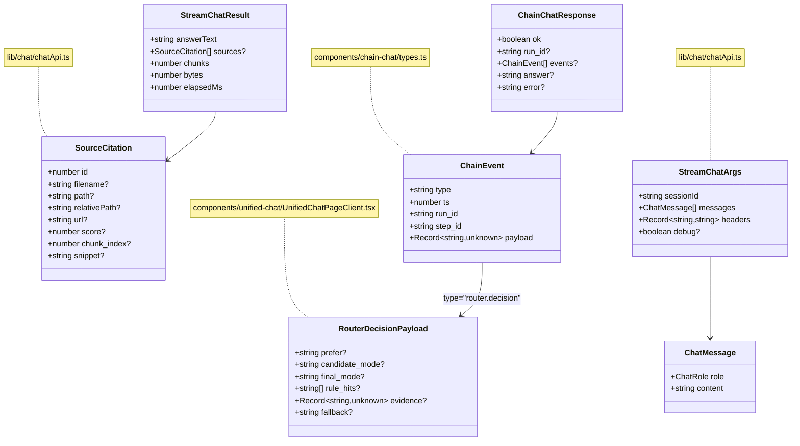

```mermaid
classDiagram
  %% 01_struct: TS 类型/Interface 统一 Struct 图（仅列关键字段，避免贴大段类型）

  class ChatMessage {
    +ChatRole role
    +string content
  }

  class SourceCitation {
    +number id
    +string filename?
    +string path?
    +string relativePath?
    +string url?
    +number score?
    +number chunk_index?
    +string snippet?
  }

  class StreamChatArgs {
    +string sessionId
    +ChatMessage[] messages
    +Record~string,string~ headers
    +boolean debug?
  }

  class StreamChatResult {
    +string answerText
    +SourceCitation[] sources?
    +number chunks
    +number bytes
    +number elapsedMs
  }

  class ChainEvent {
    +string type
    +number ts
    +string run_id
    +string step_id
    +Record~string,unknown~ payload
  }

  class ChainChatResponse {
    +boolean ok
    +string run_id?
    +ChainEvent[] events?
    +string answer?
    +string error?
  }

  class RouterDecisionPayload {
    +string prefer?
    +string candidate_mode?
    +string final_mode?
    +string[] rule_hits?
    +Record~string,unknown~ evidence?
    +string fallback?
  }

  %% 关联（真实代码来源）
  StreamChatArgs --> ChatMessage
  StreamChatResult --> SourceCitation
  ChainChatResponse --> ChainEvent
  ChainEvent --> RouterDecisionPayload : type="router.decision"

  %% 文件锚点（作为“同构规范”入口）
  note for StreamChatArgs "lib/chat/chatApi.ts"
  note for SourceCitation "lib/chat/chatApi.ts"
  note for ChainEvent "components/chain-chat/types.ts"
  note for RouterDecisionPayload "components/unified-chat/UnifiedChatPageClient.tsx"
```

