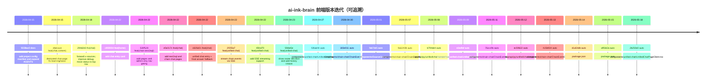

```mermaid
timeline
  title ai-ink-brain 前端版本迭代（可追溯）

  2026-04-15 : 9338ac0 docs: add project config manifest and expand AGENTS
  2026-04-15 : ebecace feat(chat,content): dedicated chat page; fix learning/tasks
  2026-04-18 : 294d2d3 fix(chat): forward x-sources; improve debug; move status to top nav

  2026-04-22 : c850004 feat(home): add chat entry card
  2026-04-22 : 530f528 feat(chain,text2sql): add pages and admin-only nav gating
  2026-04-22 : e5e317c feat(chat): add text2sql and chain chat pages
  2026-04-22 : c826d21 feat(chat): unified chat entry + final answer fallback
  2026-04-22 : 2f255a7 feat(unified-chat): stream chain events via SSE
  2026-04-22 : 45fcd70 feat(unified-chat): add SSE streaming support

  2026-04-23 : f2bbe5e feat(unified-chat): show router decision and add history corpus
  2026-04-27 : f28ae44 auto: components/unified-chat/UnifiedChatPageClient.tsx
  2026-04-30 : 183e011 auto: components/chain-chat/ChainEventCard.tsx
  2026-05-01 : fab7dc5 auto: components/SourceCitations.tsx
  2026-05-07 : 9a02408 auto: components/chain-chat/ChainEventCard.tsx
  2026-05-08 : b794de4 auto: app/api/py/unified/chat/stream/route.ts
  2026-05-09 : e3edfaf auto: components/unified-chat/UnifiedChatPageClient.tsx
  2026-05-11 : 76ccc9b auto: components/chain-chat/ChainEventCard.tsx
  2026-05-12 : ec59622 auto: app/api/py/unified/chat/route.ts
  2026-05-13 : 415b934 auto: components/chain-chat/ChainEventCard.tsx
  2026-05-14 : d1a54db auto: package.json
  2026-05-15 : af93d2a auto: package.json
  2026-05-18 : 2b250e0 auto: components/unified-chat/UnifiedChatPageClient.tsx
```

**Verify（P1）**：PR 门禁 workflow **`quality`**（`ai-ink-brain/.github/workflows/quality.yml`）含 **`pnpm test`**（Vitest，与根 `AGENTS.md` §8 一致）。

