```mermaid
timeline
  title ai-ink-brain 前端版本迭代（可追溯）

  2026-04-15 : 9338ac0 docs: add project config manifest and expand AGENTS
  2026-04-15 : ebecace feat(chat,content): dedicated chat page; fix learning/tasks
  2026-04-18 : 294d2d3 fix(chat): forward x-sources; improve debug; move status to top nav

  2026-04-22 : c850004 feat(home): add chat entry card
  2026-04-22 : 530f528 feat(chain,text2sql): add pages and admin-only nav gating
  2026-04-22 : e5e317c feat(chat): add text2sql and chain chat pages
  2026-04-22 : c826d21 feat(chat): unified chat entry + final answer fallback
  2026-04-22 : 2f255a7 feat(unified-chat): stream chain events via SSE
  2026-04-22 : 45fcd70 feat(unified-chat): add SSE streaming support

  2026-04-23 : f2bbe5e feat(unified-chat): show router decision and add history corpus
  2026-04-27 : f28ae44 auto: components/unified-chat/UnifiedChatPageClient.tsx
  2026-04-30 : 183e011 auto: components/chain-chat/ChainEventCard.tsx
  2026-05-01 : fab7dc5 auto: components/SourceCitations.tsx
  2026-05-07 : 9a02408 auto: components/chain-chat/ChainEventCard.tsx
  2026-05-08 : b794de4 auto: app/api/py/unified/chat/stream/route.ts
  2026-05-09 : e3edfaf auto: components/unified-chat/UnifiedChatPageClient.tsx
  2026-05-11 : 76ccc9b auto: components/chain-chat/ChainEventCard.tsx
  2026-05-12 : ec59622 auto: app/api/py/unified/chat/route.ts
  2026-05-13 : 415b934 auto: components/chain-chat/ChainEventCard.tsx
  2026-05-14 : d1a54db auto: package.json
  2026-05-15 : af93d2a auto: package.json
  2026-05-18 : 2b250e0 auto: components/unified-chat/UnifiedChatPageClient.tsx
  2026-05-20 : tech graph v2 parity graph_v2_schema 99_mermaid_protocol equivalence CI playbook
  2026-05-20 : T3 W2 Mermaid 双轨拓扑审计 5 对 flowchart 锚点补强 equivalence 绿 freeze TECH_GRAPH_S2_FREEZE_20260519_V2_3
  2026-05-21 : 45455e0 auto: components/unified-chat/UnifiedChatExecutionTracePanel.tsx
  2026-05-23 : 7901b24 auto: lib/unified-chat/sse/chainEventFromSse.test.ts
  2026-05-31 : 34ade39 auto: components/chain-chat/ChainEventCard.tsx
  2026-06-01 : portfolio W1 NEXT_PUBLIC_SITE_MODE SiteNav/HomeModules 四链分支 lib/site-mode.ts
  2026-06-02 : 82b9a90 auto: app/_components/home-modules.tsx
  2026-06-02 : portfolio W2 三内容页 resume/methodology/evidence get-portfolio-doc 根演示首页 PR49
  2026-06-02 : portfolio W3 访客秘钥 portfolio_visitor_session unlock/session role TTL gen-portfolio-secrets.sh
  2026-06-03 : docs(tasks,harness): content/tasks+content/harness 迁至 docs/；RAG ingest 仅扫 content/ 语料
  2026-06-04 : 22ce1c3 auto: app/_components/back-button.tsx
  2026-06-08 : f02d53c auto: app/_components/markdown-content.tsx
  2026-06-09 : tech-debt M01–M06 py-service-proxy 链 (#60 → production)
  2026-06-09 : P1 11_flow_api 增量 PROXY 子图（py-service-proxy · forward-py-rag-chat）
  2026-06-17 : 3a40c67 auto: package.json
  2026-06-21 : feat(ops-desk): site_mode=ops + /ops/login + middleware M0 secret guard + /api/ops/* skeleton
  2026-06-22 : 1f32f29 auto: app/ops/kimi-code/issues/page.tsx
  2026-06-22 : P1 规划 14_flow_ops_chat · BFF/UI after_seq · 00_main 挂链
  2026-06-23 : e52e83f auto: app/ops/kimi-code/graph/page.tsx
  2026-06-24 : f12944c auto: app/api/ops/metrics/summary/route.test.ts
  2026-06-25 : 6ad947a auto: app/api/ops/chat/models/route.test.ts
  2026-06-26 : 494d2eb auto: app/api/ops/auth/session/route.ts
```

**Verify（P1）**：PR 门禁 workflow **`quality`** 含 **`pnpm test`**、**`tech_graph_graph_export --check`** 与 **`tech_graph_graph_equivalence_check`**（graph_v2，与 `docs/tasks/specs/MIGRATION-tech_graph_v2_frontend_playbook_v1_zh.md` 一致）。

