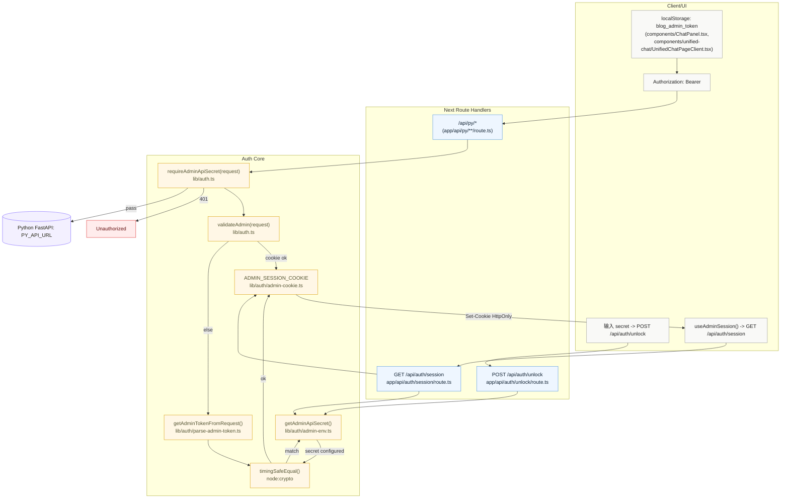

```mermaid
flowchart TD
  %% 12_flow_auth: 登录、权限、Session、Bearer（以真实代码为准）

  subgraph UI[Client/UI]
    LS["localStorage: blog_admin_token\n(components/ChatPanel.tsx,\ncomponents/unified-chat/UnifiedChatPageClient.tsx)"]:::c
    TOKEN["Authorization: Bearer <token>"]:::c
    UNLOCK_UI["输入 secret -> POST /api/auth/unlock"]:::c
    SESSION_UI["useAdminSession() -> GET /api/auth/session"]:::c
  end

  subgraph NEXT[Next Route Handlers]
    API_UNLOCK["POST /api/auth/unlock\napp/api/auth/unlock/route.ts"]:::a
    API_SESSION["GET /api/auth/session\napp/api/auth/session/route.ts"]:::a
    API_PY["/api/py/*\n(app/api/py/**/route.ts)"]:::a
  end

  subgraph AUTH[Auth Core]
    ENV["getAdminApiSecret()\nlib/auth/admin-env.ts"]:::s
    PARSE["getAdminTokenFromRequest()\nlib/auth/parse-admin-token.ts"]:::s
    COOKIE["ADMIN_SESSION_COOKIE\nlib/auth/admin-cookie.ts"]:::s
    VALIDATE["validateAdmin(request)\nlib/auth.ts"]:::s
    REQ["requireAdminApiSecret(request)\nlib/auth.ts"]:::s
    TSE["timingSafeEqual()\nnode:crypto"]:::s
  end

  %% unlock cookie mint
  UNLOCK_UI --> API_UNLOCK --> ENV
  ENV -->|secret configured| TSE
  TSE -->|ok| COOKIE
  COOKIE -->|Set-Cookie HttpOnly| SESSION_UI

  %% session check
  SESSION_UI --> API_SESSION --> ENV
  API_SESSION --> COOKIE

  %% bearer path (token in header)
  LS --> TOKEN --> API_PY

  %% request gate
  API_PY --> REQ --> VALIDATE
  VALIDATE -->|cookie ok| COOKIE
  VALIDATE -->|else| PARSE --> TSE -->|match| ENV

  %% outcome
  REQ -->|401| DENY[Unauthorized]:::e
  REQ -->|pass| UPSTREAM[(Python FastAPI: PY_API_URL)]:::p

  classDef c fill:#f9f9f7,stroke:#999,color:#222;
  classDef a fill:#eef6ff,stroke:#4a90e2,color:#123;
  classDef s fill:#fff7e6,stroke:#d89b00,color:#553;
  classDef p fill:#f3f0ff,stroke:#7b61ff,color:#221;
  classDef e fill:#ffecec,stroke:#d33,color:#611;
```

