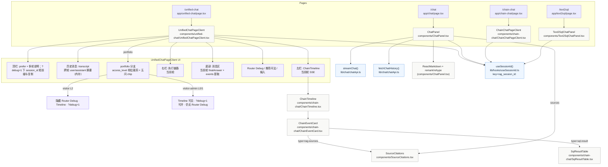

```mermaid
flowchart TB
  %% 13_flow_components: 通用组件渲染 & 数据流向（只列真实组件）

  subgraph PAGES[Pages]
    CHAT["/chat\napp/chat/page.tsx"] --> CP["ChatPanel\ncomponents/ChatPanel.tsx"]:::c
    UNIFIED["/unified-chat\napp/unified-chat/page.tsx"] --> UCP["UnifiedChatPageClient\ncomponents/unified-chat/UnifiedChatPageClient.tsx"]:::c
    CHAIN["/chain-chat\napp/chain-chat/page.tsx"] --> CCP["ChainChatPageClient\ncomponents/chain-chat/ChainChatPageClient.tsx"]:::c
    T2S["/text2sql\napp/text2sql/page.tsx"] --> T2P["Text2SqlChatPanel\ncomponents/Text2SqlChatPanel.tsx"]:::c
  end

  %% Unified：方案 A — 历史 transcript（跨轮）+ 双栏当前轮 Timeline / 执行链路 + 底部当前轮消息区
  subgraph UC_UI[UnifiedChatPageClient UI]
    UCP --> UC_TOP[顶栏: prefer + 多轮说明；?debug=1 下 session_id 短前缀与复制]:::u
    UCP --> UC_HIST[历史消息: transcript\n跨轮 user/assistant 摘要（内存）]:::u
    UCP --> UC_MID[左栏: ChainTimeline\n当前轮 SSE]:::u
    UCP --> UC_RIGHT[右栏: 执行链路\n当前轮]:::u
    UCP --> UC_MSG[底部: 消息区\n当前轮 finalAnswer + events 提取]:::u
    UCP --> UC_DBG[Router Debug / 推荐问法 / 输入]:::u
    UCP -->|portfolio| UC_PORT[portfolio 分支\naccess_level 档位裁剪 + 五问 chip]:::u
  end

  UC_PORT -->|visitor L2| UC_HIDE[隐藏 Router Debug · Timeline · ?debug=1]:::u
  UC_PORT -->|visitor-admin L0/1| UC_PART[Timeline 可见 · ?debug=1 可开 · 仍无 Router Debug]:::u

  UC_MID --> TL["ChainTimeline\ncomponents/chain-chat/ChainTimeline.tsx"]:::c
  TL --> EC["ChainEventCard\ncomponents/chain-chat/ChainEventCard.tsx"]:::c

  %% 特殊事件渲染（在 ChainEventCard 内）
  EC -->|type=sql.result| SQLT["SqlResultTable\ncomponents/chain-chat/SqlResultTable.tsx"]:::c
  EC -->|type=rag.sources| SC["SourceCitations\ncomponents/SourceCitations.tsx"]:::c

  %% RAG ChatPanel 侧：Markdown + Sources
  CP --> STREAM["streamChat()\nlib/chat/chatApi.ts"]:::s
  CP --> HISTORY["fetchChatHistory()\nlib/chat/chatApi.ts"]:::s
  CP --> MD["ReactMarkdown + remark/rehype\n(components/ChatPanel.tsx)"]:::c
  CP -->|sources| SC

  %% SessionId（多页面复用）
  UCP --> SID["useSessionId()\nlib/hooks/useSessionId.ts\nkey=rag_session_id:<scope>"]:::s
  CP --> SID
  CCP --> SID
  T2P --> SID

  classDef c fill:#f9f9f7,stroke:#999,color:#222;
  classDef s fill:#eef6ff,stroke:#4a90e2,color:#123;
  classDef u fill:#f3f0ff,stroke:#7b61ff,color:#221;
```

