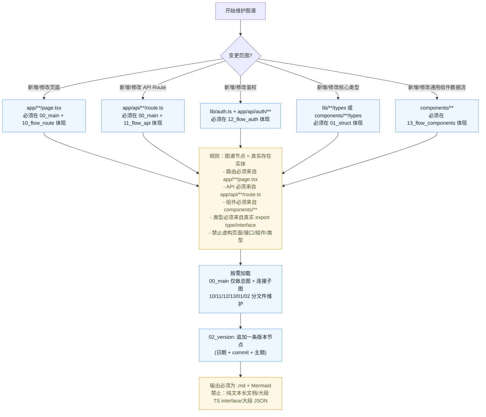

```mermaid
flowchart TD
  %% 99_spec: 前端实现规约（图形化、低 token、可追溯、反幻觉）

  START[开始维护图谱] --> SCOPE{变更范围?}

  SCOPE -->|新增/修改页面| PAGES["app/**/page.tsx\n必须在 00_main + 10_flow_route 体现"]:::r
  SCOPE -->|新增/修改 API Route| API["app/api/**/route.ts\n必须在 00_main + 11_flow_api 体现"]:::r
  SCOPE -->|新增/修改鉴权| AUTH["lib/auth.ts + app/api/auth/**\n必须在 12_flow_auth 体现"]:::r
  SCOPE -->|新增/修改核心类型| TYPES["lib/**/types 或 components/**/types\n必须在 01_struct 体现"]:::r
  SCOPE -->|新增/修改通用组件数据流| COMP["components/**\n必须在 13_flow_components 体现"]:::r

  %% 反幻觉强约束：所有节点需可定位到真实文件/路由/函数
  PAGES --> NOHALLU
  API --> NOHALLU
  AUTH --> NOHALLU
  TYPES --> NOHALLU
  COMP --> NOHALLU

  NOHALLU["规则：图谱节点 = 真实存在实体\n- 路由必须来自 app/**/page.tsx\n- API 必须来自 app/api/**/route.ts\n- 组件必须来自 components/**\n- 类型必须来自真实 export type/interface\n- 禁止虚构页面/接口/组件/类型"]:::e

  %% 按需加载：主图只连到子图，不在一个文件塞满
  NOHALLU --> LAZY["按需加载\n00_main 仅做总图 + 连接子图\n10/11/12/13/01/02 分文件维护"]:::r

  %% 版本追溯：每次重要变更追加 timeline 节点
  LAZY --> VER["02_version: 追加一条版本节点\n(日期 + commit + 主题)"]:::r

  %% 输出格式规范
  VER --> FORMAT["输出必须为 .md + Mermaid\n禁止：纯文本长文档/大段 TS interface/大段 JSON"]:::e

  classDef r fill:#eef6ff,stroke:#4a90e2,color:#123;
  classDef e fill:#fff7e6,stroke:#d89b00,color:#553;
```

