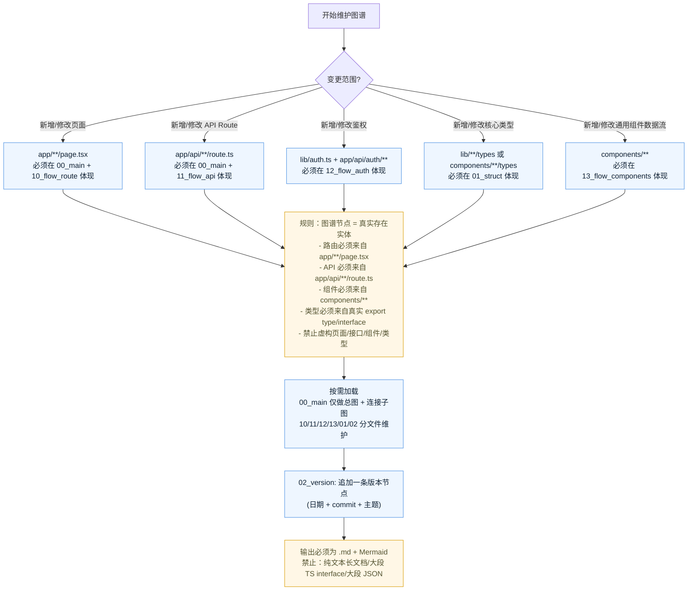

---

## 机器轨（graph_v2）与 CI 门禁

| 项 | 约定 |
| --- | --- |
| 真值文件 | `graph.json`（`schema_version: graph_v2`）与 `graph_v2_schema.md` |
| 导出 / 漂移 | `pnpm tech-graph:graph-export`；PR 必绿 `pnpm tech-graph:graph-check`（`quality` workflow） |
| 等价 | `pnpm tech-graph:equivalence-check`（`.ai.md` 参考图 vs 已提交 JSON；锚点 ≥95%、label ≥90%） |
| 结构 | `pnpm tech-graph:schema-check`（可选本地） |
| 查询 | `pnpm tech-graph:query <op> …`（方案2；默认 Agent 机器轨，见闸口 B 结论） |
| 工具脚本 | 复用 `ai-ink-brain-api-python/tools/tech_graph_*.py`（勿在前端仓复制） |
| 迁移手册 | `content/tasks/specs/MIGRATION-tech_graph_v2_frontend_playbook_v1_zh.md` |

**CI 顺序（`quality` · `lint-and-build`）**：checkout 本仓 → checkout 后端工具仓 → `pnpm install` → Python 3.11 → graph `--check` → **equivalence** → `pnpm lint` → `pnpm test` → `pnpm build`。

**失败时**：见 `graph_v2_schema.md` §7 与 Playbook §7（FP-V2-*）。

---

## 跨仓契约（SSE / Unified Chat）

- **真值**：`ai-ink-brain-api-python/docs/_tech_graph/_contract_manifest.json`（本仓 **不** 复制）。
- **前端锚点**（须在 `11_flow_api` / `13_flow_components` 与 manifest `frontend_anchors` 一致）：
  - SSE 消费：`components/unified-chat/UnifiedChatPageClient.tsx`
  - BFF 透传：`app/api/py/unified/chat/stream/route.ts`
- **本地校验（工作区 sibling 布局）**：

```bash
python3 ../ai-ink-brain-api-python/tools/tech_graph_contract_check.py
```

退出码 `0` 表示后端产出 ⊇ 契约且前端读取 ⊆ 契约。

