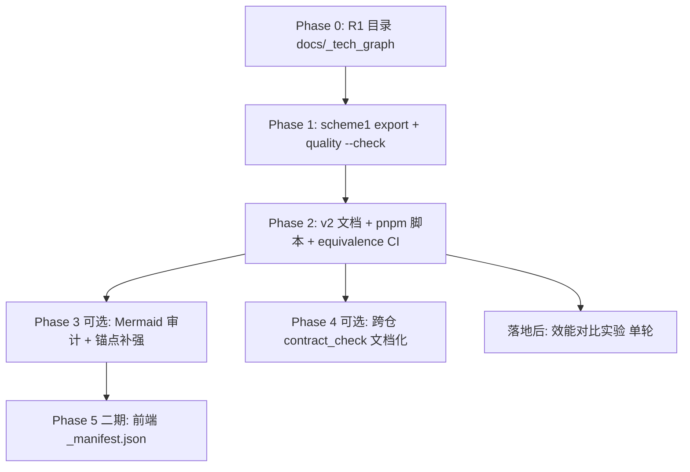

# Tech Graph v2 — 前端子仓迁移实践手册（Playbook v1）

> **用途**：记录 `ai-ink-brain` 从「仅 scheme1 `--check`」到「graph_v2 工程化最小集」的 **可复现迁移细节**，供后续 **方法论 Quickstart 样板仓** 复制（样板仓将单独建仓；本文不替代工作区 `docs/tech_graph/` 定稿 SPEC）。  
> **对照真值**：`docs/tasks/specs/SPEC-tech_graph_v2_frontend_parity_v1.md`  
> **实验策略**：**先完整落地工程化**；闸口 A/B/C 类对比实验 **不在本阶段重跑**——落地完成后，以「落地前快照 vs 完全改进方案」做单轮效能对比（见 §8）。

---

## 1. 适用对象与前提

| 项 | 说明 |
| --- | --- |
| 子仓类型 | Next.js / App Router 前端（本实践：`ai-ink-brain`） |
| 图谱根目录 | **`docs/_tech_graph/`**（R1：禁止仓根 `_tech_graph/`） |
| 工具脚本 | **不复制**到前端仓；与配对后端仓 **`ai-ink-brain-api-python/tools/tech_graph_*.py`** 同源 |
| 工作区布局 | 建议 sibling：`Projects/ai-ink-brain` + `Projects/ai-ink-brain-api-python` |
| 机器轨默认 | Agent 用 **`graph.json` + `tech_graph_graph_query.py`**（闸口 B/C 已归档于后端；前端遵循结论即可） |

---

## 2. 三轨模型（样板仓须原样写入 README/AGENTS）

| 轨 | 路径模式 | 维护者 | 消费方 |
| --- | --- | --- | --- |
| **人读轨** | `*.md`（flowchart 可裸边） | 开发者 | 人、按需 Agent |
| **协议轨** | `*.ai.md`（零裸边 + `// →` 锚点） | LLM / 导出器 | 导出 `graph.json` |
| **机器轨** | `graph.json`（`schema_version: graph_v2`） | CI + 导出脚本 | Agent 查询、影响分析 |

**原则**：改代码 → 先改 `.ai.md` → 导出/提交 `graph.json` → 同步 `.md`（语义等价，非逐字复制）。

---

## 3. 迁移阶段与执行顺序（本仓已采用）



| 阶段 | 工作包 | 子 task ID | 估 | 阻塞关账 | 本仓状态 |
| --- | --- | --- | --- | --- | --- |
| Phase 0 | R1 目录 | — | — | 是（历史） | **已完成** |
| Phase 1 | scheme1 | （done）graph_json_export | S | — | **已完成** |
| Phase 2 | W1+W3+W7 | **T1** | S | **是** | **本 PR** |
| Phase 2 | W4 | **T2** | M | **是** | **本 PR** |
| Phase 3 | W2 | **T3** | M | 否 | 建议跟进 |
| Phase 4 | W5 | **T4** | M | 否 | 文档化 **本 PR** |
| Phase 5 | W6 | **T5** | L | 否 | 未开工 |
| 实验 | 效能对比 | — | M | 否 | **落地后** |

**并行规则**：T3 可与 T1/T2 并行；T4 仅依赖后端 `_contract_manifest.json` 已存在，可与 T2 并行。

---

## 4. Phase 2 逐步操作（Quickstart 可复制）

### 4.1 文档落盘（W1）

1. **`docs/_tech_graph/graph_v2_schema.md`**  
   - 从配对后端仓同文件 **摘录结构**；改「关联 task」为前端 `docs/tasks/specs/SPEC-tech_graph_v2_frontend_parity_v1.md`。  
   - 工具表脚本路径写：**`../ai-ink-brain-api-python/tools/...`**（CI 下为 `ai-ink-brain-api-python/tools/...`）。

2. **`docs/_tech_graph/99_mermaid_protocol.md`**  
   - 策略 **A**：子仓内 **Next.js 摘要** + 指向后端 **完整协议**（避免双份漂移）。  
   - 样板仓：若 **无** 配对后端，则须 **完整复制** 协议并改「Python」为「TS/Next」示例。

3. **`docs/_tech_graph/99_spec.md`**  
   - 在 Mermaid 规约图之后增加 **§ 机器轨与 CI**（graph_v2、门禁命令、失败码）。  
   - 增加 **§ 跨仓契约**（真值在后端、前端只参与校验）。

4. **`AGENTS.md` / `docs/meta/PROJECT_CONFIG_AI_INK_BRAIN.md` §D**  
   - 列出 `pnpm tech-graph:*` 矩阵与 Python 3.11 前提。

### 4.2 本地脚本（W3，不复制 tools/）

在 `package.json` 增加（路径假定 sibling 后端仓）：

```json
"tech-graph:graph-export": "sh -c 'python3 \"${PWD}/../ai-ink-brain-api-python/tools/tech_graph_graph_export.py\" --input \"${PWD}/docs/_tech_graph\" --output \"${PWD}/docs/_tech_graph/graph.json\"'",
"tech-graph:graph-check": "…同上… --check'",
"tech-graph:equivalence-check": "sh -c 'python3 \"${PWD}/../ai-ink-brain-api-python/tools/tech_graph_graph_equivalence_check.py\" --input \"${PWD}/docs/_tech_graph\" --graph \"${PWD}/docs/_tech_graph/graph.json\"'",
"tech-graph:schema-check": "sh -c 'python3 -c \"import json,sys; from pathlib import Path; r=Path(\\\"${PWD}/../ai-ink-brain-api-python\\\").resolve(); sys.path.insert(0,str(r)); from tools.tech_graph_graph_v2_schema import validate_graph_v2; validate_graph_v2(json.load(open(\\\"${PWD}/docs/_tech_graph/graph.json\\\"))); print(\\\"OK: graph_v2 schema\\\")\"'",
"tech-graph:query": "sh -c 'python3 \"${PWD}/../ai-ink-brain-api-python/tools/tech_graph_graph_query.py\" --graph \"${PWD}/docs/_tech_graph/graph.json\" \"$@\"' --"
```

**Agent 查询示例**（方案2）：

```bash
pnpm tech-graph:query downstream UNIFIED 2
pnpm tech-graph:query describe-impact PY_UNIFIED_SSE 2
```

### 4.3 CI（W4，`quality.yml`）

在 **Checkout backend** 与 **Setup Python** 之后、`pnpm lint` 之前：

1. `tech_graph_graph_export.py --check`（已有）  
2. **`tech_graph_graph_equivalence_check.py`**（新增）  
   - `--input "${GITHUB_WORKSPACE}/docs/_tech_graph"`  
   - `--graph "${GITHUB_WORKSPACE}/docs/_tech_graph/graph.json"`  

**勿**在前端 quality 中合并 `tech_graph_contract_check`（契约真值与扫描逻辑在后端；见 §5）。

### 4.4 版本时间线（W2 子集）

在 `docs/_tech_graph/02_version.md` timeline 追加节点，例如：

- `2026-05-20 : tech graph v2 parity（equivalence CI + playbook）`

---

## 5. 跨仓契约（W5 · 真值不迁移）

| 项 | 决策 |
| --- | --- |
| `_contract_manifest.json` | **仅**存在于 `ai-ink-brain-api-python/docs/_tech_graph/` |
| 前端职责 | 在 `11_flow_api` / `13_flow_components` 标注 **SSE 消费锚点**；与 manifest 中 `frontend_anchors` 互引 |
| 本地校验（工作区根） | `python3 ai-ink-brain-api-python/tools/tech_graph_contract_check.py`（须能解析 `../ai-ink-brain/...` 路径） |
| 前端 CI | **recommended**；默认可不在 `quality` 阻塞（避免双 checkout + 路径耦合） |

**样板仓提示**：若 monorepo 内前后端同 workspace，契约检查应放在 **工作区级** 或 **后端 workflow**；前端文档写清「如何本地跑通」即可。

---

## 6. 故意不做（二期 / 他仓）

| 项 | 理由 |
| --- | --- |
| 复制 `10_flow_rag` 等后端子图 | 域边界：前端只维护 route/api/auth/components |
| 前端 `_manifest.json` + manifest_check | W6 · L；Next 路由表需单独 schema 设计 |
| 闸口 A/B/C batch 重跑 | 属后端实验归档；前端消费结论 |
| Neo4j（方案3） | R2：须 B 归档后单独立项 |
| 在前端仓复制 11 个 `tech_graph_*.py` | 与 scheme1 一致：复用后端 checkout |

---

## 7. 失败路径（前端 CI）

| ID | 触发 | 处理 |
| --- | --- | --- |
| FP-V2-1 | `.ai.md` 解析失败 | 修图 → `pnpm tech-graph:graph-export` |
| FP-V2-2 | `--check` 漂移 | 重导出并提交 `graph.json` |
| FP-V2-3 | 等价阈值未达 | 补 `// →` 锚点或边 label |
| FP-V2-4 | CI 未检出后端仓 | 修 `quality.yml` 第二 checkout |
| FP-V2-5 | `freeze_id` 与后端不一致 | 双仓规划同行更新 |

---

## 8. 落地后效能对比（替代闸口 A/B/C 重跑）

**目标**：量化「仅 scheme1」与「graph_v2 完全改进（export + equivalence + query 文档化 + 锚点补强）」对 Agent 任务的差异。

| 维度 | 建议指标 | 采集方式 |
| --- | --- | --- |
| Token / 轮次 | 完成固定三题（改路由 / 改 BFF / 改 SSE 字段） | 对话日志 + `tech_graph_token_estimate.py`（后端，可选） |
| 定位准确性 | 影响集是否含真实依赖文件 | `describe-impact` vs 人工金标 |
| CI 成本 | PR 门禁耗时 | Actions run 对比 |
| 维护成本 | 改一条边所需文件数 | 过程记录 |

**产出**：`docs/diary/reports/conclusion_frontend_v2_parity_efficiency_v1_zh.md`（落地后单独立项，**freeze_id** 新建一行，不写 commit hash）。

---

## 9. Quickstart 样板仓检查清单（复制用）

- [ ] `docs/_tech_graph/` 为唯一图谱根（R1）  
- [ ] `00_main` + 域子图 `10_flow_*` 双轨 `.md` / `.ai.md`  
- [ ] `graph_v2_schema.md` + `99_mermaid_protocol.md`（完整或摘要+链接）  
- [ ] `99_spec.md` 含 CI + 反幻觉 + 契约指针  
- [ ] `package.json`：`tech-graph:graph-check`、`equivalence-check`（及可选 `schema-check`、`query`）  
- [ ] CI：`export --check` + `equivalence`（Python 3.11 + 工具仓 checkout 或 monorepo path）  
- [ ] `AGENTS.md` 指向图谱目录与脚本矩阵  
- [ ] 跨仓契约：单一 manifest 真值仓 + 文档化 `contract_check`  
- [ ] 落地后再做 **一轮** 效能对比文档  

---

## 10. 本仓变更索引（维护者回填 commit）

| 路径 | 变更类型 |
| --- | --- |
| `docs/_tech_graph/graph_v2_schema.md` | 新增 |
| `docs/_tech_graph/99_mermaid_protocol.md` | 新增 |
| `docs/_tech_graph/99_spec.md` | 增补 § |
| `docs/_tech_graph/02_version.md` | timeline |
| `docs/_tech_graph/11_flow_api.md` | 契约锚点备注 |
| `package.json` | scripts |
| `.github/workflows/quality.yml` | equivalence step |
| `AGENTS.md` / `PROJECT_CONFIG` | 索引 |
| `docs/tasks/specs/SPEC-*.md` | §11 执行顺序 |

---

## 修订记录

| 版本 | 日期 | 说明 |
| --- | --- | --- |
| v1.0 | 2026-05-20 | Phase 2 落地 + Quickstart 检查清单 + 落地后实验约定 |
