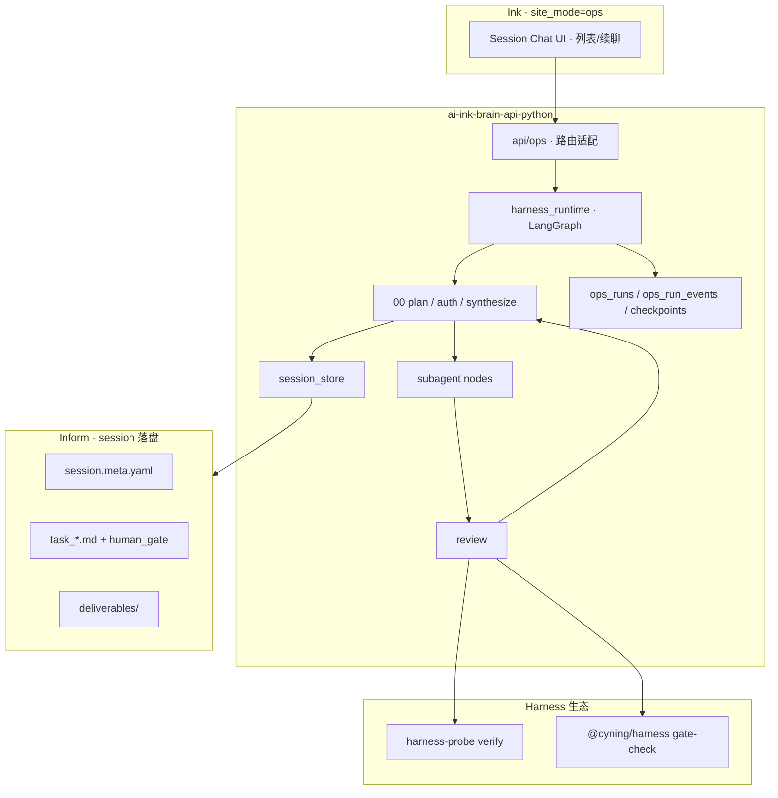
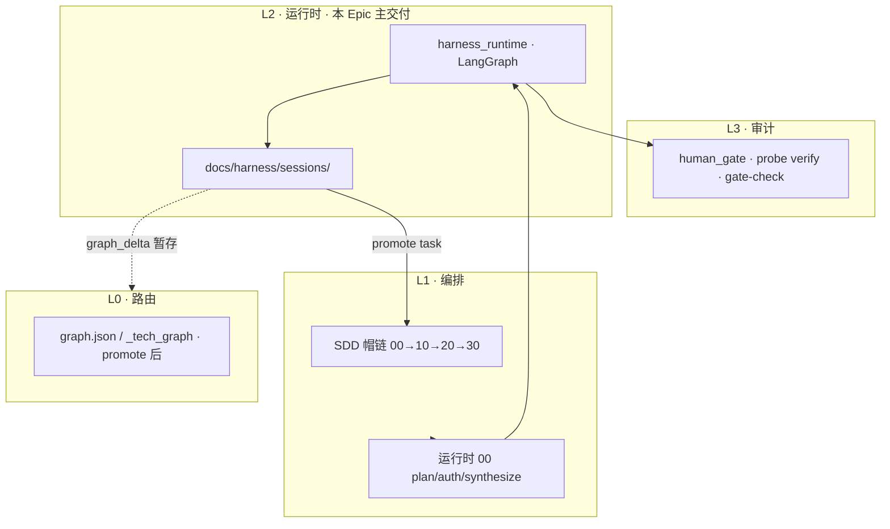

# SPEC · Ops Session Orchestrator（Harness 00 多轮 Runtime · v1）

| 项 | 内容 |
| --- | --- |
| **状态** | `spec-signed`（10-spec · 20-spec-audit R1 **conditional_pass** · B1–B7 closed · **待 HG-SPEC-SIGNOFF → approved**） |
| **20-spec-audit** | [`task_ops_session_orchestrator_spec_ACCEPT_R1_20260702.md`](../../../../docs/harness/reviews/task_ops_session_orchestrator_spec_ACCEPT_R1_20260702.md) |
| **类型** | Epic 规格真值（`docs/tasks/specs/`） |
| **代号** | **Session Orchestrator** · 下一代 Ops Chat 00 层 |
| **test_strategy** | `required`（session I/O · gate 同步 · LangGraph 断点 · import 边界） |
| **关联 PLAN** | [`PLAN_ops_session_orchestrator_v1_zh.md`](../../../../docs/harness/guides/PLAN_ops_session_orchestrator_v1_zh.md) |
| **关联 SPEC（基线）** | [`SPEC_ops_desk_kimi_code_mvp_v1_zh.md`](./SPEC_ops_desk_kimi_code_mvp_v1_zh.md) · `approved` v1.4 |
| **10-spec invoke** | [`ops-session-orchestrator`](../../../../docs/harness/invokes/by-task/ops-session-orchestrator/README.md) |
| **Session 落盘根** | `ai-ink-brain-api-python/docs/harness/sessions/` |

---

## §0 完成态一句话

在 **现有 Ink Ops Desk Chat（P1–P3 单轮 deep/ReAct）之上**，于 **api-python LangGraph** 内新增 **Harness Session Orchestrator（00 层）**：用户与 00 **多轮对话** → 计划呈现 → **对话授权同步 `human_gate`** → 派 **Subagent** → 交付物落 **`docs/harness/sessions/<session_id>/`** → 00 合并回复；**Session = 子项目**；Runtime **`harness_runtime` 与 RAG/ingest 解耦**、可剥离为独立 Agent 产品；**不**重写 kimi-code 看板/sync · **不**合并 P3-2 auth 大迁移。

---

## §1 背景与目标

### 1.1 动机

| 现状 | 缺口 |
| --- | --- |
| Ops Chat 单轮 `run_id` · classify → deep/ReAct | 无法跨轮延续计划、闸状态、交付物 |
| `ops_run_events` 可观测强 | **Inform 真值**（task · human_gate · invoke）未与 Chat 绑定 |
| Cursor/Projects 内 00 帽链成熟 | Ink 运行时缺 **等价 00**：plan · auth · dispatch · synthesize |

### 1.2 目标（可签收）

1. **多轮 Session**：同一 `session_id` 下 00 与用户澄清、更新 task 草稿、恢复上下文。
2. **闸真值落盘**：授权动作 **同步** session 内 task `human_gate` 表 + `ops_run_events`。
3. **Subagent 下沉**：现有 `run_deep` / `run_react_fallback` **迁入** subagent 子图，非废弃重写。
4. **可剥离 Runtime**：`harness_runtime` 模块 **不 import** RAG/ingest/业务 DB。
5. **与 Harness 帽链对齐**：00 → subagent（≈10-task 域内）→ review（≈20）→ verify（可选）→ 人闸。

### 1.3 与 Ops Desk MVP 关系

```text
SPEC_ops_desk（approved）· P0–P3 Chat 基线
  ↓ 演进（本 Epic）
Session Orchestrator · 00 层 + session 落盘
  ├─ 保留：看板 · sync · metrics · M0 秘钥 · ops_* 表
  └─ 扩展：session_id · 多轮消息 · harness/sessions/ · LangGraph 00 节点
```

---

## §2 已拍板决策（维护者 · 2026-07-01 · 勿推翻）

| # | 决策 |
| --- | --- |
| D1 | Session 落盘根：`ai-ink-brain-api-python/docs/harness/sessions/<session_id>/`；与 `docs/tasks/`、`_tech_graph` **分离** |
| D2 | 用户「授权并开始」→ **同步**更新 session 内 task `human_gate`；闸真值在 **文件**，非 Chat 口头 |
| D3 | Runtime 第一版在 **api-python LangGraph**（非 Cursor spawn 唯一路径） |
| D4 | `harness_runtime` **可剥离**为独立 Agent 产品；**不**硬依赖 RAG/ingest |
| D5 | 现有 Ink Ops Chat（单轮 deep/ReAct）**演进下沉**为 subagent，非废弃重写 |

### 2.1 BLOCKERS 签收（2026-07-01 · 已拍板）

> 真值副本：[`BLOCKERS.md`](../../../../docs/harness/invokes/by-task/ops-session-orchestrator/BLOCKERS.md)

| ID | 决策 | SPEC 落点 |
| --- | --- | --- |
| **B1** | Git：**A 全忽略** `sessions/**` | §5.5 |
| **B2** | session:run **1:N** | §9.1 |
| **B3** | 授权：**按钮主 + NL 辅** | §6.3 |
| **B4** | promote：**00 半自动** · maintainer 显式确认 · `target_branch` UI | §5.3 |
| **B5** | 包形态：**monorepo 子包** → S5 评估抽包 | §11.3 |
| **B6** | 图谱：**graph_delta 暂存** → 人签 promote | §10.3 |
| **B7** | probe：**subprocess CLI** v0.10+ · **非 MCP** · MVP 不依赖 | §10.4 |

---

## §3 非范围

- 不替代 Cursor / Claude Code 内 **30 改码** 主 IDE 体验（Runtime 可派发「打开 invoke」指令）
- 不在 session 目录 **自动 commit** 业务仓（Git 仅 Lead · 显式 promote）
- 不默认接入 Hermes 写 Git · 不 auto-merge
- 不把 `docs/harness/sessions/` 纳入业务 30 Agent **默认读序**
- 不实施 **harness-probe P0-1 ops-desk CLI**（probe 仓独立 Epic）
- 不改 **cyning-harness npm** 产品包代码
- 不做 **P3-2 auth 大迁移**（可引用 · 不合并 PR）
- 不在 Chat 流内 **直接改** 业务仓 `docs/_tech_graph/`（图谱 promote 须人签 · 见 §10.3）

---

## §4 架构总览

### 4.1 组件图



### 4.2 双真值模型

| 层 | 载体 | 职责 |
| --- | --- | --- |
| **Inform（文件）** | `docs/harness/sessions/<id>/` | task · human_gate · invoke 快照 · deliverables |
| **Observe（DB）** | `ops_runs` · `ops_run_events` · `ops_run_checkpoints` | 时间线 · 断点 · UI 增量拉取 |

**原则**：闸状态 **以 task 文件为准**；DB 为索引/观测，**不可**单独作为 `approved` 真值。

### 4.3 Session 生命周期

```text
created → planning → awaiting_auth → dispatched → reviewing → done | blocked | partial
                ↑                      │
                └──── 用户拒绝 / 修改计划 ───┘
```

| 状态 | 含义 | 落盘 |
| --- | --- | --- |
| `planning` | 00 澄清 · 草稿 task | `task_*` frontmatter `status: draft` |
| `awaiting_auth` | 计划已呈现 · 等人确认 | `human_gate` 仍为 `pending` |
| `dispatched` | 已授权 · subagent 执行 | 闸表 `approved` · `invokes/` 写入 |
| `reviewing` | Review / verify | `deliverables/` |
| `done` | 00 已合并回复 | `session.meta.yaml` · `status: done` |
| `blocked` | 人闸 / verify 阻塞 | 00 只输出 `gate_id` + 路径 |

---

## §5 Session 落盘契约

### 5.1 目录结构（规范）

```text
docs/harness/sessions/
  <session_id>/
    session.meta.yaml
    task_<slug>_v1.md              # Harness 任务单 · human_gate 闸真值
    invokes/
      dispatch_<run_id>_<role>.md   # 派工 prompt 快照
    deliverables/
      <run_id>/
        synthesis.md               # 00 合并稿
        review_report.md           # ≈20 输出
        verify_report.json         # 可选 · probe 结果
        graph_delta/               # 可选 · 暂存 · 不自动 promote
    events.index.yaml              # 可选 · run_id → seq 索引
```

**读取纪律**（与 [`sessions/README.md`](../../../../ai-ink-brain-api-python/docs/harness/sessions/README.md) 一致）：

| 角色 | 默认读取 |
| --- | --- |
| Session Orchestrator（00 Runtime） | ✅ |
| Ops Chat UI / 维护者 | ✅ 按 `session_id` |
| 业务 30 改码 Agent | ❌ 除非 task 已 promote |
| CI / pytest 默认 | ❌ |

### 5.2 `session.meta.yaml` Schema（v1）

```yaml
# session.meta.yaml · v1
schema_version: "1.0"
session_id: "sess_20260701_abc123"    # 见 §5.4
slug: "ops-session-orchestrator"      # Epic / 子项目 slug
title: "Session Orchestrator MVP 试点"
status: planning                      # 见 §4.3 状态机
created_at: "2026-07-01T10:00:00Z"
updated_at: "2026-07-01T10:30:00Z"
created_by: "maintainer"              # ops 角色 · 非 PII
worktree_hint:                        # 可选 · 目标实现仓
  repo: "ai-ink-brain-api-python"
  branch: "task/ops-session-s2"
primary_task_path: "task_ops_session_s2_langgraph_00_v1.md"
latest_run_id: "run_uuid"             # 最近一次 ops_run
gate_summary:                         # 缓存 · 须与 task 表一致
  pending: ["HG-EXEC-AUTH"]
  approved: []
links:
  plan: "../../../../docs/harness/guides/PLAN_ops_session_orchestrator_v1_zh.md"
  spec: "../../../../ai-ink-brain/docs/tasks/specs/SPEC_ops_session_orchestrator_v1_zh.md"
```

**校验规则（S0 实现）**：

- `session_id` 与目录名 **必须一致**
- `schema_version` 缺失 → 拒绝加载 · 返回 `SESSION_SCHEMA_UNSUPPORTED`
- `status` 非法枚举 → 拒绝 transition

### 5.3 Promote 流程（session → 业务仓 task）

**触发**：**00 半自动 + maintainer 显式确认**（BLOCKERS **B4** 已定）。

```text
1. 00 生成 promote 清单（源 session 路径 · 目标子仓 · gate · diff 预览 · 可选 PR 草稿）
2. UI 呈现 · maintainer 选择 target_branch（默认目标子仓 main · 可改）
3. maintainer 点击「确认 promote」（非自动 · 非授权后立即执行）
4. Runtime 复制 task_<slug>_v1.md → <target_repo>/docs/tasks/active/
   - 保留 human_gate · 追加 promoted_from_session / promoted_at
5. 可选：review_report → docs/harness/reviews/ · graph_delta → _tech_graph/（B6 · 须人签）
6. 可选：00 生成 PR/MR 草稿 · maintainer 在 Host IDE / gh 侧提交 · Runtime 不 auto-commit
7. promote 前（S4）：subprocess harness-probe verify --repo-root <target_repo>（B7）
8. 写入 ops_run_events: session.promoted
```

**纪律**：**不** auto-commit · **不** auto-merge · 违反 D1 的「授权后自动污染业务仓」仍禁止。

**失败路径**：目标路径已存在同名 task → `PROMOTE_CONFLICT` · 00 输出 diff 摘要 · 等人裁决。

### 5.4 `session_id` 格式

- 推荐：`sess_{YYYYMMDD}_{base32_8}`（URL-safe · 人工可读日期前缀）
- 生成：服务端 UUID v4 亦可；**一旦分配不可变**
- 与 `ops_runs` 关系：见 §9.1 · **已定 1:N**（BLOCKERS B2）

### 5.5 Git 跟踪策略（BLOCKERS B1 · 已定：A）

**决策**：`docs/harness/sessions/**` 加入 api-python `.gitignore`；仅本地/部署卷持久化；维护者可选 export 到 reviews；敏感 session 永不入库。

**S0 动作**：`.gitignore` + sessions README 同步说明。

---

## §6 human_gate 与授权 UX

### 6.1 Session 内闸 ID（v1 最小集）

| human_gate_id | 典型 status 流 | blocks_hats | 说明 |
| --- | --- | --- | --- |
| `HG-SESSION-PLAN` | pending → approved | dispatch | 00 计划呈现 · 用户授权开始派工 |
| `HG-EXEC-AUTH` | pending → approved | 30（promote 后） | 授权进入实现 / promote |
| `HG-AUDIT-R1` | pending → approved | 30 | promote 后业务 task 开工闸（Harness 全局） |
| `HG-PROMOTE` | pending → approved | — | 显式 promote 到业务仓（可选） |

**纪律**：仅 `approved` / `pending` 为机械真值（与 Harness V2 §5.6 一致）。

### 6.2 授权同步流程（D2 落地）

```text
用户触发「授权并开始」（见 §6.3）
  → node_00_auth_gate 校验 session.status == awaiting_auth
  → 原子写入 task_<slug>.md human_gate 表（HG-SESSION-PLAN → approved）
  → 更新 session.meta.yaml status → dispatched
  → append ops_run_events: gate.approved { gate_id, operator, session_id, run_id }
  → 可选：subprocess harness-probe task validate --task <path>（只读 · 不替代人签）
  → 进入 node_dispatch
```

**拒绝 / 修改**：用户选「修改计划」→ status 回 `planning` · gate 保持 `pending` · 00 重新 plan。

### 6.3 授权 UX（BLOCKERS B3 · 已定：按钮主 + NL 辅）

| 通道 | 行为 |
| --- | --- |
| **主路径** | UI 结构化按钮：「授权并开始」「修改计划」「取消」→ `auth_action` 枚举 |
| **辅路径** | NL「确认 / 开始 / 好的」→ `intent=auth_confirm` → **须二次**摘要卡或按钮 |
| **禁止** | 仅 LLM 口头「已授权」而不写文件 |

**实现**：LangGraph `interrupt()` · `POST .../auth` 与 `Command(resume={ auth_action })` 双通道。

### 6.4 恢复会话

```text
GET session by session_id
  → 读 session.meta.yaml + 解析 task human_gate
  → 00 system prompt 注入：status · pending gates · deliverables 清单
  → UI 展示：待授权 / 已派工 / 待签收 / blocked(gate_id)
```

---

## §7 LangGraph 00 层与 Checkpointer

### 7.1 图拓扑（v1）

```text
StateGraph(SessionState)
  START → node_00_plan
  node_00_plan → node_00_present_plan
  node_00_present_plan → node_00_auth_gate   # interrupt · awaiting_auth
  node_00_auth_gate → node_dispatch          # on approved
  node_00_auth_gate → node_00_plan           # on revise
  node_dispatch → node_subagent_router
  node_subagent_router → node_subagent_deep | node_subagent_react | node_subagent_fast
  node_subagent_* → node_review
  node_review → node_verify                  # optional
  node_verify → node_00_synthesize
  node_review → node_00_plan                 # retry ≤2
  node_00_synthesize → END
```

### 7.2 `SessionState`（最小字段）

| 字段 | 类型 | 说明 |
| --- | --- | --- |
| `session_id` | str | 落盘目录 key |
| `run_id` | str | 当前 ops_run |
| `messages` | list | 多轮对话（含 user/assistant/tool） |
| `session_status` | enum | §4.3 |
| `task_draft_path` | str | session 内 task 相对路径 |
| `intent` | str | 末轮路由 hint |
| `deliverables` | dict | run_id → 产出路径索引 |
| `gate_snapshot` | dict | 授权时闸表快照 |
| `error` | optional | 结构化错误 |

### 7.3 Checkpointer 双写

| 写目标 | 内容 | 真值优先级 |
| --- | --- | --- |
| `ops_run_checkpoints` | LangGraph thread state | 断点恢复 · 与 P1-b 一致 |
| `docs/harness/sessions/<id>/` | task · meta · deliverables | **Inform 真值** |

**双写纪律**：

1. **auth 节点**：先写文件（task gate + meta status）→ 再 checkpoint commit → 再 events
2. **崩溃中间态**：恢复时 **以文件 gate 为准** reconcile checkpoint
3. `thread_id` 推荐 `{session_id}:{run_id}` · session 级聚合用 `session_id`

### 7.4 与现有 P1-b 关系

- 复用 `ops_run_checkpoints` 表与现有 LangGraph 集成模式
- **新增** graph name：`session_orchestrator_v1`（与单轮 `ops_orchestrator` 图 **并存**）
- 单轮 Chat API **保持** backward compatible；session API **新路由**（§9）

---

## §8 Subagent 下沉

### 8.1 演进策略（D5）

| 现有（P1–P3） | 目标（Session Orchestrator） |
| --- | --- |
| `OpsOrchestrator.classify` + fast path | `node_subagent_fast` 或 00 内联 |
| `run_deep` → `issue_analyst` | `node_subagent_deep` 子图 · **同工具集** |
| `run_react_fallback` | `node_subagent_react` 子图 |
| `review_gate` | `node_review` · 独立节点 |
| 单轮 synthesize | `node_00_synthesize` · **跨 run 读 deliverables** |

**非目标**：不重写 issue_analyst prompt · 不改 Review 公理 A1/A3。

### 8.2 Subagent 角色表（v1）

| node | agent_role | 输入 | 产出落盘 |
| --- | --- | --- | --- |
| `node_subagent_deep` | `issue_analyst` | session 上下文 + user 末轮 | `deliverables/<run_id>/analysis.md` |
| `node_subagent_react` | `react_fallback` | Tool Protocol | `deliverables/<run_id>/react_trace.json` |
| `node_subagent_fast` | `orchestrator` | metrics/issue 模板 | 可选轻量 markdown |
| `node_review` | `review` | subagent 产出 | `deliverables/<run_id>/review_report.md` |

### 8.3 Handoff 契约

- 每次 dispatch 写入 `invokes/dispatch_<run_id>_<role>.md`（prompt 快照 · 含 session 摘要）
- Subagent **只写** session `deliverables/` · **禁止**写业务仓
- 00 synthesize 读取 deliverables + review_report → 生成用户可见回复 + `synthesis.md`

---

## §9 API 与 Ink UI 契约

### 9.1 `session_id` ↔ `ops_runs` 映射（BLOCKERS B2 · 已定：1:N）

| 实体 |  cardinality | 说明 |
| --- | --- | --- |
| `HarnessSession` | 1 | 落盘目录 · meta |
| `OpsRun` | N | 每轮用户消息或一次 dispatch 可创建新 run |

**DDL 扩展（S1 · 示意）**：

```sql
-- ops_runs 扩展列（示意 · 实施 task 细化）
ALTER TABLE ops_runs ADD COLUMN IF NOT EXISTS session_id TEXT;
CREATE INDEX IF NOT EXISTS idx_ops_runs_session_id ON ops_runs(session_id);
```

- `ops_runs.session_id` 可空（兼容旧单轮 Chat）
- `session.meta.yaml.latest_run_id` 指向最近 run

### 9.2 后端 API（v1 最小集）

| 方法 | 路径 | 说明 |
| --- | --- | --- |
| `POST` | `/ops/sessions` | 创建 session · 返回 `session_id` · 写 meta |
| `GET` | `/ops/sessions` | 列表（分页 · status 过滤） |
| `GET` | `/ops/sessions/{session_id}` | meta + gate 摘要 + 最近 messages 摘要 |
| `POST` | `/ops/sessions/{session_id}/messages` | 多轮消息 · 创建/续 run · 触发 LangGraph |
| `POST` | `/ops/sessions/{session_id}/auth` | 结构化授权 `{ action: approve \| revise \| cancel }` |
| `GET` | `/ops/sessions/{session_id}/events` | 聚合 session 下 runs 的 events（或沿用 run 级 + session 索引） |
| `POST` | `/ops/sessions/{session_id}/promote` | 00 半自动 promote 向导 · body 含 `target_repo` · `target_branch` · maintainer 确认（B4） |

**鉴权**：沿用 M0 `OPS_DESK_SECRET` / maintainer 分级（**不**等待 P3-2）。

**与现有 API**：

| 现有 | 新 Session API |
| --- | --- |
| `POST /ops/chat/messages` | **保留** · 单轮 legacy |
| `GET /ops/runs/{id}/events` | **保留** · session 视图聚合 |

### 9.3 Ink UI（v1 最小集）

| 页面/组件 | 行为 |
| --- | --- |
| `/ops/kimi-code/sessions` | Session 列表 · status · 更新时间 |
| `/ops/kimi-code/sessions/[session_id]` | 多轮 Chat · 授权按钮区 · events 时间线 |
| 授权区 | 「授权并开始」「修改计划」· blocked 时展示 `gate_id` + 文件路径 |
| 续聊 | URL 带 `session_id` · 加载历史 messages + gate 状态 |

**BFF**：Ink `app/api/ops/sessions/**` 转发 api-python · 复用 ops cookie 鉴权。

### 9.4 事件类型扩展

| event_type | 说明 |
| --- | --- |
| `session.created` | 新 session |
| `session.status_changed` | 状态机 transition |
| `gate.approved` / `gate.pending` | 闸同步 |
| `session.subagent_dispatched` | 派工 |
| `session.deliverable_written` | 落盘路径 |
| `session.promoted` | promote 完成 |
| `session.blocked` | 人闸阻塞 |

---

## §10 Verify 与 Harness 生态

### 10.1 分工（与 PLAN §6 一致）

| 组件 | Session Orchestrator 中的用法 |
| --- | --- |
| **@cyning/harness** | 模板 · `npx harness verify` gate-check · **不在 Runtime import** |
| **harness-probe** | `task validate` · `verify` · **subprocess CLI**（B7）· 结果写 deliverables |
| **harness_runtime** | 多轮 00 · session I/O · 授权 · dispatch |
| **Ink** | UI · BFF |

### 10.2 Verify 触发点

| 时机 | 动作 | 阻塞？ |
| --- | --- | --- |
| auth 后（S2 可选） | `harness-probe task validate --task <session_task> --format json` | 否 · 警告写 events |
| review 后 | 可选 `npx @cyning/harness verify` gate-check | 否 · review 已覆盖引用 |
| promote 前（S4） | `harness-probe verify --task <promoted_task> --repo-root <target> --format json --ci` | **是** · 失败则 `blocked` |
| S4 完成后 | CI 同类 pytest | 是（test_strategy） |

### 10.3 图谱同步（BLOCKERS B6 · 已定：A）

**决策**：

1. Subagent / 00 将图谱增量写入 session `deliverables/graph_delta/`（**不**直接改业务仓 `_tech_graph/`）。
2. 人签 `HG-PROMOTE-GRAPH` 或在 promote 流内专项确认后，maintainer 复制到目标子仓 `docs/_tech_graph/`。
3. Epic **S4 不依赖** 图谱 automate promote；`graph_analyst` 可先 **只读**。
4. 后续：S5+ 独立小 task。

### 10.4 harness-probe 接入（BLOCKERS B7 · 已定）

#### 10.4.1 版本与 Epic 顺序

| 项 | 决策 |
| --- | --- |
| 开 Epic 前须 probe v1.0.0？ | **否** |
| MVP（S0–S2）依赖 probe？ | **否** |
| S4 最低 probe 版本 | **v0.10.0+**（`task validate` · `verify`） |
| probe ops-desk CLI（P0-1） | **独立 Epic** · 与本仓 **并行** · 不混 PR |
| probe v1.0.0 LLM Executor | **不**阻塞 Session Orchestrator |

#### 10.4.2 接入方式 · subprocess CLI · 非 MCP

```text
harness_runtime/adapters/probe_runner.py   # 示意
  → subprocess: $HARNESS_PROBE_BIN task validate ...
  → subprocess: $HARNESS_PROBE_BIN verify ... --repo-root $HARNESS_PROBE_REPO_ROOT
  → 解析 JSON → deliverables/verify_report.json · ops_run_events
```

| 方式 | Session Orchestrator | 说明 |
| --- | --- | --- |
| **subprocess + CLI** | **是（唯一生产路径）** | 符合 §11 import 边界 |
| **pip install harness-probe** | 可选 | 仅保证 CLI 在 PATH · **仍 subprocess** |
| **import harness_probe / harness_sdk** | **否**（Runtime 内） | gate_sync 可自研 markdown 表解析 |
| **harness_mcp（stdio/SSE）** | **否** | 仅 Cursor 本地开发 · 与 Ink Ops 无关 |

**环境变量**：

| 变量 | 用途 |
| --- | --- |
| `HARNESS_PROBE_BIN` | 默认 `harness-probe` |
| `HARNESS_PROBE_REPO_ROOT` | promote 后 verify 的目标子仓根（配合 probe `--repo-root` · v0.10.1+） |

#### 10.4.3 session 场景语义

| 对象 | 允许 probe 动作 |
| --- | --- |
| session 内 **草稿** task | 仅 `task validate`（schema · human_gate · 非 strict 可选） |
| promote 后 **业务仓** task | 全量 `verify`（gates · graph_delta · pytest/ruff/mypy） |
| session 目录 | **禁止**对 `sessions/<id>/` 跑全量 pytest 作为 gate |

#### 10.4.4 部署与 probe 增强（S4 前并行）

| 项 | 决策 |
| --- | --- |
| Vercel / Serverless 请求路径 | **不**同步跑 promote 前全量 verify · 默认 maintainer 本地或 GHA |
| probe v0.10.1 建议增强 | `--repo-root` · session-draft 文档化（见 BLOCKERS B7.4） |
| S4 依赖 | probe v0.10.0 可用；`--repo-root` 未就绪时可 **validate + 人工 verify** 过渡 |

### 10.5 harness-probe 使用说明（维护者 · S4 实现参考）

> **要点**：Ink 用户聊天 **不会** 每条消息都跑 probe；后端 **不 import** probe、**不用 MCP**；仅在特定节点 **subprocess 调 CLI**（与调 `pytest` / `git` 同类）。

#### 10.5.1 聊天链路里何时跑 probe

| 用户动作 | LangGraph / 服务端 | 是否 subprocess probe |
| --- | --- | --- |
| 普通多轮消息 | 00 plan · 回复 · 写 session | **否** |
| 点「授权并开始」 | 同步 `human_gate` 文件 | **可选** `task validate`（warn · 不阻塞） |
| MVP S0–S2 全程 | schema · 多轮 · 00 层 | **否（零依赖）** |
| 点「确认 promote」 | 复制 task 到业务仓 | **S4** `verify`（**阻塞**） |

#### 10.5.2 三种接入方式（本 Epic 只选一种）

| 方式 | 说明 | Session Orchestrator |
| --- | --- | --- |
| `import harness_probe` | Python 库直接调 | **禁止**（§11.2） |
| **MCP**（`harness-probe mcp`） | Cursor IDE Agent 专用 | **禁止**（Runtime 不用） |
| **subprocess + CLI** | `subprocess.run(["harness-probe", ...])` | **唯一生产路径**（B7） |

#### 10.5.3 维护者终端示例

```bash
# 轻校验：任务单格式 + 人闸（session 草稿 / auth 后可选）
harness-probe task validate \
  --task /abs/path/to/docs/harness/sessions/<id>/task_<slug>_v1.md \
  --format json

# 重验收：promote 后针对业务仓 task（S4 · 失败 exit≠0）
harness-probe verify \
  --task /abs/path/to/ai-ink-brain-api-python/docs/tasks/active/task_ops_session_s0_schema_v1.md \
  --format json --ci
```

#### 10.5.4 Runtime 适配层示意（`probe_runner.py`）

```python
# api/harness_runtime/adapters/probe_runner.py · S4 实现 · 示意
import json, os, subprocess
from pathlib import Path

def _bin() -> str:
    return os.environ.get("HARNESS_PROBE_BIN", "harness-probe")

def task_validate(task_path: Path) -> tuple[bool, list]:
    proc = subprocess.run(
        [_bin(), "task", "validate", "--task", str(task_path.resolve()), "--format", "json"],
        capture_output=True, text=True, timeout=30, check=False,
    )
    data = json.loads(proc.stdout or "[]")
    ok = proc.returncode == 0 and all(x.get("ok") for x in data)
    return ok, data

def verify_task(task_path: Path, *, ci: bool = True) -> tuple[bool, dict]:
    cmd = [_bin(), "verify", "--task", str(task_path.resolve()), "--format", "json"]
    if ci:
        cmd.append("--ci")
    proc = subprocess.run(cmd, capture_output=True, text=True, timeout=300, check=False)
    data = json.loads(proc.stdout or "{}")
    return proc.returncode == 0 and data.get("passed", False), data
```

**环境变量**：`HARNESS_PROBE_BIN`（CLI 路径）· `HARNESS_PROBE_REPO_ROOT`（promote 后 verify 目标仓根 · 配合 v0.10.1 `--repo-root`）。

#### 10.5.5 部署

| 环境 | probe |
| --- | --- |
| 本地 / 自建 VM | `pip install -e harness-probe` → PATH 有 `harness-probe` |
| Vercel Serverless | **不在**请求路径同步全量 verify · promote 闸走 **本地 / GHA**（§10.4.4） |
| CI | 与本地相同 CLI · `verify --ci` |

#### 10.5.6 与 Epic 阶段

| 阶段 | probe |
| --- | --- |
| **S0–S2 MVP** | **不需要** |
| **S2 可选** | auth 后 `task validate` |
| **S4** | promote 前 `verify` · 见 [`BLOCKERS.md`](../../../../docs/harness/invokes/by-task/ops-session-orchestrator/BLOCKERS.md) B7 |

---

## §11 harness_runtime 包边界

### 11.1 目录结构（目标）

```text
api/
  ops/                          # 现有 Ops Desk 适配 · routes · DTO
  harness_runtime/              # 可剥离核心
    __init__.py
    graph/
      session_orchestrator.py   # StateGraph 定义
    nodes/
      n00_plan.py
      n00_auth_gate.py
      n00_synthesize.py
      n_dispatch.py
      n_subagent_deep.py
      n_subagent_react.py
      n_review.py
      n_verify.py
    session_store/
      io.py                     # meta · task · deliverables I/O
      schema.py                 # pydantic models
    gate_sync/
      human_gate.py             # parse · patch task markdown tables
    tools/
      ops_readonly.py           # 只读 ops 工具 · 注入接口
    adapters/
      llm.py                    # Provider 接口 · 不绑定 SiliconFlow 细节
      probe_runner.py           # subprocess harness-probe CLI（B7）
```

### 11.2 Import 边界（强制 · S5 验收）

**禁止 import（harness_runtime 内）**：

- `api.ingest_*` · `api.rag_*` · `api.index` chat 路径
- `public.documents` 等业务 ORM

**允许**：

- `harness_sdk`（probe 契约 · 若已安装）
- 标准库 · pydantic · langgraph · langchain_core
- `api.ops` 的 **Protocol/DTO**（通过 adapters 注入 · 避免循环 import）

### 11.3 抽包路线（BLOCKERS B5 · 已定：monorepo 子包）

| 阶段 | 形态 |
| --- | --- |
| **S0–S4** | monorepo 子包 `api/harness_runtime/` |
| **S5** | 评估独立 repo / PyPI · Host 适配留 `api/ops` |

---

## §12 Epic 实施链 S0–S5

### 12.1 Task 链

| 序 | slug | 仓 | 交付摘要 | 依赖 |
| --- | --- | --- | --- | --- |
| **S0** | `ops-session-s0-schema` | api-python | sessions README · meta schema · gate_sync 库 · pytest | P1-b 已落地 |
| **S1** | `ops-session-s1-multiturn` | api-python + Ink | session_id · DB 列 · 多轮 messages · 基础 UI 列表/续聊 | S0 |
| **S2** | `ops-session-s2-langgraph-00` | api-python | plan → auth(interrupt) → synthesize · 双写 · 无 subagent | S1 |
| **S3** | `ops-session-s3-subagent` | api-python | deep/ReAct 下沉 · deliverables · invokes 快照 | S2 · P3-1 |
| **S4** | `ops-session-s4-verify` | api-python | probe subprocess 集成 · promote 前 verify · promote 向导（B4） | S3 · probe v0.10.0+ |
| **S5** | `ops-session-s5-extract` | api-python | import 边界测试 · 抽包评估 · B6 图谱 promote 可选 | S4 |

**并行（S4 前 · harness-probe 仓）**：

| slug | 仓 | 交付 | 说明 |
| --- | --- | --- | --- |
| `probe-session-host-v0_10_1` | harness-probe | `--repo-root` · session-draft 文档 | **不**阻塞 S0–S3 · S4 前完成更佳 |

### 12.2 MVP 切片（建议首签）

**S0 + S1 + S2（不含 subagent 深析）**：

- 用户可创建 session · 多轮与 00 对话 · 授权按钮同步 `HG-SESSION-PLAN`
- task 草稿落盘 · meta 状态机 · checkpoint 双写可恢复
- **不含**：deep/ReAct 下沉（S3）· probe verify（S4）· 抽包（S5）

### 12.3 验收标准（Epic · 可勾选）

- [ ] 用户可在 Ink 创建 session · 多轮对话 · 按 `session_id` 恢复
- [ ] 授权前后 session 内 `human_gate` 与 UI 状态一致
- [ ] Subagent 交付物落在 `deliverables/` · 00 合并进回复（S3+）
- [ ] LangGraph checkpoint 与 session 文件可对照 · 断点可续
- [ ] `harness_runtime` 无 RAG 硬依赖 · import 边界测试通过（S5）
- [ ] 业务 30 Agent 默认读序不包含 sessions（规则 + 实测）
- [ ] 单轮 `/ops/chat/messages` 行为不退化

### 12.4 test_strategy

| 范围 | 策略 |
| --- | --- |
| session_store I/O · gate_sync | **required** · unit pytest |
| auth 双写 · 崩溃恢复 | **required** · integration |
| LangGraph interrupt/resume | **required** |
| subagent 下沉 | **required**（S3 起） |
| Ink UI | **recommended** · Playwright 可选 |
| harness-probe 集成 | **recommended**（S4）· MVP 不依赖 · subprocess CLI（B7） |

---

## §13 failure_paths

| 触发条件 | 系统行为 | 可重试 | 用户可见 |
| --- | --- | --- | --- |
| `session_id` 不存在 | HTTP 404 `SESSION_NOT_FOUND` | 否 | 错误提示 + 回列表 |
| meta schema 不支持 | HTTP 409 `SESSION_SCHEMA_UNSUPPORTED` | 否 | 联系维护者 |
| auth 时 gate 已 approved | 幂等成功 · 不重复 dispatch | — | 「已授权」 |
| auth 时 task 文件缺失 | `blocked` · event `session.blocked` | 否 | gate_id + 路径 |
| 双写：文件成功 DB 失败 | 标记 `partial` · 后台 reconcile | 是 | 「已保存 · 同步延迟」 |
| 双写：DB 成功文件失败 | **阻塞 dispatch** · rollback checkpoint | 是 | 「授权失败 · 请重试」 |
| subagent 超时 | run `partial` · synthesize_partial | 是（≤2） | 部分结果 + 重试 |
| review 失败 | retry delegate ≤2 · 否则 partial | 是 | Review 摘要 |
| verify 失败（promote） | `blocked` · 只输出 blockers | 否 | blockers 列表 |
| promote 路径冲突 | `PROMOTE_CONFLICT` | 否 |  diff 摘要 |
| maintainer 拒绝授权 | status → `planning` | 是 | 继续改计划 |

---

## §14 跨层架构定位与文档索引

> **读法**：本节把本 Epic 映射到工作区 **已有架构文档** 的多套编号体系；**勿混读** Constitution §0「治理递归 L-1～L3」与 §1.2「上下文记忆 L0/L1/L2」——二者 **正交**。  
> **权威总纲**：[`CONSTITUTION_personal_agent_harness_v1_zh.md`](../../../../docs/harness/guides/CONSTITUTION_personal_agent_harness_v1_zh.md) · **双 00 对照**：[`DIAGRAM_00_orchestrator_agents_human_v1_zh.md`](../../../../docs/harness/guides/DIAGRAM_00_orchestrator_agents_human_v1_zh.md) §0。

### 14.1 核心公式 · 本 Epic 落点

```text
Agent = Model + Runtime Harness + SDD Harness
              ↑ 本 SPEC 主设计对象          ↑ 本 SPEC 镜像对齐 · 非替代
```

| 组件 | 本 Epic 关系 | 真值文档 |
| --- | --- | --- |
| **Model** | 不设计 · 经 LLM Provider 注入 | api-python `PROJECT_CONFIG` · env |
| **Runtime Harness** | **S1–S5 实现** · `harness_runtime` LangGraph | 本 SPEC §7–§11 · [`PLAN_ops_session_orchestrator_v1_zh.md`](../../../../docs/harness/guides/PLAN_ops_session_orchestrator_v1_zh.md) |
| **SDD Harness** | session 内 task/human_gate · promote 到帽链 | [`GUIDANCE_harness_hat_v2_chain_v1_zh.md`](../../../../docs/harness/guides/GUIDANCE_harness_hat_v2_chain_v1_zh.md) · [`HARNESS_V2_PLAN.md`](../../../../docs/harness/HARNESS_V2_PLAN.md) |

---

### 14.2 Constitution · 五层集团（治理递归 · 横向）

| 层级 | 名称 | 本 Epic | 本 SPEC 章节 | 关联架构文档 |
| --- | --- | --- | --- | --- |
| **L-1** | 模块内 Harness | **不新建** · 不侵入 RAG/T2S 子图 | §3 非范围 · §11 import 禁止 | 后端 [`docs/_tech_graph/10_flow_rag.graph.yaml`](../../../../ai-ink-brain-api-python/docs/_tech_graph/10_flow_rag.graph.yaml) 等 |
| **L0** | 总纲路由 Harness | **间接** · session 图谱 delta 仅暂存 | §10.3 · BLOCKERS B6 | [`COMPARISON_tech_graph_coding_wiki_graph_memory_v1_zh.md`](../../../../docs/harness/guides/COMPARISON_tech_graph_coding_wiki_graph_memory_v1_zh.md) · cyning-harness graph 模板 |
| **L1** | 编排层 Harness | **双轨**：① 本 SPEC 起草属 SDD 帽链 ② 运行时 00 镜像帽链 | §6 · §12 · §16 | [`GUIDANCE_harness_hat_v2_chain_v1_zh.md`](../../../../docs/harness/guides/GUIDANCE_harness_hat_v2_chain_v1_zh.md) · [`GUIDANCE_epic_orchestration_task_chain_v1_zh.md`](../../../../docs/harness/guides/GUIDANCE_epic_orchestration_task_chain_v1_zh.md) |
| **L2** | 运行时 Harness | **核心交付** · Session + Subagent + checkpoint | §7–§9 · §11 | [`ONTOLOGY_ops_desk_kimi_code_v1_zh.md`](../../../../docs/harness/guides/ONTOLOGY_ops_desk_kimi_code_v1_zh.md) §1 Chat Loop · [`GUIDANCE_m5_orchestrator_patterns_v1_zh.md`](../../../../docs/harness/guides/GUIDANCE_m5_orchestrator_patterns_v1_zh.md) |
| **L3** | 审计层 Harness | verify · human_gate · promote 闸 | §6 · §10 · §13 | [`GUIDANCE_task_validate_ci_gate_v1_zh.md`](../../../../docs/harness/guides/GUIDANCE_task_validate_ci_gate_v1_zh.md) · [`harness-probe/docs/PLAN_v0_10_0_zh.md`](../../../../harness-probe/docs/PLAN_v0_10_0_zh.md) |



---

### 14.3 ICV 三支柱 · 本 Epic 映射

| 支柱 | 本 Epic 载体 | 本 SPEC | 关联文档 |
| --- | --- | --- | --- |
| **Inform** | `docs/harness/sessions/<id>/` · session.meta · task · deliverables | §5 · §8 | [`sessions/README.md`](../../../../ai-ink-brain-api-python/docs/harness/sessions/README.md) · ONTOLOGY §3 类表 |
| **Constrain** | human_gate 表 · sessions 读序隔离 · `.cursor/rules` 排除 | §6 · §3 | [`HARNESS_V2_PLAN.md`](../../../../docs/harness/HARNESS_V2_PLAN.md) §5 · [`GUIDANCE_backend_task_coding_l2_v1_zh.md`](../../../../docs/harness/guides/GUIDANCE_backend_task_coding_l2_v1_zh.md) |
| **Verify** | probe verify · @cyning/harness gate-check · pytest 边界 | §10 · §12 | [`GUIDANCE_task_validate_ci_gate_v1_zh.md`](../../../../docs/harness/guides/GUIDANCE_task_validate_ci_gate_v1_zh.md) · probe METHODOLOGY |

---

### 14.4 两种「00」与并行轨（DIAGRAM §0）

| | **Harness 00（工作区 SDD）** | **Session Orchestrator（运行时 00）** |
| --- | --- | --- |
| **跑在哪** | Cursor · Open `Projects/` | api-python · Ink Ops Chat |
| **本 Epic 阶段** | 10-spec → 20 → 00 起草 S0–S5 task | **S2+ 代码实现** |
| **统筹对象** | 10-spec / 20-spec-audit / 30 等 **帽链 Agent** | issue_analyst · review · react 等 **域内 Subagent** |
| **与人沟通** | BLOCKERS · `reviews/` | Chat UI · 授权按钮 · `ops_run_events` |
| **文档** | [`DIAGRAM_00_orchestrator_agents_human_v1_zh.md`](../../../../docs/harness/guides/DIAGRAM_00_orchestrator_agents_human_v1_zh.md) §3 | 本 SPEC §7 · ONTOLOGY §1 Chat Loop |

**并行轨（不混 PR）**：

| 轨 | 与本 Epic 关系 | 入口文档 |
| --- | --- | --- |
| **A · Ops Desk SDD** | 本 SPEC 所属 · 10-spec 完成后接 20 | [`PLAN_ops_desk_execution_v1_zh.md`](../../../../docs/harness/guides/PLAN_ops_desk_execution_v1_zh.md) |
| **A′ · Session Orchestrator** | 本 Epic · 叠在 Ops Chat 之上 | [`PLAN_ops_session_orchestrator_v1_zh.md`](../../../../docs/harness/guides/PLAN_ops_session_orchestrator_v1_zh.md) |
| **B · Track C meta** | ✅ done · 不阻塞 | [`PLAN_kimi_code_meta_harness_2x_v1_zh.md`](../../../../docs/harness/guides/PLAN_kimi_code_meta_harness_2x_v1_zh.md) |
| **C · Hermes Loop** | P3 只读 · **不合并** | [`STRATEGY_agent_runtime_ce_v1_zh.md`](../../../../docs/harness/guides/STRATEGY_agent_runtime_ce_v1_zh.md) · ONTOLOGY §2 |
| **D · harness-probe v0.10** | verify 子进程 · ops-desk CLI **独立 Epic** | [`harness-probe/docs/PLAN_v0_10_0_zh.md`](../../../../harness-probe/docs/PLAN_v0_10_0_zh.md) |
| **E · cyning-harness npm** | 模板 · gate-check · **不改包代码** | [`STRATEGY_MASTER_cyning_harness_v1_zh.md`](../../../../docs/harness/guides/STRATEGY_MASTER_cyning_harness_v1_zh.md) |

---

### 14.5 SDD 帽链 ↔ 运行时节点镜像

| SDD 帽（工作区 · L1） | 运行时节点（api-python · L2） | HumanGate / Verify |
| --- | --- | --- |
| **00 统筹** | `node_00_plan` · `node_00_auth_gate` · `node_00_synthesize` | `HG-SESSION-PLAN` |
| **10-spec / 10-task**（域内） | `node_subagent_*` · task 草稿写入 session | — |
| **20-spec-audit / 20-task-audit** | `node_review` | Review 规则 ≈ SPEC §4.6.4 |
| **30 改码** | **不在 Runtime 内** · promote 后 IDE/Cursor | `HG-AUDIT-R1` · `HG-EXEC-AUTH` |
| **40 / 50** | `node_verify`（可选）· probe | verify report → deliverables |
| **人闸** | auth interrupt · promote | 文件 `human_gate` 真值 §6 |

**帽链真值**：[`GUIDANCE_harness_hat_v2_chain_v1_zh.md`](../../../../docs/harness/guides/GUIDANCE_harness_hat_v2_chain_v1_zh.md) §2.1 · [`ASSESSMENT_hat_chain_00_50_corrected_v1_zh.md`](../../../../docs/harness/guides/ASSESSMENT_hat_chain_00_50_corrected_v1_zh.md) §1.2（通用 SDD Mermaid）。

---

### 14.6 ONTOLOGY · Ops 域类扩展（相对 MVP）

| 类 | MVP（ONTOLOGY v1） | Session Orchestrator 增量 | 物理落点 |
| --- | --- | --- | --- |
| `OpsRun` | 单轮 Chat | **可选** `session_id` FK · 1:N | `ops_runs` |
| `RunEvent` | 时间线 | 扩展 `session.*` · `gate.*` 事件 | `ops_run_events` |
| `RunCheckpoint` | P1-b | session 文件 **双写** reconcile | `ops_run_checkpoints` |
| **`HarnessSession`**（新） | — | 多轮 00 · 子项目 | `docs/harness/sessions/<id>/` |
| `HumanGate` | 跨域引用 | session task 内 **闸真值** | `task_*.md` 表 |
| `HarnessWorkItem` | kimi-code-meta task | **promote** 目标 | 各子仓 `docs/tasks/active/` |

**本体真值**：[`ONTOLOGY_ops_desk_kimi_code_v1_zh.md`](../../../../docs/harness/guides/ONTOLOGY_ops_desk_kimi_code_v1_zh.md) · 实施 S0 后须 **minor 版本** 增补 `HarnessSession`（ONTOLOGY §0 维护规则）。

---

### 14.7 ExecutionShell · Host 与 Runtime 边界

| Shell / Host | 与本 Epic | 文档 |
| --- | --- | --- |
| **Cursor** | SDD 帽链 00 派 10-spec/30 · **非** Session Runtime Host | DIAGRAM §0.1 · [`GUIDANCE_epic_orchestration_task_chain_v1_zh.md`](../../../../docs/harness/guides/GUIDANCE_epic_orchestration_task_chain_v1_zh.md) |
| **Ink + api-python** | Session Orchestrator **第一版 Host** | 本 SPEC §9 · [`SPEC_ops_desk_kimi_code_mvp_v1_zh.md`](./SPEC_ops_desk_kimi_code_mvp_v1_zh.md) §4.6 |
| **Kimi Code CLI** | 未来可复用 `harness_runtime` Sidecar · **非 v1** | [`GUIDANCE_kimi_code_00_observability_v1_zh.md`](../../../../docs/harness/guides/GUIDANCE_kimi_code_00_observability_v1_zh.md) |
| **Hermes CLI** | P3 只读 · 草稿 → task · **不替代** session 00 | [`STRATEGY_agent_runtime_ce_v1_zh.md`](../../../../docs/harness/guides/STRATEGY_agent_runtime_ce_v1_zh.md) §4 |

---

### 14.8 上下文记忆层（Token · 正交轴 · 非治理 L0）

> 编号与 §14.2 **不同域** · 见 CONSTITUTION §1.2。

| 记忆层 | Session Orchestrator 用法 | 文档 |
| --- | --- | --- |
| **结构轨 L0** | subagent 只读 graph · delta 暂存 deliverables | [`COMPARISON_tech_graph_coding_wiki_graph_memory_v1_zh.md`](../../../../docs/harness/guides/COMPARISON_tech_graph_coding_wiki_graph_memory_v1_zh.md) |
| **过程轨 L1** | session task · invokes · rounds 快照 | 本 SPEC §5 |
| **叙事轨 L2** | promote / 关账后 ingest coding_wiki · **非 Chat 热路径** | [`GUIDANCE_coding_wiki_llm_wiki_insert_v1_zh.md`](../../../../docs/harness/guides/GUIDANCE_coding_wiki_llm_wiki_insert_v1_zh.md) |
| **执行快照 L1.5** | `ops_run_events` · checkpoint | ONTOLOGY · 本 SPEC §7.3 |

---

### 14.9 Harness 生态组件 · 职责一览

| 组件 | 层级 | 本 Epic 用法 | 规划文档 |
| --- | --- | --- | --- |
| **工作区 `docs/harness/`** | L1 SDD | SPEC · invoke · BLOCKERS · reviews | [`docs/harness/README.md`](../../../../docs/harness/README.md) |
| **`@cyning/harness` npm** | L3 Verify + L1 模板 | gate-check · 模板 · **不 import** | [`STRATEGY_MASTER_cyning_harness_v1_zh.md`](../../../../docs/harness/guides/STRATEGY_MASTER_cyning_harness_v1_zh.md) |
| **harness-probe** | L3 Verify | `task validate` · `verify` · **subprocess CLI**（B7） | [`harness-probe/docs/PLAN_v0_10_0_zh.md`](../../../../harness-probe/docs/PLAN_v0_10_0_zh.md) · BLOCKERS B7 |
| **`harness_runtime`** | L2 Runtime | **本 Epic 新建** | 本 SPEC §11 |
| **`cyning-harness` 产品 ontology** | 战略 | 对齐 Lifecycle · 不替代 Ops 域本体 | [`STRATEGY_ONTOLOGY_cyning_harness_v1_zh.md`](../../../../docs/harness/guides/STRATEGY_ONTOLOGY_cyning_harness_v1_zh.md) · [`POINTER_design_ontology_cyning_harness_v1_zh.md`](../../../../docs/harness/guides/POINTER_design_ontology_cyning_harness_v1_zh.md) |
| **Ink Ops UI** | Host 表现层 | session 列表 · 多轮 · 授权 UX | [`PLAN_ops_desk_execution_v1_zh.md`](../../../../docs/harness/guides/PLAN_ops_desk_execution_v1_zh.md) §7 |

---

### 14.10 本 Epic 在整体调用链中的位置（时序）

```text
[已完成 · 基线]
  SPEC_ops_desk approved · P0–P3 Chat · LangGraph P1-b · ReAct P3-1

[当前 · SDD L1]
  10-spec R0–R8 → SPEC draft（本文）
  → 20-spec-audit → HG-SPEC-SIGNOFF
  → 00 起草 S0–S5 task

[将建 · Runtime L2]
  S0 schema → S1 multiturn → S2 00 层 → S3 subagent → S4 verify → S5 抽包

[并行 · 不混 PR]
  harness-probe v0.10 · Hermes P3 · P3-2 auth 迁移
```

---

## §15 依赖与引用

### 15.1 架构总纲（必读）

| 文档 | 路径 |
| --- | --- |
| CONSTITUTION · 五层集团 + ICV | [`CONSTITUTION_personal_agent_harness_v1_zh.md`](../../../../docs/harness/guides/CONSTITUTION_personal_agent_harness_v1_zh.md) |
| DIAGRAM · 双 00 × 并行轨 | [`DIAGRAM_00_orchestrator_agents_human_v1_zh.md`](../../../../docs/harness/guides/DIAGRAM_00_orchestrator_agents_human_v1_zh.md) |
| 帽链 V2 | [`GUIDANCE_harness_hat_v2_chain_v1_zh.md`](../../../../docs/harness/guides/GUIDANCE_harness_hat_v2_chain_v1_zh.md) |
| HARNESS_V2_PLAN | [`HARNESS_V2_PLAN.md`](../../../../docs/harness/HARNESS_V2_PLAN.md) |
| ONTOLOGY Ops Desk | [`ONTOLOGY_ops_desk_kimi_code_v1_zh.md`](../../../../docs/harness/guides/ONTOLOGY_ops_desk_kimi_code_v1_zh.md) |

### 15.2 本 Epic 与 Ops Desk 链

| 文档 | 路径 |
| --- | --- |
| PLAN Session Orchestrator | [`PLAN_ops_session_orchestrator_v1_zh.md`](../../../../docs/harness/guides/PLAN_ops_session_orchestrator_v1_zh.md) |
| PLAN Ops Desk 执行 | [`PLAN_ops_desk_execution_v1_zh.md`](../../../../docs/harness/guides/PLAN_ops_desk_execution_v1_zh.md) |
| SPEC Ops Desk MVP | [`SPEC_ops_desk_kimi_code_mvp_v1_zh.md`](./SPEC_ops_desk_kimi_code_mvp_v1_zh.md) |
| sessions README | [`ai-ink-brain-api-python/docs/harness/sessions/README.md`](../../../../ai-ink-brain-api-python/docs/harness/sessions/README.md) |
| 10-spec invoke | [`ops-session-orchestrator`](../../../../docs/harness/invokes/by-task/ops-session-orchestrator/README.md) |
| BLOCKERS | [`BLOCKERS.md`](../../../../docs/harness/invokes/by-task/ops-session-orchestrator/BLOCKERS.md) · **closed B1–B7** |
| SCOPE_NOTE | [`SCOPE_NOTE_v1_zh.md`](../../../../docs/harness/invokes/by-task/ops-session-orchestrator/SCOPE_NOTE_v1_zh.md) |

### 15.3 实现 · 配置 · 生态

| 文档 | 路径 |
| --- | --- |
| PROJECT_CONFIG 前端 | [`PROJECT_CONFIG_AI_INK_BRAIN.md`](../../meta/PROJECT_CONFIG_AI_INK_BRAIN.md) |
| PROJECT_CONFIG 后端 | [`PROJECT_CONFIG_AI_INK_BRAIN_API_PYTHON.md`](../../../../ai-ink-brain-api-python/docs/meta/PROJECT_CONFIG_AI_INK_BRAIN_API_PYTHON.md) |
| harness-probe v0.10+ | [`harness-probe/docs/PLAN_v0_10_0_zh.md`](../../../../harness-probe/docs/PLAN_v0_10_0_zh.md) · S4 最低 · v0.10.1 `--repo-root` 并行 |
| STRATEGY Master | [`STRATEGY_MASTER_cyning_harness_v1_zh.md`](../../../../docs/harness/guides/STRATEGY_MASTER_cyning_harness_v1_zh.md) |
| STRATEGY Agent Runtime C+E | [`STRATEGY_agent_runtime_ce_v1_zh.md`](../../../../docs/harness/guides/STRATEGY_agent_runtime_ce_v1_zh.md) |
| Ops 并发/幂等 | [`GUIDANCE_ops_desk_concurrency_idempotency_v1_zh.md`](../../../../docs/harness/guides/GUIDANCE_ops_desk_concurrency_idempotency_v1_zh.md) |
| Ops 数据路径门闸 | [`GUIDANCE_ops_desk_data_path_phase_gate_v1_zh.md`](../../../../docs/harness/guides/GUIDANCE_ops_desk_data_path_phase_gate_v1_zh.md) |

**前置实现依赖**：Ops Desk P1-b（LangGraph + checkpointer）· P3-1（ReAct fallback）已 CLOSE 或等价能力。

---

## §16 思考轮（10-spec 回填 · R0–R8）

> 扩展理由：Session Orchestrator 为 Epic 级架构增量，需在默认 R0–R5 之外增加 session 契约 · LangGraph · 生态边界 · task 链专轮。  
> 逐轮落盘：[`rounds/`](../../../../docs/harness/invokes/by-task/ops-session-orchestrator/rounds/)

### R0 · 读入与 SPEC 骨架

- 读入 PLAN v1 · SCOPE_NOTE 五项拍板 · Ops Desk SPEC §4.6 · sessions README
- 确认本 Epic **增量**于 approved MVP · 不重写 kimi-code SPEC
- 产出 SPEC §0–§3 骨架 + §14 跨层索引占位

### R1 · Session 落盘契约

- 定稿 §5 目录结构 · `session.meta.yaml` v1 schema · promote 六步流
- `session_id` 格式 · 读取纪律与 30 Agent 隔离
- Git 策略留 BLOCKERS B1 · 推荐 MVP 全忽略

### R2 · human_gate 与授权 UX

- 定稿 §6 闸 ID 最小集 · 授权同步原子顺序（文件 → checkpoint → events）
- UX：按钮主 + NL 辅 · LangGraph interrupt + `auth_action` 枚举
- 恢复会话：meta + gate 注入 00 prompt

### R3 · LangGraph 00 层 + checkpointer 双写

- 定稿 §7 图拓扑 · SessionState 字段 · `thread_id` 约定
- 双写 reconcile 以 **文件为准** · 新 graph 名与 P1-b 并存
- crash 中间态 failure_paths 写入 §13

### R4 · Subagent 下沉

- 定稿 §8 演进表 · 角色落盘 · invokes 快照
- 明确 **不重写** issue_analyst/Review · 仅节点搬迁
- 依赖 P3-1 ReAct · S3 task

### R5 · API + Ink UI 契约

- 定稿 §9 REST 最小集 · BFF 转发 · 事件类型扩展
- session:run **1:N 推荐** · DDL 示意留 BLOCKERS B2
- 单轮 API backward compatible

### R6 · verify / harness 生态 + 图谱同步

- 定稿 §10 分工 · §10.4 probe subprocess（B7）
- B6 已定：graph_delta 暂存 → 人签 promote

### R7 · harness_runtime 抽包边界

- 定稿 §11 目录 · 禁止 import 列表 · adapters 注入
- monorepo 首版 · S5 评估独立 repo（BLOCKERS B5）

### R8 · Epic task 链 S0–S5 + MVP 切片

- 定稿 §12 六 task · 依赖 · MVP = S0+S1+S2
- test_strategy `required` · Epic 验收勾选
- 下一棒：20-spec-audit 或 00 起草 S0 task

### 思考轮控制

| 字段 | 值 |
| --- | --- |
| `actual_last_round` | R8 |
| `early_stop` | `no` |
| `round_extension_note` | Epic 级增量 · R6–R8 覆盖生态边界 · task 链 · MVP 切片（超出默认 R0–R5） |
| `early_stop_reason` | — |
| `residual_risks` | ① P3-2 auth 未合并 · M0 秘钥仍为主鉴权 ② probe `--repo-root` v0.10.1 与 S4 并行 ③ Vercel 不宜同步全量 verify · 走本地/GHA ④ B4 promote 目标分支须 S4 UI 写清各子仓惯例 |

---

## 修订记录

| 日期 | 版本 | 说明 |
| --- | --- | --- |
| 2026-07-01 | v1.0 draft | 10-spec R0–R8 回填 · 待 20-spec-audit |
| 2026-07-01 | v1.1 draft | 增补 §14 跨层架构定位 · §15 依赖索引分组 |
| 2026-07-01 | v1.2 draft | B1–B7 拍板 · §10.4 probe 接入 · promote 00 半自动（B4） |
| 2026-07-02 | v1.3 spec-signed | 20-spec-audit R1 conditional_pass · §10.5 probe 使用说明 |
